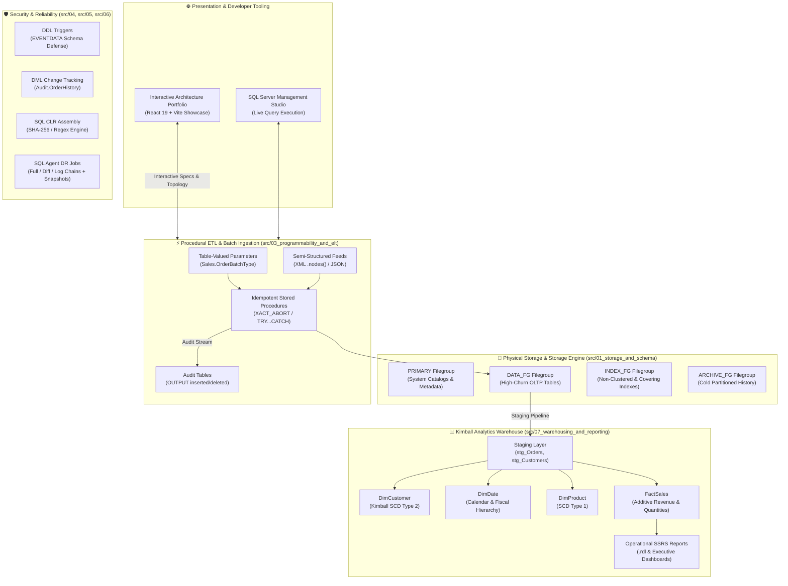
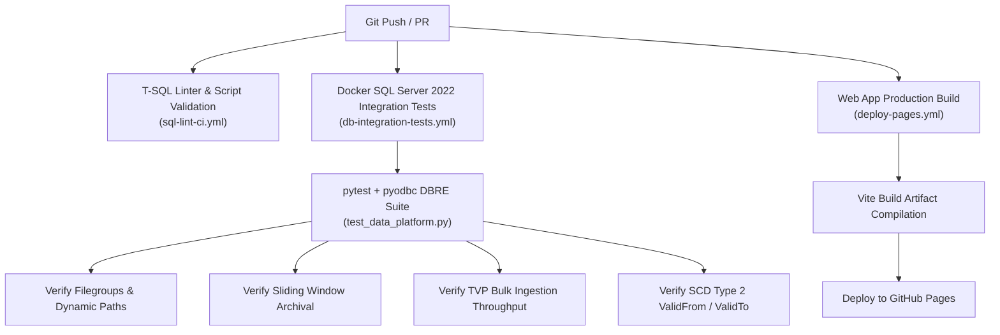

<div align="center">

# 🚀 Enterprise SQL Server Data Platform & DBRE Sandbox
### *Production-Grade Database Reliability Engineering, Procedural ETL, Kimball Dimensional Warehousing & Interactive Web Studio*

[](https://maharatech.gov.eg/course/view.php?id=2305)
[](#)
[](#)
[](#)
[](https://sohila-khaled-abbas.github.io/sql-server-data-platform/)

<br />

[](https://learn.microsoft.com/en-us/sql/t-sql/)
[](#architecture-overview)
[](https://www.python.org/)
[](https://react.dev/)
[](https://vitejs.dev/)
[](https://hub.docker.com/_/microsoft-mssql-server)
[](https://github.com/Sohila-Khaled-Abbas/sql-server-data-platform/actions)
[](LICENSE)

<br />

**[🌐 Launch Interactive Web App](https://sohila-khaled-abbas.github.io/sql-server-data-platform/)** •
**[🧠 Obsidian Second Brain](#-obsidian-second-brain--pkm-vault-integration)** •
**[✨ Platform Highlights](#-key-platform-pillars)** •
**[🏛️ System Architecture](#%EF%B8%8F-architecture-overview)** •
**[🗺️ Syllabus & Competency Matrix](#%EF%B8%8F-syllabus-to-dbre-competency-mapping)** •
**[💻 Web Studio](#-interactive-learning-studio--vibe-coding-ui)** •
**[🚀 Quick Start](#-local-development--quickstart)** •
**[🧪 Testing & CI](#-testing--quality-assurance-matrix)** •
**[📚 Handbooks & Docs](#-specialized-handbooks--documentation-hub)**

---

</div>

## 📌 Executive Summary

This repository is a production-grade codebase and architectural reference for modern **Data Engineering & Database Reliability Engineering (DBRE)** on Microsoft SQL Server 2022. It is systematically engineered from the official ITI / MaharaTech curriculum: **[Implementing and Developing SQL Server Objects (Course ID: 2305)](https://maharatech.gov.eg/course/view.php?id=2305)** taught by Eng. Rami Mohamed Abonagi.

Moving far beyond isolated classroom scripts, this repository provides a unified enterprise data platform that models the complete lifecycle of production data:
- **Physical storage design & multi-filegroup segregation**
- **Sliding-window partition switching with zero I/O historical archival**
- **High-throughput transactional bulk ingestion via Table-Valued Parameters (TVPs)**
- **ACID transaction safety, deadlock prevention, and non-blocking audit capture**
- **Kimball-style analytical data warehousing (Star Schema with SCD Type 1 & 2)**
- **Automated database administration via SMO, PowerShell, and Python**
- **A modern, full-stack Interactive Learning Platform with an in-browser WebAssembly SQL engine and dark-mode glassmorphic UI**

> [!TIP]
> **Zero Installation Required to Practice!**
> You can run T-SQL queries directly in your browser without spinning up SQL Server. Visit the **[Live Interactive Web Studio](https://sohila-khaled-abbas.github.io/sql-server-data-platform/)** to run code, track your progress across 102 lessons, take interactive quizzes, and explore database execution plans.

---

## 💎 Key Platform Pillars

<table>
  <tr>
    <td width="50%" valign="top">
      <h3>🏛️ 1. Physical Storage & I/O Isolation</h3>
      <ul>
        <li><b>Multi-Filegroup Architecture:</b> Segregates <code>PRIMARY</code> (catalogs), <code>DATA_FG</code> (active OLTP), <code>INDEX_FG</code> (non-clustered indexes), and <code>ARCHIVE_FG</code> (cold storage).</li>
        <li><b>Sliding-Window Partitioning:</b> Horizontal partition switching via <code>ALTER TABLE ... SWITCH PARTITION</code> for instant archival without table locks.</li>
        <li><b>Dynamic Paths:</b> Auto-provisions using <code>SERVERPROPERTY('InstanceDefaultDataPath')</code> for seamless cross-platform execution (Local Windows vs Linux/Docker).</li>
      </ul>
    </td>
    <td width="50%" valign="top">
      <h3>⚡ 2. High-Throughput Procedural ETL</h3>
      <ul>
        <li><b>Table-Valued Parameters (TVPs):</b> Streams batch operations in a single network round-trip via strongly typed <code>Sales.OrderBatchType</code>.</li>
        <li><b>Semi-Structured XML/JSON:</b> High-performance ingestion with <code>.nodes()</code>, <code>.value()</code>, and <code>FOR XML PATH</code> shredding.</li>
        <li><b>Resilient Transactions:</b> <code>SET XACT_ABORT ON</code>, explicit <code>TRY...CATCH</code>, automatic rollback on error, and audit output via the <code>OUTPUT</code> clause.</li>
      </ul>
    </td>
  </tr>
  <tr>
    <td width="50%" valign="top">
      <h3>🛡️ 3. Governance, Auditing & DBRE</h3>
      <ul>
        <li><b>Non-Blocking Change Data Capture:</b> Row-level audit trails using virtual <code>inserted</code>/<code>deleted</code> tables with zero table-level lock escalation.</li>
        <li><b>DDL & Schema Governance:</b> Server- and database-scoped triggers capturing <code>EVENTDATA()</code> XML payloads to prevent rogue <code>DROP TABLE</code> actions.</li>
        <li><b>Injection Defense:</b> Hardened dynamic SQL patterns strictly enforcing <code>sys.sp_executesql</code> with typed parameters and <code>QUOTENAME()</code>.</li>
      </ul>
    </td>
    <td width="50%" valign="top">
      <h3>📊 4. Kimball Dimensional Warehousing</h3>
      <ul>
        <li><b>Star Schema (OmniFlowDW):</b> Full transformation from 3NF normalized OLTP into dimensional facts and conformed dimensions.</li>
        <li><b>Slowly Changing Dimensions:</b> Native implementation of SCD Type 2 (historical tracking via <code>ValidFrom</code>, <code>ValidTo</code>, <code>IsCurrent</code>) and SCD Type 1.</li>
        <li><b>SSRS Operational Reports:</b> Parameterized enterprise reports (<code>.rdl</code>) with regional drilldowns, matrix aggregates, and charts.</li>
      </ul>
    </td>
  </tr>
  <tr>
    <td width="50%" valign="top">
      <h3>💻 5. Modern Architecture Portfolio &amp; Case Study</h3>
      <ul>
        <li><b>2026-Style Dark Interface:</b> Built with Plus Jakarta Sans, JetBrains Mono, and subtle SQL Server red accents.</li>
        <li><b>Interactive Topology &amp; ERD:</b> Interactive layer inspector, dual-mode ERD viewer, and animated data flow pipeline.</li>
        <li><b>Searchable Repo Explorer:</b> Real-time filtering across SQL scripts, runbooks, schemas, and test suites.</li>
      </ul>
    </td>
    <td width="50%" valign="top">
      <h3>🤖 6. Enterprise Automation &amp; Tooling</h3>
      <ul>
        <li><b>SMO PowerShell &amp; Python:</b> Declarative schema generation, automated scripting, and backup validation via Microsoft SMO.</li>
        <li><b>SQL CLR Assemblies:</b> In-engine C# high-speed cryptographic hashing (SHA-256) and regex pattern matching.</li>
        <li><b>Containerized CI/CD:</b> GitHub Actions workflows running automated pytest integration suites against SQL Server 2022.</li>
      </ul>
    </td>
  </tr>
</table>

---

## 🏛️ Architecture Overview

The following diagram illustrates the end-to-end data lifecycle across storage tiers, procedural ETL pipelines, governance triggers, analytical warehousing, and the client portfolio showcase:



---

## 🗺️ Syllabus-to-DBRE Competency Mapping

The platform directly operationalizes every topic from **MaharaTech Course 2305** into hardened, production-grade engineering artifacts:

| Chapter & Course Module | Syllabus Topics | DBRE & Data Platform Implementation | Verified Artifacts & Docs |
| :--- | :--- | :--- | :--- |
| **CH01: Database Creation & Management** | Multi-Filegroups, Constraints, Clustered/Non-Clustered Indexes, Backups, Database Snapshots | **Storage Engine & Physical Modeling**: Multi-filegroup IO separation, dynamic path provisioning, non-blocking sparse snapshot creation and point-in-time recovery runbooks. | [`src/01_storage_and_schema/`](src/01_storage_and_schema/)<br>[`docs/ch01-case-study-erd-and-implementation.md`](docs/ch01-case-study-erd-and-implementation.md)<br>[`docs/db2-integrity-constraints-live.md`](docs/db2-integrity-constraints-live.md) |
| **CH02: SQL Programming Essentials** | Control of Flow, Functions (Inline vs MSTVF vs Scalar), Transactions & Concurrency | **ACID Management & Computation**: Set-based query optimization, eliminating RBAR cursor overhead, TVF plan regression mitigation, and Scalar UDF inlining. | [`src/02_indexing_and_performance/`](src/02_indexing_and_performance/)<br>[`docs/performance-tuning-handbook.md`](docs/performance-tuning-handbook.md) |
| **CH03: Advanced Query & Scalability** | Horizontal Range Partitioning, XML/XQuery, CTEs, Sequences, TVPs, Disaster Recovery | **Data Ingestion & Scalability**: Horizontal sliding window partition switching, semi-structured XML shredding, high-throughput TVP streaming, and Log Shipping standby topologies. | [`src/03_programmability_and_elt/`](src/03_programmability_and_elt/)<br>[`docs/disaster-recovery-runbook.md`](docs/disaster-recovery-runbook.md) |
| **CH04: Procedures, Triggers & Automation** | Stored Procedures, Audit Triggers, CLR Integration, Administrative SMO Automation | **Pipeline Orchestration & Extensibility**: Idempotent transactional ETL procedures, virtual `inserted`/`deleted` audit pipelines, SQL injection defense, C# CLR hashing, and SMO automation. | [`src/04_governance_and_audit/`](src/04_governance_and_audit/)<br>[`src/05_automation_and_smo/`](src/05_automation_and_smo/)<br>[`docs/learning-guidance.md`](docs/learning-guidance.md) |
| **CH05: Reporting & Warehousing** | SSRS, OLTP vs OLAP, Kimball Dimensional Modeling, RDLC Report Definitions | **Analytics Engineering**: 3NF to Star Schema dimensional modeling, slowly changing dimensions (SCD 1 & 2), surrogate key generation pipelines, and enterprise SSRS reports. | [`src/07_warehousing_and_reporting/`](src/07_warehousing_and_reporting/)<br>[`docs/dimensional-model.md`](docs/dimensional-model.md)<br>[`docs/data-dictionary.md`](docs/data-dictionary.md) |

---

## 💻 Interactive Architecture Showcase & Portfolio

The `/web` client is built as a modern, 2026-style project portfolio and interactive case study platform, designed with the **Plus Jakarta Sans** typography system, technical grid lines, and a dark-first charcoal aesthetic:

### ✨ Portfolio Website Features
* **14 Detailed Sections**: Fully responsive architecture showcase with sticky navigation, executive problem breakdown, and creator profile.
* **Live Pipeline Topology**: Visual tracking of data movement from TVP batch streaming to Kimball star schema aggregation.
* **Searchable Repository Explorer**: Instant real-time filtering across SQL scripts, runbooks, schemas, and test suites with direct GitHub links.
* **Dual-Mode ERD Visualizer**: Interactive schema cards toggling between the analytical Star Schema (`OmniFlowDW`) and the normalized 3NF Company ERD.
* **SQL Engineering Showcase**: Curated, syntax-highlighted T-SQL engineering patterns with one-click copy and repository links.
* **Technical Deep Dives**: Comprehensive coverage of storage allocation, ACID boundaries, DR runbooks, and event-driven DDL defense.

---

## 🚀 Local Development & Quickstart

You can run the entire platform locally via Docker, natively on Windows, or explore the portfolio showcase.

### Option 1: Full Docker Containerized Stack (Recommended)

Spin up an isolated SQL Server 2022 instance and automatically deploy all schemas:

```bash
# 1. Clone the repository
git clone https://github.com/Sohila-Khaled-Abbas/sql-server-data-platform.git
cd sql-server-data-platform

# 2. Start containerized SQL Server 2022 instance
cd docker
docker compose up -d

# 3. Deploy all database objects and seed data via PowerShell
cd ..
pwsh ./deploy.ps1 -Environment Docker
```

---

### Option 2: Local SQL Server 2022 Instance

If you have SQL Server 2022 Developer Edition installed locally with SQL Server Management Studio (SSMS):

```powershell
# Open PowerShell as Administrator and run the universal deployment orchestrator
.\deploy.ps1 -Environment Local
```

> [!NOTE]
> The deployment orchestrator automatically inspects `SERVERPROPERTY('InstanceDefaultDataPath')` to place secondary filegroups (`DATA_FG`, `INDEX_FG`, `ARCHIVE_FG`) in your instance's default directory.

---

### Option 3: Launch the Portfolio Web Application (Vite + React)

To launch the interactive architecture portfolio locally:

```bash
# Navigate to web directory
cd web

# Install dependencies
npm install

# Start Vite development server
npm run dev
```

Open **`http://localhost:5173`** in your browser to begin exploring!

To produce a production-ready static build:
```bash
npm run build
```

---

## 🧪 Testing & Quality Assurance Matrix

Every component of this data platform is backed by automated CI/CD workflows and rigorous testing harnesses:



### Automated Test Commands

```bash
# 1. Run Python DBRE Integration Harness against local/Docker SQL Server
pytest tests/python/test_data_platform.py -v

# 2. Run deterministic database schema migration runner
python scripts/migration_runner.py --verify

# 3. Verify production compilation of Web Studio
cd web && npm run build
```

---

## 📂 Repository Structure

<details>
<summary><b>📁 Click to expand complete directory tree</b></summary>

```text
sql-server-data-platform/
├── .github/
│   ├── ISSUE_TEMPLATE/
│   │   ├── bug_report.yml              # Structured issue form for bug reporting
│   │   ├── config.yml                  # Issue chooser configuration
│   │   ├── feature_request.yml         # Architectural enhancement proposals
│   │   └── performance_issue.yml       # Query plan & index regression triage
│   ├── workflows/
│   │   ├── db-integration-tests.yml    # End-to-end containerized SQL Server 2022 CI
│   │   ├── deploy-pages.yml            # GitHub Pages automated build & deployment
│   │   ├── markdown-lint.yml           # Documentation validation & markdown linting
│   │   ├── release-drafter.yml         # Automated semantic release drafting
│   │   └── sql-lint-ci.yml             # T-SQL linting and migration verification
│   ├── dependabot.yml                  # Automated actions, docker & pip dependencies
│   ├── release-drafter.yml             # Categorized release changelog configuration
│   └── PULL_REQUEST_TEMPLATE.md        # DBRE pull request checklist & template
├── docker/
│   ├── docker-compose.yml              # Local SQL Server 2022 containerized instance
│   ├── .env.example                    # Sample environment variables
│   └── init/                           # Entrypoint bootstrapping scripts
│       └── 01_bootstrap.sql
├── docs/
│   ├── architecture-diagram.md         # Visual Mermaid architecture & storage diagrams
│   ├── ch01-case-study-erd-and-implementation.md # Chapter 1 Company ERD & relational breakdown
│   ├── ch01-vid06-constraints-rules-defaults-live.md # Live SQL Server 2022 telemetry for rules & defaults
│   ├── course-syllabus-mapping.md      # Full syllabus to platform competency mapping
│   ├── curriculum/                     # Enterprise Obsidian Second Brain / PKM Vault (102 Lessons)
│   │   ├── 00 - HOME/                  # Central launchpad, dynamic dashboards, roadmap, weekly review
│   │   ├── 01 - COURSE/                # 102 structured video notes across CH01-CH05 + Final Project + Audit
│   │   ├── 02 - CONCEPTS/              # 33 atomic concept notes across 10 architectural domains
│   │   ├── 03 - SQL PATTERNS/          # 18 production T-SQL cookbook notes & best practices
│   │   ├── 04 - LAB/                   # Assignments 01-05, storage architecture, and Kimball bus matrix
│   │   ├── 05 - PROJECTS/              # 5 Chapter mini-projects + 11-part final project suite + case study
│   │   ├── 06 - REVISION/              # 20 syntax cheat sheets, flashcards, interview guide, mistake journal
│   │   ├── 07 - RESOURCES/             # SQL Server 2022 docs, MaharaTech resources, DBRE bibliography
│   │   ├── 08 - TEMPLATES/             # 7 standardized templates for notes, concepts, and patterns
│   │   ├── 99 - ATTACHMENTS/           # Visual diagrams, Excalidraw files, and media
│   │   ├── 8-WEEK-STUDY-PLAN.md        # 8-week intensive study milestone tracker
│   │   ├── LEARNING_TRACKER.md         # Interactive 102-lesson progress checklist
│   │   ├── MENTOR_WORKFLOW.md          # 4-stage engineering mastery workflow
│   │   ├── STUDY_PLAN.md               # 6-phase data engineering roadmap
│   │   └── VIDEO_INDEX.md              # 102 MaharaTech official video catalog with deep links
│   ├── data-dictionary.md              # Complete data dictionary for OLTP & OLAP schemas
│   ├── db2-integrity-constraints-live.md # CH01_VID05 Live DB2 Integrity Constraints telemetry
│   ├── dimensional-model.md            # Kimball star schema bus matrix & grain definitions
│   ├── disaster-recovery-runbook.md    # RPO/RTO targets, VLF layout & recovery runbook
│   ├── ititest-live-schema.md          # Live ITITest database schema verification
│   ├── learning-guidance.md            # In-depth DBRE handbook & interview questions
│   └── performance-tuning-handbook.md  # Query optimizer, indexing & wait statistics handbook
├── scripts/
│   ├── generate_mock_data.py           # High-throughput mock data generator (50,000+ rows)
│   ├── generate_syllabus_doc.py        # Automated syllabus documentation generator
│   ├── generate_video_catalog.py       # Video catalog and metadata generator
│   ├── migration_runner.py             # Deterministic SHA-256 migration orchestrator
│   └── sync_ititest_db.py              # ITITest database synchronization script
├── src/
│   ├── 01_storage_and_schema/
│   │   ├── 01_filegroups_and_files.sql # Physical storage allocation & secondary filegroups
│   │   ├── 02_custom_types_and_rules.sql # User-defined data types, rules & defaults
│   │   ├── 03_integrity_constraints.sql # Foreign keys, check constraints & cascading rules
│   │   ├── 04_partitioning_scheme.sql  # Partition functions & sliding window partition switching
│   │   ├── 05_company_case_study_schema.sql # Canonical ITI Company ERD implementation
│   │   ├── ch01_vid05_integrity_constraints.sql # DB2 DDL with 8 constraints (c1-c8) & cascade tests
│   │   └── ch01_vid06_constraints_rules_defaults.sql # ITI Instructor DDL, rules (myrule), sp_bindrule & defaults
│   ├── 02_indexing_and_performance/
│   │   ├── 01_clustered_nonclustered.sql # Clustered, covering non-clustered, filtered & columnstore
│   │   ├── 02_indexed_views.sql        # Materialized aggregation views with SCHEMABINDING
│   │   └── 03_execution_plan_analysis.sql # Benchmarking cursor vs set-based operations
│   ├── 03_programmability_and_elt/
│   │   ├── 01_tvps_and_bulk_ingestion.sql # High-performance table-valued parameter ingestion
│   │   ├── 02_xml_shredding_and_generation.sql # Semi-structured data parsing (FOR XML & XQuery)
│   │   ├── 03_stored_procedures_etl.sql   # Transactional DML pipelines with OUTPUT clause
│   │   ├── 04_hierarchical_data_and_ctes.sql # Recursive CTEs and organization hierarchies
│   │   └── 05_scalar_vs_table_functions.sql # Performance isolation (Inline vs MSTVF vs Scalar)
│   ├── 04_governance_and_audit/
│   │   ├── 01_audit_change_capture_triggers.sql # Change tracking via inserted/deleted tables
│   │   ├── 02_ddl_and_server_triggers.sql       # Schema modification governance
│   │   └── 03_dynamic_sql_guardrails.sql        # Parameterized dynamic SQL (SQL injection defense)
│   ├── 05_automation_and_smo/
│   │   ├── clr/                                 # C# custom assemblies (UDF/Stored Procs)
│   │   │   ├── SqlClrExtensions.cs
│   │   │   ├── SqlClrExtensions.csproj
│   │   │   └── Deploy-ClrAssembly.sql
│   │   └── smo_scripts/                         # Automated administration via PowerShell / Python
│   │       ├── BackupDatabase.ps1
│   │       └── ScriptDatabaseObjects.py
│   ├── 06_reliability_and_dr/
│   │   ├── 01_backup_and_maintenance_jobs.sql   # Full/Diff/Log maintenance jobs via SQL Agent
│   │   ├── 02_snapshot_lifecycle.sql            # Read-only reporting & rollback snapshots
│   │   └── 03_high_availability_docs/           # Architecture specs for Log Shipping & Mirroring
│   │       └── log_shipping_and_ag_guide.md
│   └── 07_warehousing_and_reporting/
│       ├── 01_oltp_source_schema.sql
│       ├── 02_dimensional_star_schema.sql       # Dim/Fact tables with surrogate keys
│       ├── 03_etl_staging_to_dw.sql             # Staging load procedures
│       └── ssrs_reports/                        # Report definitions (.rdl)
│           └── SalesExecutiveSummary.rdl
├── tests/
│   ├── python/
│   │   └── test_data_platform.py                # pytest DBRE integration test harness
│   └── tSQLt/
│       └── test_stored_procedures.sql           # In-engine unit testing suite
├── web/                                         # Modern Data Platform Portfolio & Case Study Showcase
│   ├── src/
│   │   ├── components/                          # 14 Portfolio Showcase Sections (Architecture, ERD, SQL, Explorer, etc.)
│   │   │   └── icons/                           # Custom vector icon components (GithubIcon, etc.)
│   │   ├── data/                                # Grounded repository metadata, schemas, and SQL scripts
│   │   ├── styles/                              # 2026 dark-first responsive design system (portfolio.css)
│   │   ├── App.jsx                              # Modular portfolio application container
│   │   └── main.jsx                             # React 19 entrypoint
│   ├── index.html                               # Single-page portfolio shell with SEO & OpenGraph
│   ├── vite.config.js                           # Vite build configuration with chunk splitting
│   └── package.json                             # React 19, Vite, Lucide React
├── deploy.ps1                                   # Universal PowerShell deployment orchestrator
├── CONTRIBUTING.md                              # T-SQL coding standards & contribution guide
├── CODE_OF_CONDUCT.md                           # Contributor Covenant Code of Conduct
├── SECURITY.md                                  # Vulnerability reporting & injection defense
├── LICENSE                                      # MIT Open Source License
└── README.md                                    # This document
```
</details>

---

## 📚 Specialized Handbooks & Documentation Hub

Explore our deep-dive handbooks located in [`/docs`](docs/):

### 🎓 Curriculum & Learning Companion (102 Video Modules)
* 🧠 **[Obsidian Second Brain Study Hub](docs/curriculum/README.md)**: Master Map of Content (MOC) with dynamic Dataview dashboards and live video notes.
* 🗺️ **[Interactive 102-Lesson Learning Tracker](docs/curriculum/LEARNING_TRACKER.md)**: Four-stage engineering checklist (*Watched*, *Reproduced*, *Modified*, *Explained*).
* 📅 **[8-Week DBRE Sprint Study Plan](docs/curriculum/8-WEEK-STUDY-PLAN.md)**: Structured weekly curriculum path from storage internals to dimensional star schemas.
* 📑 **[102 Video Notes Catalog](docs/curriculum/VIDEO_INDEX.md)**: Direct index to every official lecture and corresponding code module.
* 🛡️ **[The Mentor Workflow Handbook](docs/curriculum/MENTOR_WORKFLOW.md)**: 4-stage engineering mastery framework.

### 📖 Technical Reference Handbooks
* 📖 **[Learning Guidance & DBRE Deep-Dive](docs/learning-guidance.md)**: 5-Phase career progression roadmap, essential concepts, and 25+ real-world DBRE interview scenarios.
* ⚡ **[Performance Tuning Handbook](docs/performance-tuning-handbook.md)**: Query optimizer internals, SARGability rules, indexing strategies, and wait statistics analysis.
* 🛡️ **[Disaster Recovery Runbook](docs/disaster-recovery-runbook.md)**: RPO/RTO calculations, VLF optimization, non-blocking snapshots, and log shipping runbooks.
* 🏢 **[Company Case Study ERD & Relational Mapping](docs/ch01-case-study-erd-and-implementation.md)**: Peter Chen ERD mapping to 3NF relational schemas with integrity constraints.
* 🛡️ **[Live Integrity Constraints Telemetry (DB2)](docs/db2-integrity-constraints-live.md)**: Live verification of constraints c1 through c8 with cascade rule behavior.
* ⚙️ **[Constraints, Rules & Defaults Live Telemetry (ITI)](docs/ch01-vid06-constraints-rules-defaults-live.md)**: Live verification of `CREATE RULE`, `sp_bindrule`, `sp_bindefault`, and `WITH NOCHECK` on SQL Server 2022.
* 📊 **[Data Dictionary](docs/data-dictionary.md)**: Full metadata specification for all transactional and dimensional schemas.
* ⭐ **[Dimensional Model Bus Matrix](docs/dimensional-model.md)**: Kimball star schema grain definitions, conformed dimensions, and additive facts.
* 🗺️ **[Full Course Syllabus Mapping](docs/course-syllabus-mapping.md)**: Video-by-video curriculum alignment with corresponding code modules.

---

## 🧠 Obsidian Second Brain & PKM Vault Integration

This repository includes an enterprise-grade, fully configured **Personal Knowledge Management (PKM) Second Brain** located at [`docs/curriculum/`](docs/curriculum/). It is ready to open directly in **[Obsidian](https://obsidian.md/)** with zero friction:

### 🚀 Opening the Vault in Obsidian
1. Download and launch **Obsidian**.
2. Click **"Open folder as vault"**.
3. Select `docs/curriculum/` (or the repository root folder).
4. All 60+ pre-installed plugins, Dataview queries, and the custom SQL-Red theme snippet (`second-brain.css`) will automatically load!

### 📂 10-Folder Enterprise PKM Architecture

```
docs/curriculum/
├── 00 - HOME/        # Central Launchpad, Dynamic Course Dashboard, Learning Roadmap, Weekly Reviews
├── 01 - COURSE/      # 102 Structured Video Notes across CH01–CH05 + Final Project + Discrepancy Audit
├── 02 - CONCEPTS/    # 33 Atomic Concept Notes across 10 Architectural Domains (Internals, ACID, B-Trees, etc.)
├── 03 - SQL PATTERNS/# 18 Production T-SQL Pattern Cookbook Notes (Inline TVFs, Indexed Views, XML, etc.)
├── 04 - LAB/         # Assignments 01–05, Physical Storage Engine Diagrams, Kimball Bus Matrix Models
├── 05 - PROJECTS/    # 5 Chapter Mini Projects + 11-Part Capstone Project Suite + Portfolio Case Study
├── 06 - REVISION/    # 20 Fast-Reference Cheat Sheets, Spaced Repetition Flashcards, Interview Handbook
├── 07 - RESOURCES/   # Microsoft SQL Server 2022 Official Docs, MaharaTech Resources, DBRE Bibliography
├── 08 - TEMPLATES/   # 7 Standardized Obsidian Templates (Video Note, Concept, Pattern, Review, etc.)
└── 99 - ATTACHMENTS/ # Diagrams, Mermaid Visuals, and Supporting Media Assets
```

### 💎 Key Second Brain Capabilities

* 📋 **Standardized 17-Section Video Note Blueprint:** Every single one of the 102 lesson notes includes Bloom-taxonomy Learning Goals, Core Intuition, Deep Internals, SQL Syntax, runnable Mentor Examples with line-by-line breakdown, Data Engineering Perspectives, Abilities Checklist, Hands-On Labs, Challenges, Mentor Challenges (with Hint & Expected Evidence), Common Mistakes, Production Considerations, Legacy/Version Awareness (`CREATE RULE`, Mirroring, Cursors), Related Concepts wikilinks, Interview Questions, and Knowledge Checks.
* 🧠 **Atomic Concept Graph:** 33 standalone concept notes covering Storage Internals (Pages/Extents), Query Optimization (B-Trees, Covering Indexes), Concurrency (ACID, Isolation Levels), and Dimensional Warehousing (Facts, Dimensions, SCD Type 2).
* 🍳 **Production T-SQL Pattern Cookbook:** 18 drop-in T-SQL recipes covering TVP batch streaming, recursive CTE hierarchies, dynamic SQL injection defense (`sp_executesql`), safe cursor iteration, and atomic SCD Type 2 dimension merges.
* 📊 **Dynamic Dataview Dashboards:** Live aggregation tables in [`Course Dashboard.md`](docs/curriculum/00%20-%20HOME/Course%20Dashboard.md) and [`Weekly Review.md`](docs/curriculum/00%20-%20HOME/Weekly%20Review.md) that automatically compute lesson progress, pending exercises, and spaced repetition schedules.
* 🎯 **Comprehensive Revision Suite:** 20 quick-reference syntax cheat sheets, 50+ spaced repetition flashcards, a structured DBRE technical interview handbook, and a production mistake post-mortem journal.
* 🎨 **Curated Dark Charcoal & SQL-Red Theme:** Customized via [`.obsidian/snippets/second-brain.css`](docs/curriculum/.obsidian/snippets/second-brain.css) featuring a modern charcoal canvas (`#16181D`), elevated panel cards (`#1E222B`), and Microsoft SQL Red accents (`#CC292B`).
* 🔗 **Bidirectional Platform Synergy:** Deeply hyperlinked with the repository's production code in [`src/`](src/) and the live [OmniFlow Interactive Web Studio](https://sohila-khaled-abbas.github.io/sql-server-data-platform/).

---

## 🤝 Contributing & Community Standards

Contributions are welcome! Whether you are optimizing a T-SQL query plan, adding an interactive lesson, or expanding our test suites:

1. Review our **[Contribution Guidelines](CONTRIBUTING.md)** for T-SQL naming conventions, indentation rules, and PR checklists.
2. Review our **[Security Policy](SECURITY.md)** regarding parameterized queries and dynamic SQL safety.
3. Adhere to our **[Code of Conduct](CODE_OF_CONDUCT.md)** to foster an inclusive, welcoming community.

---

## 📜 License & Acknowledgments

* **License**: Distributed under the **[MIT License](LICENSE)**.
* **Curriculum & Mentorship**: Special appreciation to **[Information Technology Institute (ITI)](https://iti.gov.eg/)**, **[MaharaTech](https://maharatech.gov.eg/)**, and **Eng. Rami Mohamed Abonagi** for developing the foundational curriculum that inspired this platform.

<div align="center">
  <sub>Engineered with precision for the modern Data Engineering and Database Reliability Engineering community.</sub>
</div>
