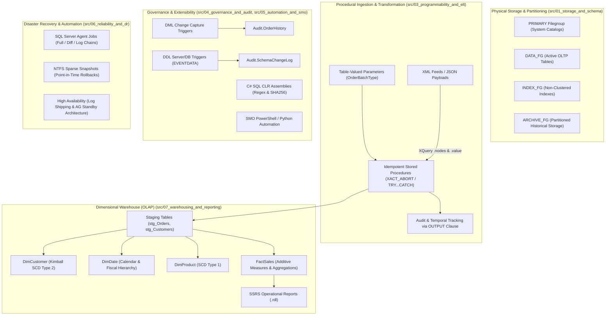

# Enterprise SQL Server Database Platform & Data Engineering Sandbox

[](https://maharatech.gov.eg/course/view.php?id=2305)
[](#)
[](#)
[](#)
[](#)
[](#)
[](#)
[](#)
[](#)
[](https://sohila-khaled-abbas.github.io/sql-server-data-platform/)
[](#)
[](CONTRIBUTING.md)
[](CODE_OF_CONDUCT.md)
[](SECURITY.md)

## Executive Summary
This repository serves as an operational codebase and architectural proof of competency for modern **Data Engineering & Database Reliability Engineering (DBRE)** on Microsoft SQL Server 2022. It is engineered directly from the curriculum of the official ITI / MaharaTech course: **[Implementing and Developing SQL Server Objects (Course ID: 2305)](https://maharatech.gov.eg/course/view.php?id=2305)** taught by Eng. Rami Mohamed Abonagi.

Rather than a loose collection of academic lecture scripts, it is designed as a unified enterprise database platform demonstrating physical storage design, ACID transaction management, high-throughput procedural ETL, database governance, automated administrative operations via SMO, disaster recovery strategies, and an analytical dimensional warehouse (Kimball Star Schema).

* 🌐 **Interactive Web App (GitHub Pages)**: [https://sohila-khaled-abbas.github.io/sql-server-data-platform/](https://sohila-khaled-abbas.github.io/sql-server-data-platform/) (Dynamic Learning Roadmap, Architecture Topology, Migration Engine, 101-Module Learning Hub, WASM SQL Engine, LeetCode Challenges, and Plan Simulator)
* 🏛️ **Architecture Topology**: Interactive End-to-End System Design from OLTP to Ingestion, Partition Staging, Kimball Star Schema, and SSRS/BI
* 🚀 **Enterprise Migration Engine**: Deterministic SHA-256 migration orchestrator (`scripts/migration_runner.py`) with idempotent execution and audit logging
* 🧪 **Automated DBRE Test Suite**: `pytest` harness (`tests/python/test_data_platform.py`) verifying 3NF circular FKs, partition schemes, TVP types, and SCD Type 2
* 🎲 **Synthetic Enterprise Data Generator**: High-throughput mock data generator (`scripts/generate_mock_data.py`) producing 50,000+ relational & dimensional rows
* 🗺️ **Course Roadmap & 101-Module Curriculum**: Interactive 5-stage progression tracking with cross-cutting skills and persistent course attachments
* 🏢 **Case Study ERD**: [Company Database Peter Chen ERD & Relational Mapping](docs/ch01-case-study-erd-and-implementation.md)
* 📖 **Deep-Dive Handbook**: [Learning Guidance & DBRE Deep-Dive](docs/learning-guidance.md)
* ⚡ **Performance Tuning**: [Query Optimizer, Indexing & Wait Stats Handbook](docs/performance-tuning-handbook.md)
* 🛡️ **Disaster Recovery**: [High Availability & Incident Response Runbook](docs/disaster-recovery-runbook.md)
* 🗺️ **Curriculum Alignment**: [Syllabus to Platform Competency Mapping](docs/course-syllabus-mapping.md)
* 📊 **Data Dictionary**: [Schemas, Tables & Constraints](docs/data-dictionary.md)
* ⭐ **Dimensional Model**: [Kimball Star Schema Bus Matrix](docs/dimensional-model.md)

---

## Architecture Overview



---

## Syllabus-to-Data-Engineering Competency Mapping

| Course Module | Syllabus Topics | Data Engineering & DBRE Competency |
| :--- | :--- | :--- |
| **CH01: Database Creation & Management** | Filegroups, Integrity Constraints, Indexes, Backups, Snapshots | **Storage Engine & Physical Modeling**: Multi-filegroup IO separation, dynamic path provisioning, non-blocking sparse snapshot creation and restoration runbooks. |
| **CH02: SQL Programming Essentials** | Control of Flow, Functions (Inline vs MSTVF vs Scalar), Transactions | **ACID Management & Computation**: Set-based optimization, avoiding RBAR (Row-By-Agonizing-Row), managing concurrency, mitigating TVF plan regression and Scalar UDF inlining. |
| **CH03: Advanced Query & High Availability** | Partitioning, XML/XQuery, CTEs, Sequences, TVPs, Log Shipping | **Data Ingestion & Scalability**: Horizontal range partitioning, sliding window partition switching, semi-structured XML parsing, high-throughput bulk ingestion via TVPs, and disaster recovery replication. |
| **CH04: Procedures, Triggers & Automation** | Stored Procs, Triggers (Audit), CLR, SMO Automation | **Pipeline Orchestration & Extensibility**: Idempotent transactional ETL procedures, change tracking via virtual `inserted`/`deleted` tables, secure dynamic SQL guardrails, CLR managed code, and SMO administrative automation. |
| **CH05: Reporting & Warehousing** | SSRS, OLAP vs OLTP, Dimensional Modeling, RDLC | **Analytics Engineering**: Kimball star schema design, slowly changing dimensions (SCD 1 & 2), surrogate key pipelines, operational data marts, and enterprise SSRS report definitions. |

---

## Repository Structure

```text
sql-server-data-platform/
├── .github/
│   ├── ISSUE_TEMPLATE/
│   │   ├── bug_report.yml              # Structured issue form for bug reporting
│   │   ├── config.yml                  # Issue chooser configuration
│   │   ├── feature_request.yml         # Architectural enhancement proposals
│   │   └── performance_issue.yml       # Query plan & index regression triage
│   ├── workflows/
│   │   ├── db-integration-tests.yml    # End-to-end containerized SQL Server 2022 CI
│   │   ├── deploy-pages.yml            # GitHub Pages automated build & deployment
│   │   ├── markdown-lint.yml           # Documentation validation & markdown linting
│   │   ├── release-drafter.yml         # Automated semantic release drafting
│   │   └── sql-lint-ci.yml             # T-SQL linting and migration verification
│   ├── dependabot.yml                  # Automated actions, docker & pip dependencies
│   ├── release-drafter.yml             # Categorized release changelog configuration
│   └── PULL_REQUEST_TEMPLATE.md        # DBRE pull request checklist & template
├── docker/
│   ├── docker-compose.yml              # Local SQL Server 2022 containerized instance
│   ├── .env.example                    # Sample environment variables
│   └── init/                           # Entrypoint bootstrapping scripts
│       └── 01_bootstrap.sql
├── docs/
│   ├── architecture-diagram.md         # Visual Mermaid architecture & storage diagrams
│   ├── ch01-case-study-erd-and-implementation.md # Chapter 1 Company ERD & relational breakdown
│   ├── course-syllabus-mapping.md      # Syllabus to platform competency mapping
│   ├── data-dictionary.md              # Data dictionary for OLTP & OLAP schemas
│   ├── dimensional-model.md            # Kimball star schema bus matrix & grain definitions
│   ├── disaster-recovery-runbook.md    # RPO/RTO targets, VLF layout & recovery runbook
│   ├── learning-guidance.md            # In-depth DBRE handbook & interview questions
│   └── performance-tuning-handbook.md  # Query optimizer, indexing & wait statistics handbook
├── src/
│   ├── 01_storage_and_schema/
│   │   ├── 01_filegroups_and_files.sql # Physical storage allocation & secondary filegroups
│   │   ├── 02_custom_types_and_rules.sql # User-defined data types, rules & defaults
│   │   ├── 03_integrity_constraints.sql # Foreign keys, check constraints & cascading rules
│   │   ├── 04_partitioning_scheme.sql  # Partition functions & sliding window partition switching
│   │   └── 05_company_case_study_schema.sql # Canonical ITI Company ERD implementation
│   ├── 02_indexing_and_performance/
│   │   ├── 01_clustered_nonclustered.sql # Clustered, covering non-clustered, filtered & columnstore
│   │   ├── 02_indexed_views.sql        # Materialized aggregation views with SCHEMABINDING
│   │   └── 03_execution_plan_analysis.sql # Benchmarking cursor vs set-based operations
│   ├── 03_programmability_and_elt/
│   │   ├── 01_tvps_and_bulk_ingestion.sql # High-performance table-valued parameter ingestion
│   │   ├── 02_xml_shredding_and_generation.sql # Semi-structured data parsing (FOR XML & XQuery)
│   │   ├── 03_stored_procedures_etl.sql   # Transactional DML pipelines with OUTPUT clause
│   │   ├── 04_hierarchical_data_and_ctes.sql # Recursive CTEs and organization hierarchies
│   │   └── 05_scalar_vs_table_functions.sql # Performance isolation (Inline vs MSTVF vs Scalar)
│   ├── 04_governance_and_audit/
│   │   ├── 01_audit_change_capture_triggers.sql # Change tracking via inserted/deleted tables
│   │   ├── 02_ddl_and_server_triggers.sql       # Schema modification governance
│   │   └── 03_dynamic_sql_guardrails.sql        # Parameterized dynamic SQL (SQL injection defense)
│   ├── 05_automation_and_smo/
│   │   ├── clr/                                 # C# custom assemblies (UDF/Stored Procs)
│   │   │   ├── SqlClrExtensions.cs
│   │   │   ├── SqlClrExtensions.csproj
│   │   │   └── Deploy-ClrAssembly.sql
│   │   └── smo_scripts/                         # Automated administration via PowerShell / Python
│   │       ├── BackupDatabase.ps1
│   │       └── ScriptDatabaseObjects.py
│   ├── 06_reliability_and_dr/
│   │   ├── 01_backup_and_maintenance_jobs.sql   # Full/Diff/Log maintenance jobs via SQL Agent
│   │   ├── 02_snapshot_lifecycle.sql            # Read-only reporting & rollback snapshots
│   │   └── 03_high_availability_docs/           # Architecture specs for Log Shipping & Mirroring
│   │       └── log_shipping_and_ag_guide.md
│   └── 07_warehousing_and_reporting/
│       ├── 01_oltp_source_schema.sql
│       ├── 02_dimensional_star_schema.sql       # Dim/Fact tables with surrogate keys
│       ├── 03_etl_staging_to_dw.sql             # Staging load procedures
│       └── ssrs_reports/                        # Report definitions (.rdl)
│           └── SalesExecutiveSummary.rdl
├── tests/
│   └── tSQLt/                                   # Unit testing test cases for stored procedures
│       └── test_stored_procedures.sql
├── web/                                         # Interactive GitHub Pages Web Application (Vite + WASM)
│   ├── src/                                     # In-browser SQL engine, ERD & Plan simulator
│   ├── index.html                               # Responsive modern learning portal shell
│   └── package.json
├── deploy.ps1                                   # Universal deployment orchestrator
├── CONTRIBUTING.md                              # T-SQL coding standards & contribution guide
├── CODE_OF_CONDUCT.md                           # Contributor Covenant Code of Conduct
├── SECURITY.md                                  # Vulnerability reporting & injection defense
├── .gitignore
└── LICENSE
```

---

## Key Modules & Implementation Highlights

### 1. Storage & Index Architecture (`/src/01_storage_and_schema`, `/src/02_indexing_and_performance`)
* **Dynamic Multi-Filegroup Design**: Isolates metadata (`PRIMARY`), high-churn operational tables (`DATA_FG`), non-clustered indexes (`INDEX_FG`), and historical archives (`ARCHIVE_FG`). Dynamically queries `SERVERPROPERTY('InstanceDefaultDataPath')` so scripts execute seamlessly on local drive configurations (e.g. `D:\SQL Server\...`) and Docker paths (`/var/opt/mssql/data/`).
* **Table Partitioning & Sliding Windows**: Range Right date partitioning on `Sales.Invoices` with partition switching (`ALTER TABLE ... SWITCH PARTITION`) enabling zero-IO historical archival.
* **Covering Indexes & Materialized Views**: Implementation of covering non-clustered indexes with `INCLUDE` clauses to eliminate Key Lookups, alongside schemabound indexed views for pre-aggregated analytical reporting.
* **Execution Plan Benchmarking**: Comparative benchmark between RBAR cursors and set-based window functions (`SUM() OVER (...)`) measuring logical reads and CPU time.

### 2. High-Throughput Procedural Pipelines (`/src/03_programmability_and_elt`)
* **Bulk Processing with TVPs**: Eliminates per-row client round trips by streaming batch payloads via strongly typed User-Defined Table Types (`Sales.OrderBatchType`).
* **Semi-Structured Processing**: Ingests and shreds nested XML payloads using `.nodes()` and `.value()` XQuery methods, while producing clean XML data via `FOR XML PATH`.
* **ACID Transaction Boundaries**: Stored procedures utilizing `SET XACT_ABORT, NOCOUNT ON`, explicit `BEGIN TRANSACTION / COMMIT`, `TRY...CATCH` blocks with error re-raising via `THROW`, and non-locking audit capture using `OUTPUT inserted.*, deleted.*`.
* **Function Tuning**: Deep-dive into execution plan differences between Scalar UDFs, Multi-Statement TVFs (fixed 100-row estimate in classic cardinality models), and Inline TVFs.

### 3. Governance, Auditing & Extensibility (`/src/04_governance_and_audit`, `/src/05_automation_and_smo`)
* **Audit Automation**: Row-level CDC tracking via virtual `inserted` and `deleted` tables into dedicated audit history tables without table-level blocking.
* **DDL Governance**: Database-level DDL triggers capturing `EVENTDATA()` to audit schema modifications or block unauthorized `DROP TABLE` operations.
* **SQL Injection Defense**: Hardened dynamic SQL patterns using `sys.sp_executesql` with typed parameters and `QUOTENAME()`.
* **CLR Integration**: High-performance C# managed assembly providing regex matching and cryptographic hashing (SHA256) inside the database engine.
* **SMO Scripting**: PowerShell and Python automation scripts utilizing Microsoft SQL Server Management Objects (SMO) for declarative schema generation and backup validation.

### 4. Enterprise Analytics & Reporting (`/src/07_warehousing_and_reporting`)
* **OLTP to OLAP Transition**: Complete transformation of normalized 3NF transactional data into a Kimball-style Star Schema (`OmniFlowDW`).
* **Slowly Changing Dimensions**: Automated SCD Type 2 tracking (`ValidFrom`, `ValidTo`, `IsCurrent`) on `DimCustomer` and SCD Type 1 on `DimProduct`.
* **SSRS Operational Reporting**: Parameterized enterprise report definition (`.rdl`) featuring date ranges, regional grouping, matrix aggregates, and drillthrough capabilities.

---

## Local Development & Reproduction

### Prerequisites
* Windows 10/11 or Linux with SQL Server 2022 (Developer / Enterprise / Standard)
* Or Docker Desktop with Docker Compose
* PowerShell 5.1+ or PowerShell 7+
* Python 3.10+ with `pyodbc` (for Python SMO automation)
* `sqlcmd` utility in PATH

### Quickstart

#### Option A: Deploy to Local SQL Server Instance (Default)
The provided deployment script automatically detects your local SQL Server instance and Windows Authentication:

```powershell
# Run PowerShell deployment against local default instance
.\deploy.ps1 -Environment Local
```

#### Option B: Deploy to Docker SQL Server 2022
If you prefer running inside an isolated Docker container:

```bash
# 1. Start SQL Server 2022 container
cd docker
docker compose up -d

# 2. Deploy platform objects to Docker container
cd ..
pwsh ./deploy.ps1 -Environment Docker
```

---

## License
Distributed under the [MIT License](LICENSE).
