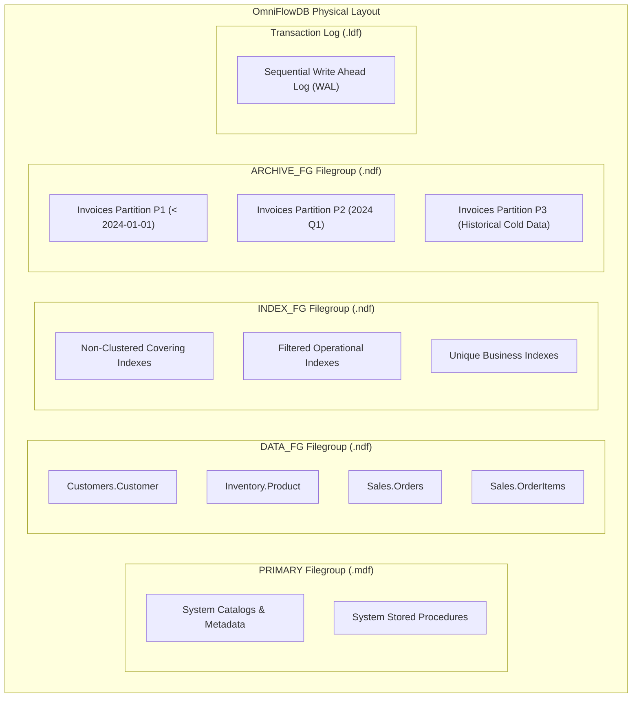
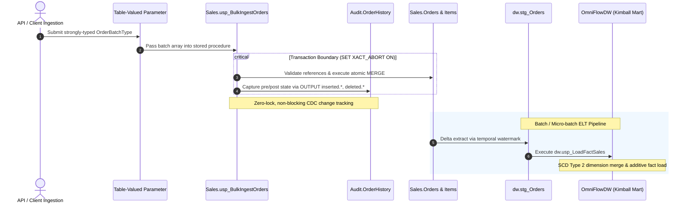
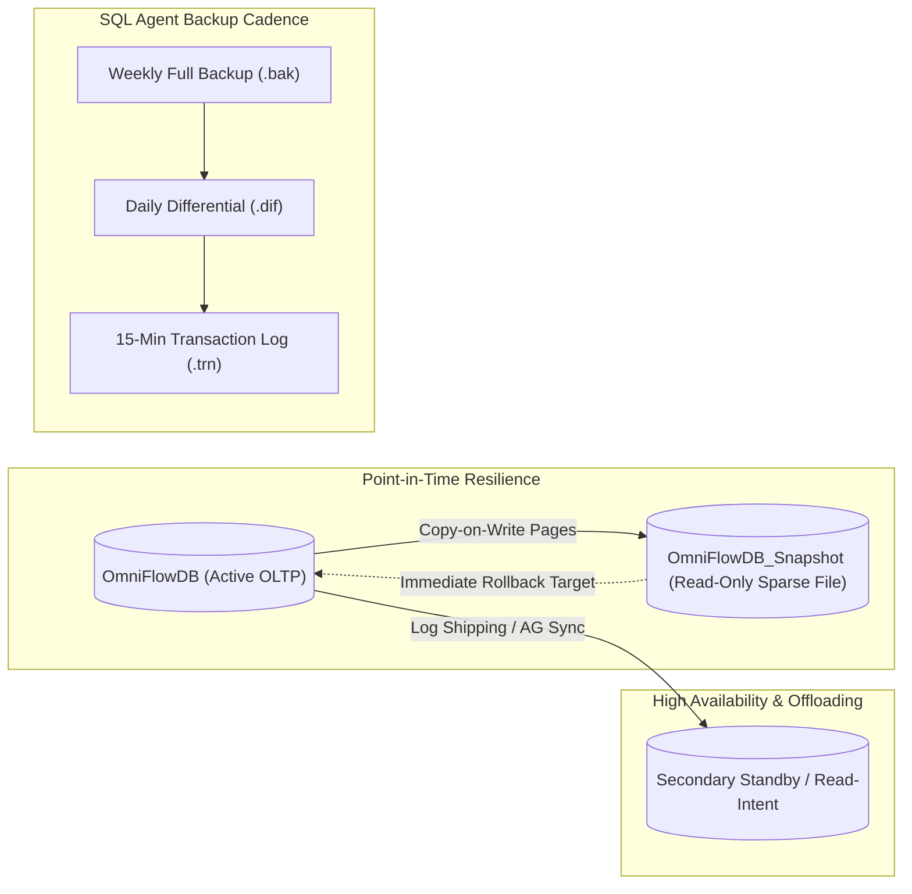

# Architecture & Storage Internals Documentation

## 1. Physical Storage & Filegroup Topology

The `OmniFlowDB` transactional database uses an enterprise multi-filegroup topology designed to optimize IO throughput, isolate administrative operations, and isolate maintenance overhead.

### Architectural Justifications:
1. **Separation of System and User Data**: `PRIMARY` filegroup contains solely SQL Server metadata and internal system objects. User tables are prohibited on `PRIMARY`, safeguarding against catalog corruption and facilitating piecemeal restores.
2. **IO Isolation for Indexes**: Placing non-clustered indexes on `INDEX_FG` separates random read operations (index seeks/lookups) from sequential table scans and data page write operations.
3. **Storage Tiering via Partitions**: High-churn active partitions reside on `DATA_FG` (typically high-speed NVMe/SSD storage), whereas historical partitions switch onto `ARCHIVE_FG` (cost-optimized high-capacity storage).

---

## 2. End-to-End Procedural ELT & Operational Flow

---

## 3. Disaster Recovery & Snapshot Architecture

