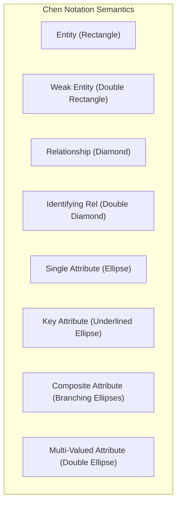
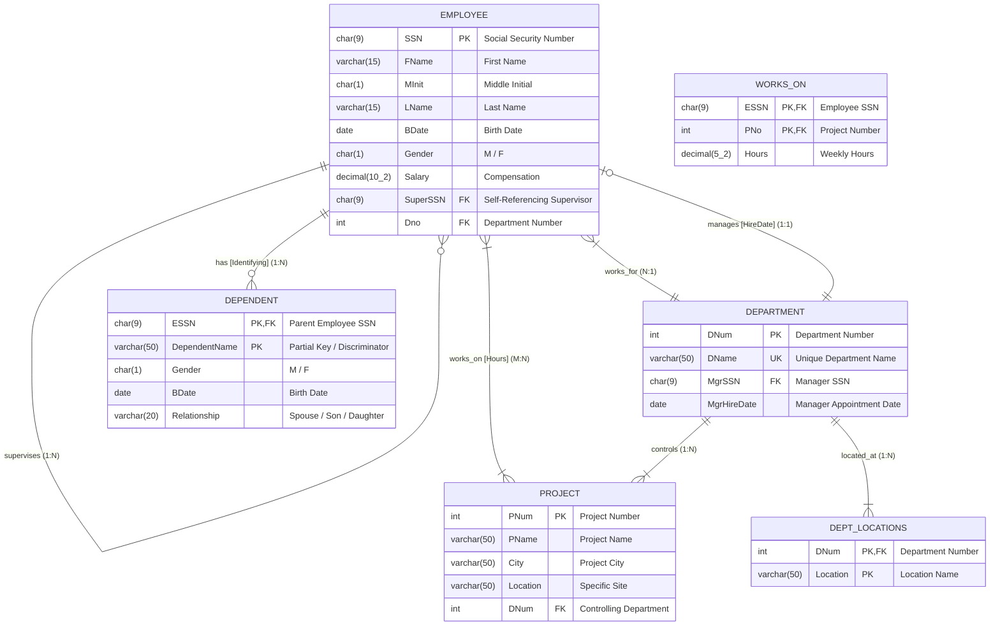
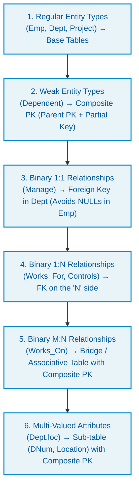
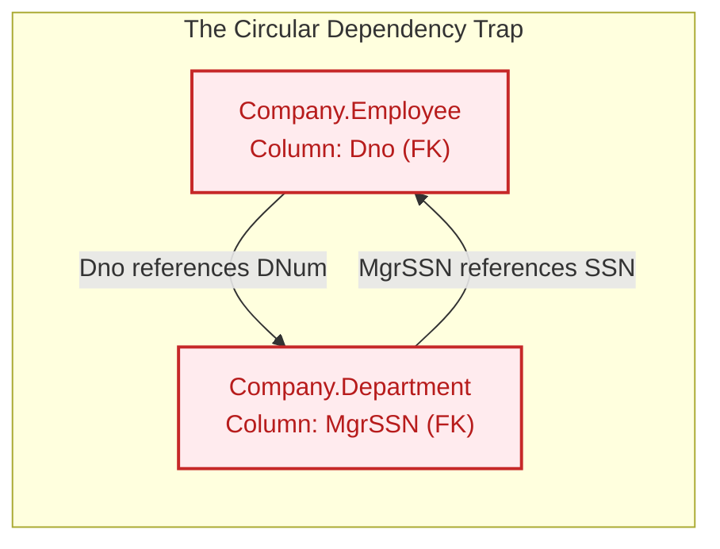
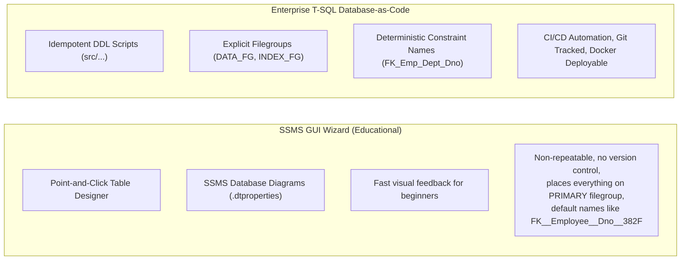

# Chapter 1 Case Study: ITItest Database & Company Relational Implementation

A comprehensive architectural and engineering breakdown of the **Company Enterprise Case Study** implemented in database **`ITItest`** from **[MaharaTech Course 2305: Implementing and Developing SQL Server Objects](https://maharatech.gov.eg/course/view.php?id=2305)** (*CH01_VID02: Create Database Using Wizard* through *CH01_VID05* by Eng. Rami Mohamed Abonagi).

> [!IMPORTANT]
> **Live Physical Database Configuration (`ITItest`)**:
> - **Database Name**: `ITItest`
> - **Physical File Storage Root**: `D:\courses\Data Science\Data Engineering\MaharaTech\Implementing and Developing SQL server objects\CH01\Mydb`
> - **Multi-Filegroup Architecture**:
>   - Primary Data File: `ITItest.mdf` on filegroup `[PRIMARY]` (8 MB, Autogrowth: 64 MB)
>   - Secondary Data File 1: `file2.ndf` on filegroup `[fg1]` (8 MB, Autogrowth: 64 MB)
>   - Secondary Data File 2: `file3.ndf` on filegroup `[fg2]` (8 MB, Autogrowth: 64 MB)
>   - Secondary Data File 3: `file4.ndf` on filegroup `[fg3]` (8 MB, Autogrowth: 64 MB)
>   - Transaction Log File: `ITItest_log.ldf` (8 MB, Autogrowth: 64 MB)
> - **Live Synchronizer**: Run `python scripts/sync_ititest_db.py --watch` to dynamically fetch tables and columns as you build them in the SSMS Wizard! (See [Live Schema Documentation](ititest-live-schema.md)).

---

## 1. Conceptual Chen-Notation ERD Breakdown

The provided diagram is the canonical **Company Database ERD** formulated using Peter Chen's notation and implemented within **`ITItest`**. Below is the full anatomical breakdown of all semantic constructs:



### Entity & Relationship Inventory



---

## 2. ER-to-Relational Mapping Transformation Rules

Transforming a conceptual Chen ERD into a normalized 3NF/BCNF relational database schema requires applying six strict relational mapping algorithms:



### Detailed Mapping Specification Matrix

| ER Construct | Chen Symbol | Relational Table Representation | Primary Key (PK) | Foreign Key(s) (FK) | Integrity / Cascading Rules |
| :--- | :--- | :--- | :--- | :--- | :--- |
| **`Emp` Entity** | Rectangle | `Company.Employee` | `SSN` | `SuperSSN -> Employee(SSN)`, `Dno -> Department(DNum)` | `ON DELETE NO ACTION` (Prevents orphan cycles) |
| **`name` Attribute** | Composite Oval | Flattened columns: `FName`, `MInit`, `LName` | N/A | N/A | `FName` and `LName` `NOT NULL` |
| **`Dept` Entity** | Rectangle | `Company.Department` | `DNum` | `MgrSSN -> Employee(SSN)` | `DName UNIQUE`; `MgrSSN` nullable during setup |
| **`loc` Attribute** | Double Oval (Multi-valued) | `Company.DeptLocations` | `(DNum, Location)` | `DNum -> Department(DNum)` | `ON DELETE CASCADE` (Delete locs if Dept removed) |
| **`project` Entity** | Rectangle | `Company.Project` | `PNum` | `DNum -> Department(DNum)` | `ON DELETE NO ACTION` |
| **`work` (M:N)** | Diamond | `Company.WorksOn` | `(ESSN, PNo)` | `ESSN -> Employee(SSN)`, `PNo -> Project(PNum)` | `ON DELETE CASCADE` for ESSN and PNo |
| **`Dependent`** | Double Rectangle (Weak) | `Company.Dependent` | `(ESSN, DependentName)` | `ESSN -> Employee(SSN)` | `ON DELETE CASCADE` (Child deleted if Emp deleted) |
| **`supervise` (1:N)** | Recursive Diamond | In `Company.Employee` (`SuperSSN`) | `SSN` | `SuperSSN -> Employee(SSN)` | Self-referencing FK, allows `NULL` for top CEO |

---

## 3. The Circular Dependency Challenge ("Chicken-and-Egg" FKs)

A famous architectural challenge in the ITI Company database is the **Circular Foreign Key Dependency** between `Employee` and `Department`:



### Why Does This Break Naive Scripts?
1. If you run `CREATE TABLE Employee` with `Dno REFERENCES Department(DNum)`, the engine throws:
   ```text
   Msg 1767, Level 16: Foreign key 'FK_Employee_Department' references invalid table 'Department'.
   ```
2. If you instead create `Department` first with `MgrSSN REFERENCES Employee(SSN)`, it fails because `Employee` does not exist yet!
3. Even after creating both tables with nullable FKs, an `INSERT` into `Employee` requires a valid `Dno`, but `Department` cannot be inserted without a valid `MgrSSN`!

### Production DBRE Solution:
1. **Phase 1 (Creation)**: Create tables without circular FK constraints (or leave `MgrSSN` and `Dno` unconstrained initially).
2. **Phase 2 (Constraint Binding)**: Apply the foreign keys via `ALTER TABLE ... ADD CONSTRAINT` after both tables exist.
3. **Phase 3 (Data Ingestion)**:
   * Insert Department with `MgrSSN = NULL`.
   * Insert Employee with `Dno = <Target Dept>`.
   * Update Department with `MgrSSN = <Manager SSN>`.

---

## 4. SSMS Wizard vs. Production T-SQL Comparison

In *CH01_VID02*, the instructor demonstrates creating this database via the **SSMS Database Wizard & Table Designer GUI**. Below is the comparative analysis from a DBRE perspective:



| Criterion | SSMS Wizard Approach (VID02) | DBRE Code-First Approach (Our Platform) |
| :--- | :--- | :--- |
| **Reproducibility** | Manual clicks; cannot be automated in CI/CD | 100% automated via PowerShell / `sqlcmd` / Docker |
| **Physical Storage** | Dumps all data and indexes onto `PRIMARY.mdf` | Segregates tables to `DATA_FG` and indexes to `INDEX_FG` |
| **Constraint Naming** | System-generated random hashes (`FK__Emp__Dno__4A82F1`) | Explicit convention (`FK_Employee_Department_Dno`) |
| **Disaster Recovery** | Manual right-click wizard backups | Automated SQL Agent jobs with checksums and verification |
| **Version Control** | Binary `.mdf` files cannot be diffed in Git | Pure `.sql` scripts with full Git commit history |

---

## 5. Case Study T-SQL Verification & Query Patterns

Once deployed or synchronized via `src/01_storage_and_schema/05_ititest_case_study_schema.sql` into **`ITItest`**, the following canonical queries validate the model:

### 1. Hierarchical Organization Chart (Recursive CTE)
```sql
USE [ITItest];
GO

WITH OrgChart AS (
    -- Anchor: CEO / Top-level Manager (SuperSSN is NULL)
    SELECT SSN, FName + ' ' + LName AS EmployeeName, SuperSSN, 1 AS OrgLevel
    FROM Employee
    WHERE SuperSSN IS NULL

    UNION ALL

    -- Recursive Member: Direct Reports
    SELECT e.SSN, e.FName + ' ' + e.LName, e.SuperSSN, o.OrgLevel + 1
    FROM Employee e
    INNER JOIN OrgChart o ON e.SuperSSN = o.SSN
)
SELECT OrgLevel, REPLICATE('  |--', OrgLevel - 1) + EmployeeName AS Hierarchy
FROM OrgChart
ORDER BY OrgLevel;
```

### 2. Multi-Department Project Effort Matrix (M:N Workload Aggregation)
```sql
USE [ITItest];
GO

SELECT 
    d.DName AS DepartmentName,
    p.PName AS ProjectName,
    COUNT(w.ESSN) AS TotalAssignedEmployees,
    ISNULL(SUM(w.Hours), 0) AS TotalWeeklyHours
FROM Project p
INNER JOIN Department d ON p.DNum = d.DNum
LEFT JOIN WorksOn w ON p.PNum = w.PNo
GROUP BY d.DName, p.PName
ORDER BY d.DName, TotalWeeklyHours DESC;
```

### 3. Cascade Delete Proof (Weak Entity Lifecycle)
```sql
USE [ITItest];
GO

-- When an Employee is deleted, all their Dependents in Dependent 
-- are automatically purged via ON DELETE CASCADE without orphan remnants.
DELETE FROM Employee WHERE SSN = '999887777';
SELECT * FROM Dependent WHERE ESSN = '999887777'; -- Returns 0 rows!
```
