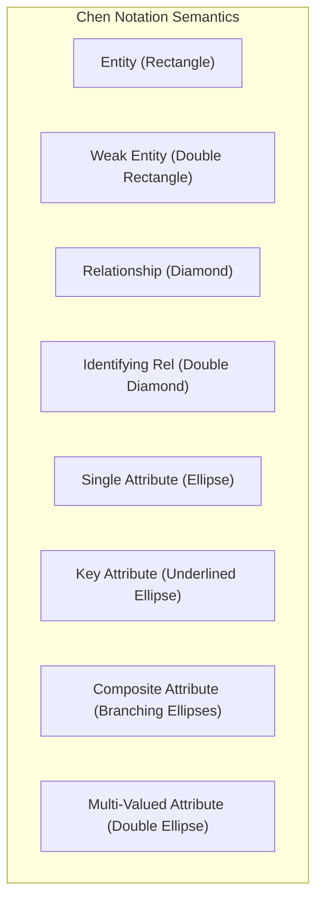
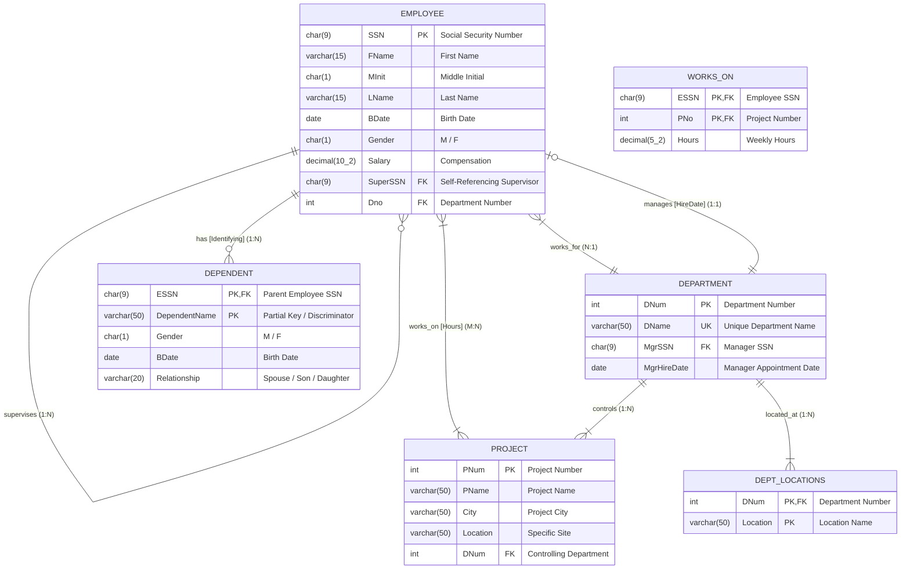
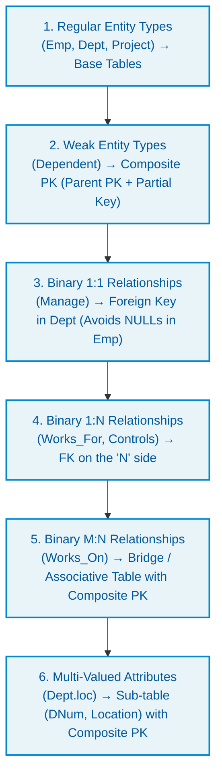
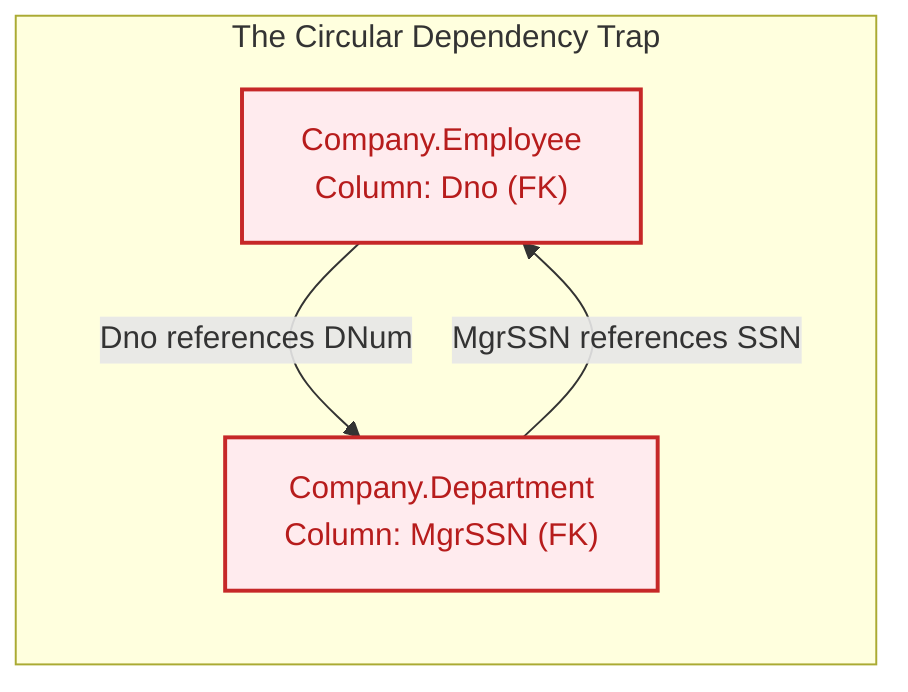
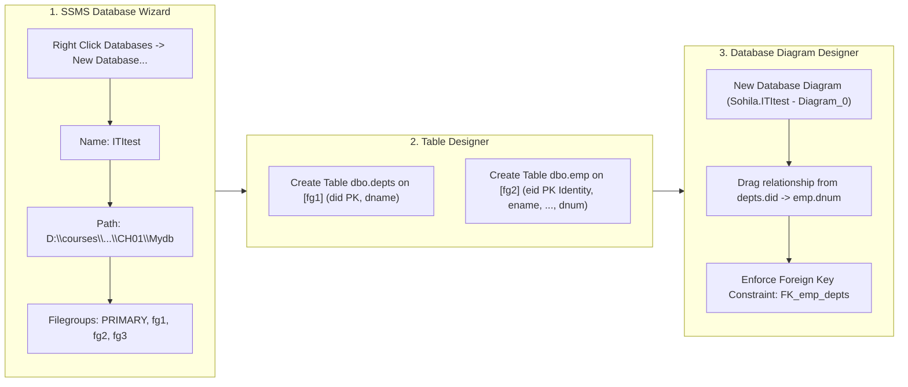
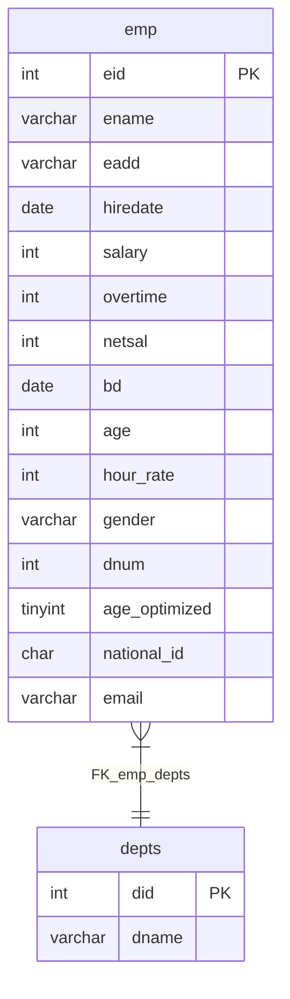

# Chapter 1 Case Study: ITItest Database & Company Relational Implementation

A comprehensive architectural and engineering breakdown of the **Company Enterprise Case Study** implemented in database **`ITItest`** from **[MaharaTech Course 2305: Implementing and Developing SQL Server Objects](https://maharatech.gov.eg/course/view.php?id=2305)** (*CH01_VID02: Create Database Using Wizard* through *CH01_VID05* by Eng. Rami Mohamed Abonagi).

> [!IMPORTANT]
> **Live Physical Database Configuration (`ITItest`)**:
> - **Database Name**: `ITItest`
> - **Physical File Storage Root**: `D:\courses\Data Science\Data Engineering\MaharaTech\Implementing and Developing SQL server objects\CH01\Mydb`
> - **Multi-Filegroup Architecture**:
>   - Primary Data File: `ITItest.mdf` on filegroup `[PRIMARY]` (8 MB, Autogrowth: 64 MB)
>   - Secondary Data File 1: `file2.ndf` on filegroup `[fg1]` (8 MB, Autogrowth: 64 MB)
>   - Secondary Data File 2: `file3.ndf` on filegroup `[fg2]` (8 MB, Autogrowth: 64 MB)
>   - Secondary Data File 3: `file4.ndf` on filegroup `[fg3]` (8 MB, Autogrowth: 64 MB)
>   - Transaction Log File: `ITItest_log.ldf` (8 MB, Autogrowth: 64 MB)
> - **Live Synchronizer**: Run `python scripts/sync_ititest_db.py --watch` to dynamically fetch tables and columns as you build them in the SSMS Wizard! (See [Live Schema Documentation](ititest-live-schema.md)).

---

## 1. Conceptual Chen-Notation ERD Breakdown

The provided diagram is the canonical **Company Database ERD** formulated using Peter Chen's notation and implemented within **`ITItest`**. Below is the full anatomical breakdown of all semantic constructs:



### Entity & Relationship Inventory



---

## 2. ER-to-Relational Mapping Transformation Rules

Transforming a conceptual Chen ERD into a normalized 3NF/BCNF relational database schema requires applying six strict relational mapping algorithms:



### Detailed Mapping Specification Matrix

| ER Construct | Chen Symbol | Relational Table Representation | Primary Key (PK) | Foreign Key(s) (FK) | Integrity / Cascading Rules |
| :--- | :--- | :--- | :--- | :--- | :--- |
| **`Emp` Entity** | Rectangle | `Company.Employee` | `SSN` | `SuperSSN -> Employee(SSN)`, `Dno -> Department(DNum)` | `ON DELETE NO ACTION` (Prevents orphan cycles) |
| **`name` Attribute** | Composite Oval | Flattened columns: `FName`, `MInit`, `LName` | N/A | N/A | `FName` and `LName` `NOT NULL` |
| **`Dept` Entity** | Rectangle | `Company.Department` | `DNum` | `MgrSSN -> Employee(SSN)` | `DName UNIQUE`; `MgrSSN` nullable during setup |
| **`loc` Attribute** | Double Oval (Multi-valued) | `Company.DeptLocations` | `(DNum, Location)` | `DNum -> Department(DNum)` | `ON DELETE CASCADE` (Delete locs if Dept removed) |
| **`project` Entity** | Rectangle | `Company.Project` | `PNum` | `DNum -> Department(DNum)` | `ON DELETE NO ACTION` |
| **`work` (M:N)** | Diamond | `Company.WorksOn` | `(ESSN, PNo)` | `ESSN -> Employee(SSN)`, `PNo -> Project(PNum)` | `ON DELETE CASCADE` for ESSN and PNo |
| **`Dependent`** | Double Rectangle (Weak) | `Company.Dependent` | `(ESSN, DependentName)` | `ESSN -> Employee(SSN)` | `ON DELETE CASCADE` (Child deleted if Emp deleted) |
| **`supervise` (1:N)** | Recursive Diamond | In `Company.Employee` (`SuperSSN`) | `SSN` | `SuperSSN -> Employee(SSN)` | Self-referencing FK, allows `NULL` for top CEO |

---

## 3. The Circular Dependency Challenge ("Chicken-and-Egg" FKs)

A famous architectural challenge in the ITI Company database is the **Circular Foreign Key Dependency** between `Employee` and `Department`:



### Why Does This Break Naive Scripts?
1. If you run `CREATE TABLE Employee` with `Dno REFERENCES Department(DNum)`, the engine throws:
   ```text
   Msg 1767, Level 16: Foreign key 'FK_Employee_Department' references invalid table 'Department'.
   ```
2. If you instead create `Department` first with `MgrSSN REFERENCES Employee(SSN)`, it fails because `Employee` does not exist yet!
3. Even after creating both tables with nullable FKs, an `INSERT` into `Employee` requires a valid `Dno`, but `Department` cannot be inserted without a valid `MgrSSN`!

### Production DBRE Solution:
1. **Phase 1 (Creation)**: Create tables without circular FK constraints (or leave `MgrSSN` and `Dno` unconstrained initially).
2. **Phase 2 (Constraint Binding)**: Apply the foreign keys via `ALTER TABLE ... ADD CONSTRAINT` after both tables exist.
3. **Phase 3 (Data Ingestion)**:
   * Insert Department with `MgrSSN = NULL`.
   * Insert Employee with `Dno = <Target Dept>`.
   * Update Department with `MgrSSN = <Manager SSN>`.

---

## 4. MaharaTech CH01_VID02: Create Database Using Wizard & Diagramming

In **CH01_VID02: Create Database Using Wizard**, Eng. Rami Mohamed Abonagi demonstrates visual database engineering using the **SSMS GUI**:



### Key Implementation Details in `ITItest` (`CH01\Mydb`):
1. **Primary & Secondary Data Files**:
   - `ITItest.mdf` on `[PRIMARY]` (8 MB, 64 MB growth)
   - `file2.ndf` on `[fg1]` (8 MB, 64 MB growth) -> designated for `dbo.depts`
   - `file3.ndf` on `[fg2]` (8 MB, 64 MB growth) -> designated for `dbo.emp`
   - `file4.ndf` on `[fg3]` (8 MB, 64 MB growth) -> designated for indexes and reporting
   - `ITItest_log.ldf` (8 MB, 64 MB growth)
2. **Tables Created**:
   - **`dbo.depts`**: Stored on `[fg1]`. Primary key `did` (INT). Attribute `dname` (VARCHAR(50)).
   - **`dbo.emp`**: Stored on `[fg2]`. Primary key `eid` (INT IDENTITY(1,1)). 12 attributes including defaults (`('cairo')`, `(getdate())`).
3. **Database Diagram & Foreign Key**:
   - Created database diagram in SSMS (`Sohila.ITItest - Diagram_0`).
   - Defined `FK_emp_depts` referencing `dbo.depts(did)` from `dbo.emp(dnum)`.
   - Enabled `Enforce Foreign Key Constraint = Yes` and `Check Existing Data On Creation = Yes`.

---

## 5. MaharaTech CH01_VID03: Create Database Using Code (T-SQL vs Wizard)

In **CH01_VID03: Create Database Using Code**, Eng. Rami transitions students from the graphical wizard to programmatic **Database-as-Code** via T-SQL scripts.

All concepts from the lecture are codified in [`src/01_storage_and_schema/01_create_database_code_ch01_vid03.sql`](file:///d:/courses/Data%20Science/Data%20Engineering/Projects/sql-server-data-platform/src/01_storage_and_schema/01_create_database_code_ch01_vid03.sql), tailored directly to your local environment:

### 1. Minimal Database Creation & Default Instance Storage Paths
```sql
USE [master];
GO

-- Minimal T-SQL command
CREATE DATABASE MyfirstDB;
GO

-- Where did SQL Server place these files?
-- Query SQL Server instance default paths:
SELECT 
    CAST(SERVERPROPERTY('InstanceDefaultDataPath') AS NVARCHAR(512)) AS [Default_Data_Path_MDF],
    CAST(SERVERPROPERTY('InstanceDefaultLogPath') AS NVARCHAR(512)) AS [Default_Log_Path_LDF];
```
> [!NOTE]
> On your machine, SQL Server stores default databases in `D:\SQL Server\MSSQL16.MSSQLSERVER\MSSQL\DATA\`. When no path is specified, SQL Server automatically creates `MyfirstDB.mdf` and `MyfirstDB_log.ldf` there.

---

### 2. Creating Database with Explicit Files, Filegroups, and Growth Limits
Instead of accepting arbitrary defaults, enterprise database reliability engineers (DBRE) declare exact sizes, growth increments, and maximum caps:

```sql
USE [master];
GO

CREATE DATABASE [MyDB]
ON PRIMARY
(
    NAME = N'MyDB_data',
    FILENAME = N'D:\courses\Data Science\Data Engineering\MaharaTech\Implementing and Developing SQL server objects\CH01\Mydb\MyDB_data.mdf',
    SIZE = 10MB,
    MAXSIZE = 100MB,
    FILEGROWTH = 5MB
),
FILEGROUP [MyDB_FG1]
(
    NAME = N'MyDB_fg1_data',
    FILENAME = N'D:\courses\Data Science\Data Engineering\MaharaTech\Implementing and Developing SQL server objects\CH01\Mydb\MyDB_fg1_data.ndf',
    SIZE = 8MB,
    MAXSIZE = 100MB,
    FILEGROWTH = 5MB
)
LOG ON
(
    NAME = N'MyDB_log',
    FILENAME = N'D:\courses\Data Science\Data Engineering\MaharaTech\Implementing and Developing SQL server objects\CH01\Mydb\MyDB_log.ldf',
    SIZE = 5MB,
    MAXSIZE = 50MB,
    FILEGROWTH = 5MB
);
GO
```

---

### 3. Backing Up the Database to Physical Disk (`.bak`)
In the video, Eng. Rami runs `Backup DataBase Mydb to disk='e:\mydb.bak'`. On your workstation:

```sql
BACKUP DATABASE [MyDB]
TO DISK = N'D:\courses\Data Science\Data Engineering\MaharaTech\Implementing and Developing SQL server objects\CH01\Mydb\MyDB.bak'
WITH FORMAT,
     INIT,
     NAME = N'MyDB-Full Database Backup (CH01_VID03)',
     STATS = 25;
GO
```

---

### 4. Dropping a Database Safely (Handling Open Connections)
Running `DROP DATABASE MyDB` in SSMS often triggers **Error 3702** (*"Cannot drop database 'MyDB' because it is currently in use"*). The production pattern is:

```sql
USE [master];
GO

-- Forcefully close active sessions and rollback uncommitted transactions
ALTER DATABASE [MyDB] SET SINGLE_USER WITH ROLLBACK IMMEDIATE;
DROP DATABASE [MyDB];
GO
```

---

### 5. Restoring a Database from Disk Backup (`.bak`)
To restore the database from its backup file:

```sql
USE [master];
GO

-- Verify contents of the backup media
RESTORE FILELISTONLY 
FROM DISK = N'D:\courses\Data Science\Data Engineering\MaharaTech\Implementing and Developing SQL server objects\CH01\Mydb\MyDB.bak';

-- Restore and bring database online
RESTORE DATABASE [MyDB]
FROM DISK = N'D:\courses\Data Science\Data Engineering\MaharaTech\Implementing and Developing SQL server objects\CH01\Mydb\MyDB.bak'
WITH REPLACE,
     RECOVERY,
     STATS = 25;
GO
```

---

### Comparison: Wizard (VID02) vs Code (VID03)
| Criterion | SSMS Wizard Approach (VID02) | T-SQL Code-First Approach (VID03) |
| :--- | :--- | :--- |
| **Reproducibility** | Manual point-and-click; cannot be automated | 100% automated via `.sql` scripts and CI/CD |
| **Storage Precision** | Easy to miss filegroup assignment | Explicit `ON [fg1]` and `LOG ON` declarations |
| **Growth Management** | Defaults to arbitrary percentage growth | Explicit `FILEGROWTH = 5MB` prevents fragmentation |
| **Disaster Recovery** | Manual right-click wizard | Scriptable `BACKUP` and `RESTORE` commands |
| **Version Control** | Binary `.mdf` cannot be diffed | Plaintext SQL with full Git history and code reviews |

---

## 5. Case Study T-SQL Verification & Query Patterns

Once deployed or synchronized via `src/01_storage_and_schema/05_ititest_case_study_schema.sql` into **`ITItest`**, the following canonical queries validate the model:

### 1. Hierarchical Organization Chart (Recursive CTE)
```sql
USE [ITItest];
GO

WITH OrgChart AS (
    -- Anchor: CEO / Top-level Manager (SuperSSN is NULL)
    SELECT SSN, FName + ' ' + LName AS EmployeeName, SuperSSN, 1 AS OrgLevel
    FROM Employee
    WHERE SuperSSN IS NULL

    UNION ALL

    -- Recursive Member: Direct Reports
    SELECT e.SSN, e.FName + ' ' + e.LName, e.SuperSSN, o.OrgLevel + 1
    FROM Employee e
    INNER JOIN OrgChart o ON e.SuperSSN = o.SSN
)
SELECT OrgLevel, REPLICATE('  |--', OrgLevel - 1) + EmployeeName AS Hierarchy
FROM OrgChart
ORDER BY OrgLevel;
```

### 2. Multi-Department Project Effort Matrix (M:N Workload Aggregation)
```sql
USE [ITItest];
GO

SELECT 
    d.DName AS DepartmentName,
    p.PName AS ProjectName,
    COUNT(w.ESSN) AS TotalAssignedEmployees,
    ISNULL(SUM(w.Hours), 0) AS TotalWeeklyHours
FROM Project p
INNER JOIN Department d ON p.DNum = d.DNum
LEFT JOIN WorksOn w ON p.PNum = w.PNo
GROUP BY d.DName, p.PName
ORDER BY d.DName, TotalWeeklyHours DESC;
```

### 3. Cascade Delete Proof (Weak Entity Lifecycle)
```sql
USE [ITItest];
GO

-- When an Employee is deleted, all their Dependents in Dependent 
-- are automatically purged via ON DELETE CASCADE without orphan remnants.
DELETE FROM Employee WHERE SSN = '999887777';
SELECT * FROM Dependent WHERE ESSN = '999887777'; -- Returns 0 rows!
```
---

## 6. Live Synchronized Schema from `ITItest` (`CH01\Mydb`)

<!-- LIVE_ITITEST_SCHEMA_START -->

> [!NOTE]
> **Live SSMS Synchronization**: Auto-synchronized from local SQL Server instance (`-S .`) database **`ITItest`** at `2026-09-18 19:17:25 UTC`.
> **Database File Storage Root**: `D:\courses\Data Science\Data Engineering\MaharaTech\Implementing and Developing SQL server objects\CH01\Mydb`

### 6.1 Physical Filegroup Allocations (`CH01\Mydb`)
| Logical File | Filegroup | Type | Size | Growth | Physical Disk Path |
| :--- | :--- | :--- | :--- | :--- | :--- |
| **`ITItest`** | `PRIMARY` | `ROWS` | `8 MB` | `64 MB` | `D:\courses\Data Science\Data Engineering\MaharaTech\Implementing and Developing SQL server objects\CH01\Mydb\ITItest.mdf` |
| **`file2`** | `fg1` | `ROWS` | `8 MB` | `64 MB` | `D:\courses\Data Science\Data Engineering\MaharaTech\Implementing and Developing SQL server objects\CH01\Mydb\file2.ndf` |
| **`file3`** | `fg2` | `ROWS` | `8 MB` | `64 MB` | `D:\courses\Data Science\Data Engineering\MaharaTech\Implementing and Developing SQL server objects\CH01\Mydb\file3.ndf` |
| **`file4`** | `fg3` | `ROWS` | `8 MB` | `64 MB` | `D:\courses\Data Science\Data Engineering\MaharaTech\Implementing and Developing SQL server objects\CH01\Mydb\file4.ndf` |
| **`ITItest_log`** | `N/A (LOG)` | `LOG` | `8 MB` | `64 MB` | `D:\courses\Data Science\Data Engineering\MaharaTech\Implementing and Developing SQL server objects\CH01\Mydb\ITItest_log.ldf` |

### 6.2 Live Relational Tables Catalog
Currently **2 tables** active in `ITItest`:

| Schema | Table Name | Storage Filegroup | Row Count | Primary Key | Columns | Foreign Keys |
| :--- | :--- | :--- | :--- | :--- | :--- | :--- |
| `dbo` | **`depts`** | `fg1` | `1` | `did` | `2 cols` | `0 FKs` |
| `dbo` | **`emp`** | `fg2` | `1` | `eid` | `15 cols` | `1 FKs` |

### 6.3 Live Reverse-Engineered ER Diagram



### 6.4 Detailed Table Column Definitions

#### Table: `dbo.depts` (Storage: `[fg1]`)
| Column Name | Data Type | Nullable | Identity | Default | PK |
| :--- | :--- | :--- | :--- | :--- | :--- |
| `did` | `INT` | `NO` | `NO` | `-` | [PK] |
| `dname` | `VARCHAR(50)` | `YES` | `NO` | `-` |  |

#### Table: `dbo.emp` (Storage: `[fg2]`)
| Column Name | Data Type | Nullable | Identity | Default | PK |
| :--- | :--- | :--- | :--- | :--- | :--- |
| `eid` | `INT` | `NO` | `YES` | `-` | [PK] |
| `ename` | `VARCHAR(50)` | `NO` | `NO` | `-` |  |
| `eadd` | `VARCHAR(50)` | `YES` | `NO` | `('cairo')` |  |
| `hiredate` | `DATE` | `YES` | `NO` | `(getdate())` |  |
| `salary` | `INT` | `YES` | `NO` | `-` |  |
| `overtime` | `INT` | `YES` | `NO` | `-` |  |
| `netsal` | `INT` | `YES` | `NO` | `-` |  |
| `bd` | `DATE` | `YES` | `NO` | `-` |  |
| `age` | `INT` | `YES` | `NO` | `-` |  |
| `hour_rate` | `INT` | `YES` | `NO` | `-` |  |
| `gender` | `VARCHAR(1)` | `YES` | `NO` | `-` |  |
| `dnum` | `INT` | `YES` | `NO` | `-` |  |
| `age_optimized` | `TINYINT` | `YES` | `NO` | `-` |  |
| `national_id` | `CHAR(14)` | `YES` | `NO` | `-` |  |
| `email` | `VARCHAR(100)` | `YES` | `NO` | `-` |  |

<!-- LIVE_ITITEST_SCHEMA_END -->
