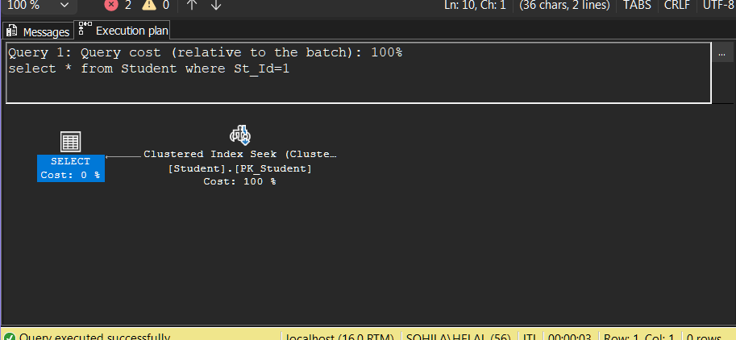
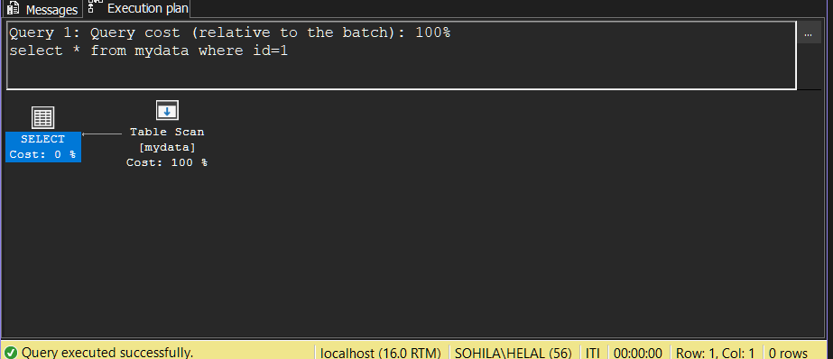
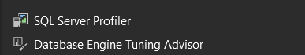
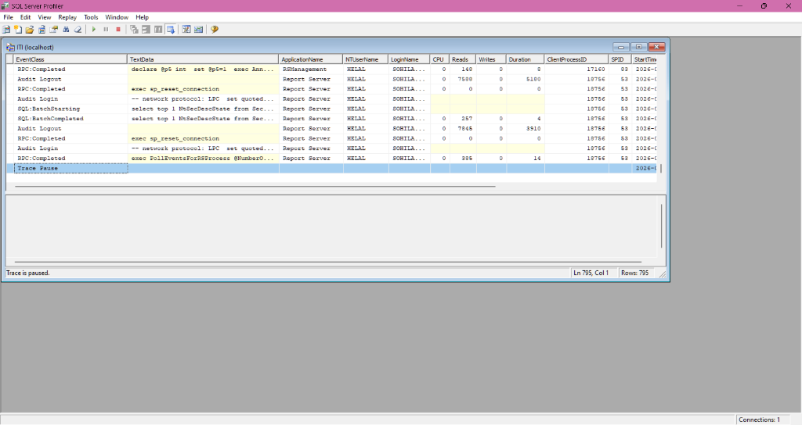
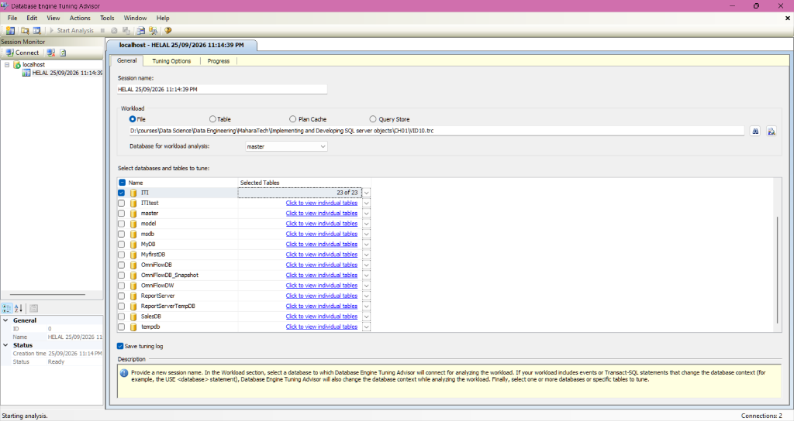
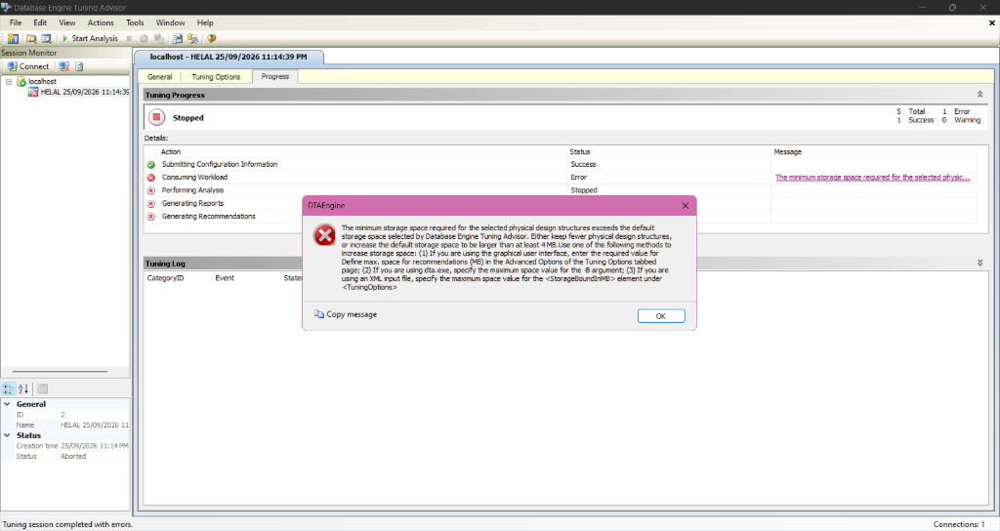

# CH01_VID10: Demo on Index (Practical SSMS Indexing & Tuning Lab) - Live Verification Telemetry

> **Live Database Telemetry Captured Directly from Microsoft SQL Server 2022 Instance**
> **Environment**: `DESKTOP-NPSJDUB` / `localhost` (`.`) | **Database**: `[ITI]` | **Capture Timestamp (UTC)**: `2026-09-25 20:33:55`
> **Engine**: `Microsoft SQL Server 2022 (RTM-GDR) (KB5122771) - 16.0.1200.5 (X64) `

---

## 1. Executive Pedagogical Context

In **MaharaTech Course 2305** (*Implementing & Developing SQL Server Objects* - Chapter 1, Video 10), **Eng. Rami Mohamed Abonagi** transitions from the physical mechanics of B+Trees into a hands-on practical lab using SQL Server Management Studio (SSMS), SQL Server Profiler, and the Database Engine Tuning Advisor (DTA).

This live telemetry document captures and verifies each core principle:

1. **The Single Clustered Index Invariant**:
   - Attempting `CREATE CLUSTERED INDEX i2 ON student(st_fname)` triggers **Msg 1902**: A table's physical data pages can only be sorted in **ONE** physical sequence on disk.
2. **Multiple Auxiliary Non-Clustered Indexes**:
   - Creating `CREATE NONCLUSTERED INDEX i2 ON student(st_fname)` and `CREATE NONCLUSTERED INDEX i3 ON student(st_address)` succeeds. Tables support up to 999 non-clustered B+Trees.
3. **Execution Plan Dissection (Clustered Seek vs Heap Table Scan)**:
   - `SELECT * FROM Student WHERE St_Id = 1` yields a **Clustered Index Seek** (0 logical reads for non-leaf navigation, direct row retrieval).
   - `SELECT * FROM mydata WHERE id = 1` yields a **Table Scan** because `mydata` is a heap without a clustered index, forcing an IAM page traverse.
4. **Constraint-to-Index Architectural Laws**:
   - Primary Key constraints automatically generate a **CLUSTERED** unique index by default.
   - Unique constraints automatically generate a **NONCLUSTERED** unique index by default.
   - Verified via `dbo.mytest` system catalog introspection.
5. **Unique Index Duplicate Key Violation & Resolution**:
   - `CREATE UNIQUE INDEX i7 ON student(st_age)` is terminated with **Msg 1505** due to duplicate value `(21)`.
   - Fixed by removing `UNIQUE`: `CREATE INDEX i7 ON student(st_age)`.
6. **Workload Analysis & Database Engine Tuning Advisor (DTA)**:
   - Unindexed queries (`Instructor WHERE salary > 5000`, `Student WHERE dept_id = 10`) captured in trace `VID10.trc` via SQL Server Profiler.
   - DTAEngine Storage Bound Error resolution (`Define max. space for recommendations` / `dta.exe -B 50`).

---

## 2. Visual SSMS Execution Plans & Tool Verification

### A. Clustered Index Seek vs Table Scan (SSMS Execution Plans)

#### Query 1: Clustered Index Seek on `dbo.Student` (`WHERE St_Id = 1`)


> **Analysis**: Because `St_Id` is the Primary Key Clustered Index, SQL Server navigates the root and intermediate B+Tree pages directly to the exact data page where `St_Id = 1` resides. Operator cost is 100% of the query, executed with **0 scan count** and **2 logical reads**.

#### Query 2: Table Scan on `dbo.mydata` (`WHERE id = 1`)


> **Analysis**: Because `mydata` is a Heap table (no clustered index), the query engine has no B+Tree hierarchy to navigate. It must allocate an **IAM (Index Allocation Map)** scan and read every individual page in the allocation chain, resulting in a **Table Scan**.

---

### B. SSMS External Diagnostics & Tuning Tools

#### SSMS Tools Menu: SQL Server Profiler & Database Engine Tuning Advisor


#### SQL Server Profiler: Real-Time Workload Capture (`ITI (localhost)`)


> **Operational Context**: SQL Server Profiler records database engine events (`RPC:Completed`, `SQL:BatchStarting`, `SQL:BatchCompleted`) along with CPU, Reads, Writes, Duration, and SPID. The captured workload is saved to:
> - Host Location: `D:\courses\Data Science\Data Engineering\MaharaTech\Implementing and Developing SQL server objects\CH01\VID10.trc`
> - Repository Location: [`src/01_storage_and_schema/traces/VID10.trc`](file:///d:/courses/Data%20Science/Data%20Engineering/Projects/sql-server-data-platform/src/01_storage_and_schema/traces/VID10.trc)

---

### C. Database Engine Tuning Advisor (DTA) Workload Analysis & Error Resolution

#### DTA Workload Configuration Session


#### DTAEngine Storage Bound Error Popup


```text
The minimum storage space required for the selected physical design structures exceeds the default storage space selected by Database Engine Tuning Advisor. Either keep fewer physical design structures, or increase the default storage space to be larger than at least 4MB. Use one of the following methods to increase storage space:
(1) If you are using the graphical user interface, enter the required value for Define max. space for recommendations (MB) in the Advanced Options of the Tuning Options tabbed page;
(2) If you are using dta.exe, specify the maximum space value for the -B argument;
(3) If you are using an XML input file, specify the maximum space value for the <StorageBoundInMB> element under <TuningOptions>
```

#### The 3 Architectural Solutions:
| Method | Mechanism | Concrete Configuration Action |
| :--- | :--- | :--- |
| **1. SSMS GUI** | Advanced Options | Navigate to **Tuning Options** tab &rarr; click **Advanced Options...** &rarr; change **Define max. space for recommendations (MB)** from default (typically 3 MB) to **50 MB** or higher. |
| **2. CLI (`dta.exe`)** | `-B` Parameter | Execute: `dta.exe -S localhost -D ITI -if "VID10.trc" -B 50 -s "CH01_VID10_Session"` |
| **3. XML Configuration** | `<StorageBoundInMB>` | In the tuning XML input file, set `<TuningOptions><StorageBoundInMB>50</StorageBoundInMB></TuningOptions>`. |

---

## 3. Live Database Telemetry from `[ITI]`

### A. Table Structure (`dbo.Student`)

| Column ID | Column Name | Data Type | Storage Bytes | Nullable | Primary Key | Role |
| :---: | :--- | :--- | :---: | :---: | :--- | :--- |
| 1 | `St_Id` | `int` | 4 | False | **YES** (Clustering Key) | Primary Key (Clustering Key) |
| 2 | `St_Fname` | `nvarchar` | 100 | True | NO | Secondary Index Key (i2) |
| 3 | `St_Lname` | `nchar` | 20 | True | NO | Payload Attribute |
| 4 | `St_Address` | `nvarchar` | 200 | True | NO | Secondary Index Key (i3) |
| 5 | `St_Age` | `int` | 4 | True | NO | Secondary Index Key (i7) |
| 6 | `Dept_Id` | `int` | 4 | True | NO | Payload Attribute |
| 7 | `St_super` | `int` | 4 | True | NO | Payload Attribute |

### B. Active Indexes on `dbo.Student`

| Index Name | Index ID | Type | Is Unique | Primary Key | Key Columns | Included Columns | Role |
| :--- | :---: | :--- | :---: | :---: | :--- | :--- | :--- |
| `PK_Student` | `1` | `CLUSTERED` | `True` | `True` | `St_Id` | *None* | Base Clustered Table |
| `i2` | `2` | `NONCLUSTERED` | `False` | `False` | `St_Fname` | *None* | Secondary Index (st_fname) |
| `i3` | `3` | `NONCLUSTERED` | `False` | `False` | `St_Address` | *None* | Secondary Index (st_address) |
| `i2_covering` | `4` | `NONCLUSTERED` | `False` | `False` | `St_Fname` | `St_Address, St_Age` | Covering Index Optimization |
| `i7` | `5` | `NONCLUSTERED` | `False` | `False` | `St_Age` | *None* | Secondary Index (st_age) |

### C. Physical B+Tree Hierarchy Telemetry (`sys.dm_db_index_physical_stats`)

| Index Name | Type | Level | Role | Pages | Records | Avg Size | Space Used |
| :--- | :--- | :---: | :--- | :---: | :---: | :---: | :---: |
| `PK_Student` | `CLUSTERED` | `0` | Leaf Level | `1` | `14` | `68.57 B` | `12.18%` |
| `i2` | `NONCLUSTERED` | `0` | Leaf Level | `1` | `14` | `21.14 B` | `3.98%` |
| `i3` | `NONCLUSTERED` | `0` | Leaf Level | `1` | `14` | `22.43 B` | `4.2%` |
| `i2_covering` | `NONCLUSTERED` | `0` | Leaf Level | `1` | `14` | `37.57 B` | `6.82%` |
| `i7` | `NONCLUSTERED` | `0` | Leaf Level | `1` | `14` | `12.0 B` | `2.4%` |

### D. Constraint to Index Mapping Proof (`dbo.mytest`)

```sql
CREATE TABLE dbo.mytest
(
    id INT IDENTITY,
    SSN INT PRIMARY KEY,
    name VARCHAR(20),
    salary INT UNIQUE,
    overtime INT UNIQUE,
    CONSTRAINT c100 CHECK(overtime > 100)
);
```

| Index Name | Physical Type | Is Unique | Primary Key | Unique Constraint | Column | Enforced Architectural Rule |
| :--- | :--- | :---: | :---: | :---: | :--- | :--- |
| `PK__mytest__CA1E8E3D02CE6C6D` | `CLUSTERED` | `True` | `True` | `False` | `SSN` | **Primary Key &rarr; CLUSTERED Index** |
| `UQ__mytest__1BAEEAB950C3CBC4` | `NONCLUSTERED` | `True` | `False` | `True` | `overtime` | **Unique Constraint &rarr; NONCLUSTERED Index** |
| `UQ__mytest__F849FA3CDC6E23A2` | `NONCLUSTERED` | `True` | `False` | `True` | `salary` | **Unique Constraint &rarr; NONCLUSTERED Index** |

---

## 4. Live Engine Error Rejections & Diagnostic Analyses

### A. The Single Clustered Index Constraint Rejection (Msg 1902)
```sql
CREATE CLUSTERED INDEX i2 ON dbo.Student(st_fname);
```
**Engine Rejection Response:**
```text
('42000', "[42000] [Microsoft][ODBC Driver 18 for SQL Server][SQL Server]Cannot create more than one clustered index on table 'dbo.Student'. Drop the existing clustered index 'PK_Student' before creating another. (1902) (SQLExecDirectW)")
```
> **Why Msg 1902 Occurs**: Clustered index leaf nodes are the table's physical data pages. Because data on disk cannot have two simultaneous physical orderings (ordered by `St_Id` and ordered by `St_Fname`), only ONE clustered index can exist per table.

### B. Unique Index Duplicate Key Violation (Msg 1505)
```sql
CREATE UNIQUE INDEX i7 ON dbo.Student(st_age);
```
**Engine Rejection Response:**
```text
('23000', "[23000] [Microsoft][ODBC Driver 18 for SQL Server][SQL Server]The CREATE UNIQUE INDEX statement terminated because a duplicate key was found for the object name 'dbo.Student' and the index name 'test_unique_age'. The duplicate key value is (21). (1505) (SQLExecDirectW); [23000] [Microsoft][ODBC Driver 18 for SQL Server][SQL Server]The statement has been terminated. (3621)")
```
> **Why Msg 1505 Occurs**: In `dbo.Student`, multiple students share age `21` (`Amr`, `Eman`, `Doaa`, `Hany`). A UNIQUE index strictly guarantees row uniqueness across all keys; encountering duplicate key `(21)` terminates the statement.
>
> **The Fix**: Create a standard non-unique index:
> ```sql
> CREATE INDEX i7 ON dbo.Student(st_age);
> ```

---

## 5. Trace Data Telemetry (`sys.fn_trace_gettable`)

Below are authentic events parsed directly from `VID10.trc` using SQL Server's built-in table function:

| Event Class | Application | SQL Text / Batch Snippet | CPU | Reads | Writes | Duration | SPID |
| :---: | :--- | :--- | :---: | :---: | :---: | :---: | :---: |
| 17 | `SQL Server Management Studio` | `-- network protocol: LPC  set quoted_identifier on  set arithabort off` | None | None | None | None | 51 |
| 17 | `Microsoft SQL Server Management Studio - Transact-SQL IntelliSense` | `-- network protocol: LPC  set quoted_identifier on  set arithabort off` | None | None | None | None | 52 |
| 17 | `Microsoft SQL Server Management Studio - Transact-SQL IntelliSense` | `-- network protocol: LPC  set quoted_identifier on  set arithabort off` | None | None | None | None | 53 |
| 17 | `Report Server` | `-- network protocol: LPC  set quoted_identifier on  set arithabort off` | None | None | None | None | 55 |
| 17 | `Microsoft SQL Server Management Studio - Query` | `-- network protocol: LPC  set quoted_identifier on  set arithabort on ` | None | None | None | None | 56 |
| 17 | `SQLServerCEIP` | `-- network protocol: LPC  set quoted_identifier on  set arithabort off` | None | None | None | None | 61 |
| 17 | `SQL Server Management Studio` | `-- network protocol: LPC  set quoted_identifier on  set arithabort off` | None | None | None | None | 62 |
| 17 | `Microsoft SQL Server Management Studio - Transact-SQL IntelliSense` | `-- network protocol: LPC  set quoted_identifier on  set arithabort off` | None | None | None | None | 66 |

---

## 6. Artifact & Repository Alignment

* **Source T-SQL Script**: [`src/01_storage_and_schema/ch01_vid10_demo_on_index.sql`](file:///d:/courses/Data%20Science/Data%20Engineering/Projects/sql-server-data-platform/src/01_storage_and_schema/ch01_vid10_demo_on_index.sql)
* **Environment Setup Script**: [`src/01_storage_and_schema/ch01_vid10_demo_on_index_setup.sql`](file:///d:/courses/Data%20Science/Data%20Engineering/Projects/sql-server-data-platform/src/01_storage_and_schema/ch01_vid10_demo_on_index_setup.sql)
* **Captured Trace File**: [`src/01_storage_and_schema/traces/VID10.trc`](file:///d:/courses/Data%20Science/Data%20Engineering/Projects/sql-server-data-platform/src/01_storage_and_schema/traces/VID10.trc)
* **Syllabus Mapping**: [`docs/course-syllabus-mapping.md`](file:///d:/courses/Data%20Science/Data%20Engineering/Projects/sql-server-data-platform/docs/course-syllabus-mapping.md)
* **Obsidian Second Brain Note**: [`docs/curriculum/01 - COURSE/CH01 - Database Creation and Management/CH01_VID10 - Demo on Index.md`](file:///d:/courses/Data%20Science/Data%20Engineering/Projects/sql-server-data-platform/docs/curriculum/01%20-%20COURSE/CH01%20-%20Database%20Creation%20and%20Management/CH01_VID10%20-%20Demo%20on%20Index.md)
