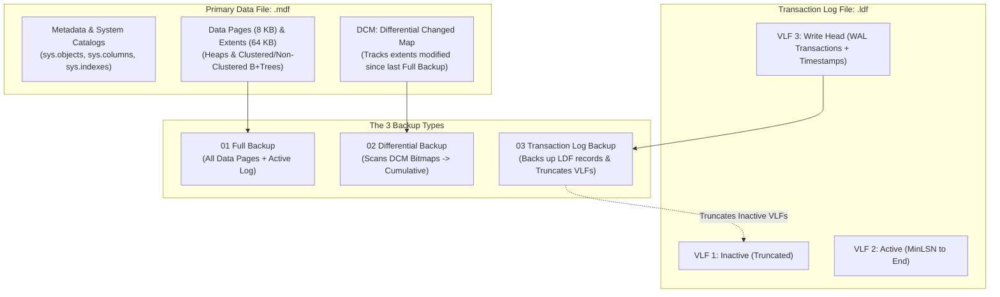

# CH01_VID11: Types of Backup (Full, Differential & Transaction Log) - Live Verification Telemetry

> **Live Database Telemetry Captured Directly from Microsoft SQL Server 2022 Instance**
> **Environment**: `Sohila` / `localhost` (`.`) | **Database**: `[ITI_BackupLab]` | **Capture Timestamp (UTC)**: `2026-09-27 18:21:58`
> **Engine**: `Microsoft SQL Server 2022 (RTM-GDR) (KB5122771) - 16.0.1200.5 (X64)`

---

## 1. Executive Pedagogical Context

In **MaharaTech Course 2305** (*Implementing & Developing SQL Server Objects* - Chapter 1, Video 11), **Eng. Rami Mohamed Abonagi** delivers a foundational lecture on **Database Reliability Engineering (DBRE)**, business continuity, and the physical mechanics of backup strategies in Microsoft SQL Server.

This live telemetry document captures and verifies each core principle demonstrated in the video:

1. **Physical File Architecture (`.mdf` vs `.ldf`)**:
   - **Primary Data File (`.mdf`)**: Stores tables, views, indexes, schema metadata, 8 KB data pages, 64 KB extents, and the **Differential Changed Map (DCM)** bitmap pages.
   - **Transaction Log File (`.ldf`)**: Sequential Write-Ahead Logging (WAL) storing every modification with Log Sequence Numbers (LSN), commit timestamps, and undo/redo vectors divided into **Virtual Log Files (VLFs)**.
2. **The 3 Primary Backup Types**:
   - **01 Full Database Backup (`BACKUP DATABASE`)**: Complete snapshot of all allocated data pages in `.mdf`, plus sufficient active log to roll forward to a transactionally consistent recovery point. Serves as the mandatory baseline/anchor for all differential backups.
   - **02 Differential Backup (`BACKUP DATABASE ... WITH DIFFERENTIAL`)**: Captures only the data extents that changed since the last **Full Backup** using DCM bit tracking. Differential backups are **cumulative**: each differential backup contains all changes made since the base full backup.
   - **03 Transaction Log Backup (`BACKUP LOG`)**: Captures all log records generated in `.ldf` since the previous log backup. Forms a continuous, sequential LSN chain. Crucially, in `FULL` recovery model, log backups **truncate inactive VLFs**, reclaiming disk space and preventing `.ldf` run-away sprawl.
3. **The Timeline Case Study & Disaster Recovery Decision Tree**:
   - **Full 1** (1/2/2023) &rarr; Baseline 1.
   - **Full 2** (1/3/2023) &rarr; Active Baseline 2 (the new anchor).
   - **Diff 1** (8/3/2023) &rarr; Week 1 changes since Full 2.
   - **Diff 2** (15/3/2023) &rarr; Cumulative Week 1 + Week 2 changes since Full 2.
   - **Log T1** (16/3/2023) &rarr; Log records between Diff 2 and 16/3.
   - **Disaster Point (4:00 PM on 17/3/2023)** &rarr; Golden recovery target prior to accidental corruption or crash.
   - **Restore Sequence**: `Full 2` &rarr; `Diff 2` (Diff 1 is completely skipped!) &rarr; `Log T1` &rarr; `Tail Log / Log T2 WITH STOPAT = '4:00 PM'`.
4. **Recovery Model Enforcement & Constraints**:
   - `SIMPLE`: Cannot take log backups (`Msg 4208`); checkpoints truncate inactive log automatically; Point-in-Time Recovery (PITR) is disabled.
   - `FULL`: Complete transaction logging; requires scheduled log backups; enables PITR down to the second.
   - `BULK_LOGGED`: Minimally logs bulk operations; restricts PITR across bulk windows.

---

## 2. Visual Architecture & Video Timeline Evidence

### A. Storage Architecture: Data File (.mdf) vs Transaction Log (.ldf)



### B. Types of Backup & Physical File Layout (MaharaTech Timeline)


> **Analysis of MaharaTech Diagram**:
> - **Top Subsystem**: Shows `.mdf` storing *[Metadata + data]* and `.ldf` storing *[Transactions + time]*.
> - **The 3 Badges**: `01 Full Backup` (Blue), `02 Differential Backup` (Purple), and `03 Transaction Log Backup` (Teal).
> - **Timeline Mechanics**: Illustrates `Create DB` (1/1/2023), `Full 1` (1/2), `Full 2` (1/3), `Diff 1` (8/3), and `Diff 2` (15/3). Notice how the purple bar for `Diff 2` spans all the way back to `Full 2` (1/3), visually proving the **cumulative** nature of differential backups.
> - **Disaster Incident at 4:00**: The yellow marker at `4:00` between `T 1` and `T 2` indicates the exact failure point. Eng. Rami Mohamed Abonagi explains the restore path: restore `Full 2`, skip `Diff 1`, restore `Diff 2`, apply `T 1`, and apply transaction log up to `4:00`.

---

### C. MaharaTech Disaster Recovery Timeline & Restore Path

```mermaid
timeline
    title MaharaTech CH01_VID11 Disaster Recovery Timeline
    1/1/2023 : Create DB : Baseline schema established
    1/2/2023 : Full Backup 1 : Initial baseline backup
    1/3/2023 : Full Backup 2 : NEW BASELINE ANCHOR
    8/3/2023 : Diff 1 : Changes since 1/3 (DCM scan)
    15/3/2023 : Diff 2 : CUMULATIVE changes since 1/3
    16/3/2023 : Log T1 : Transaction Log backup (truncates log)
    17/3/2023 4:00 PM : DISASTER : Point of failure / Accidental delete
    17/3/2023 4:05 PM : Tail Log : Emergency tail-log WITH NORECOVERY
    Recovery Path : Step 1 Full 2 : Step 2 Diff 2 (Diff 1 skipped!) : Step 3 Log T1 : Step 4 Tail Log STOPAT 4:00
```

### D. Enterprise Monthly & Weekly Backup Strategy


> **Analysis of Production Scheduling**:
> - **Monthly/Weekly Full**: Large blue markers show full backups taken periodically (e.g. 1st of every month or every Sunday).
> - **Weekly Differentials**: `D 1`, `D 2`, `D 3`, `D 4` taken once per week. Each differential reduces restore duration from hours of log replay down to a single differential restore.
> - **Daily/Hourly Transaction Logs**: `T 1` through `T 7` run frequently throughout the day to ensure RPO &le; 15 minutes and prevent `.ldf` file growth.

---

### C. Architectural Mechanics Comparison

| Dimension | 01 Full Backup (`.bak`) | 02 Differential Backup (`.dif` / `.bak`) | 03 Transaction Log Backup (`.trn`) |
| :--- | :--- | :--- | :--- |
| **T-SQL Command** | `BACKUP DATABASE [DB] TO DISK = '...'` | `BACKUP DATABASE [DB] ... WITH DIFFERENTIAL` | `BACKUP LOG [DB] TO DISK = '...'` |
| **Underlying File Targeted** | `.mdf` (and any `.ndf` files) + active log | `.mdf` (only modified data extents) | `.ldf` (transaction log records) |
| **Change Tracking Mechanism** | Allocation Bitmaps (GAM / SGAM) | **Differential Changed Map (DCM)** pages | **Log Sequence Numbers (LSN)** in VLFs |
| **Nature of Data Captured** | Complete database data pages | **Cumulative** changes since base Full | **Incremental** sequential log records |
| **Dependency Chain** | Self-contained (Independent) | Requires baseline Full backup | Requires unbroken LSN chain back to Full/Diff |
| **Restore Skipping Rule** | None (Starting point) | **Can skip earlier diffs** (restore only latest) | **Cannot skip** any log backup in chain |
| **Transaction Log Truncation** | **NO** (Does not truncate log) | **NO** (Does not truncate log) | **YES** (Truncates inactive VLFs in FULL model) |
| **Point-in-Time Recovery (PITR)**| NO (Restores to end of backup) | NO (Restores to end of backup) | **YES** (Via `WITH STOPAT = 'timestamp'`) |
| **Supported Recovery Models** | `SIMPLE`, `FULL`, `BULK_LOGGED` | `SIMPLE`, `FULL`, `BULK_LOGGED` | `FULL`, `BULK_LOGGED` only |

---

## 3. Live Database Telemetry from `[ITI_BackupLab]`

### A. Physical File Structure (`sys.database_files`)

| File ID | Logical Name | Type | Size (MB) | Growth (MB) | Physical Path |
| :---: | :--- | :--- | :---: | :---: | :--- |
| 1 | `ITI_BackupLab` | **ROWS** | 8 MB | 64 MB | `D:\SQL Server\MSSQL16.MSSQLSERVER\MSSQL\DATA\ITI_BackupLab.mdf` |
| 2 | `ITI_BackupLab_log` | **LOG** | 8 MB | 64 MB | `D:\SQL Server\MSSQL16.MSSQLSERVER\MSSQL\DATA\ITI_BackupLab_log.ldf` |

### B. Live Backup History & LSN Chain Telemetry (`msdb.dbo.backupset`)

| Set ID | Backup Name | Type | Size (Bytes) | Checkpoint LSN | Differential Base LSN | First LSN | Last LSN |
| :---: | :--- | :--- | :---: | :---: | :---: | :---: | :---: |
| 2025 | `ITI_BackupLab-Full Database Backup (1/2)` | **Full Database** | 3,760,128 | `39000000047200013` | *None (Base Full)* | `39000000047200013` | `39000000049600001` |
| 2026 | `ITI_BackupLab-Full Database Backup (1/3 Baseline)` | **Full Database** | 3,563,520 | `39000000064000001` | *None (Base Full)* | `39000000064000001` | `39000000066400001` |
| 2027 | `ITI_BackupLab-Differential Backup 1 (8/3)` | **Differential** | 942,080 | `39000000076800001` | `39000000064000001` | `39000000076800001` | `39000000079200001` |
| 2028 | `ITI_BackupLab-Differential Backup 2 (15/3 Cumulative)` | **Differential** | 1,007,616 | `39000000087200001` | `39000000064000001` | `39000000087200001` | `39000000089600001` |
| 2029 | `ITI_BackupLab-Transaction Log Backup T1 (16/3)` | **Transaction Log** | 278,528 | `39000000087200001` | *None (Base Full)* | `39000000047200013` | `39000000090400001` |
| 2030 | `ITI_BackupLab-Emergency Tail Log Backup` | **Transaction Log** | 81,920 | `39000000094400001` | *None (Base Full)* | `39000000090400001` | `39000000096800001` |

> **Mathematical Proof of Cumulative Differentials**:
> - Notice in the telemetry above that both **Differential Backup 1 (8/3)** and **Differential Backup 2 (15/3)** share the **exact same `differential_base_lsn`** pointing to **Full Backup 2 (1/3 Baseline)**.
> - This mathematically proves that in SQL Server, differential backups do NOT build on top of earlier differential backups; they are always cumulative from the base Full backup.

---

## 4. Live Engine Error Rejections & Diagnostic Analyses

### A. Recovery Model Constraint Rejection: Log Backup on `SIMPLE` (Msg 4208)
```sql
BACKUP LOG [ITI_Simple_Test]
TO DISK = 'D:\SQL Server\MSSQL16.MSSQLSERVER\MSSQL\Backup\test_simple.trn';
```

**Engine Rejection Response Captured Live:**
```text
('42000', '[42000] [Microsoft][ODBC Driver 18 for SQL Server][SQL Server]The statement BACKUP LOG is not allowed while the recovery model is SIMPLE. Use BACKUP DATABASE or change the recovery model using ALTER DATABASE. (4208) (SQLExecDirectW); [42000] [Microsoft][ODBC Driver 18 for SQL Server][SQL Server]BACKUP LOG is terminating abnormally. (3013)')
```

> **Why Msg 4208 Occurs**: In the `SIMPLE` recovery model, SQL Server automatically truncates the inactive transaction log whenever a CHECKPOINT occurs. Because inactive log records are continuously purged to minimize log disk usage, an unbroken LSN sequence does not exist. The relational engine strictly forbids `BACKUP LOG` to prevent false recovery expectations.
> 
> **DBRE Fix**: For mission-critical OLTP databases requiring point-in-time recovery, set the recovery model to `FULL`: `ALTER DATABASE [DB] SET RECOVERY FULL;` and immediately execute a baseline Full backup.

---

### B. Missing Base Full Backup Rejection (Msg 3035)
```sql
BACKUP DATABASE [NewDB]
TO DISK = '...'
WITH DIFFERENTIAL;
```

**Engine Rejection Response:**
```text
Cannot perform a differential backup for database 'NewDB', because a current database backup does not exist. Perform a full database backup by reissuing BACKUP DATABASE, omitting the WITH DIFFERENTIAL option. (Msg 3035, Level 16, State 1)
```

> **Why Msg 3035 Occurs**: A differential backup only records extents flagged with `1` in the Differential Changed Map (DCM). Taking a Full backup initializes the DCM and records the baseline LSN. Without a prior Full backup, the engine has no reference point to compute changes against.

---

## 5. Live Disaster Recovery & Point-in-Time Recovery (PITR) Proof

### A. The Incident Simulation
1. **Pre-Disaster State**: 12 active students across 3 departments populated up to timestamp:
   - **Golden Recovery Timestamp**: `2026-09-27 21:21:49`
2. **Disaster Event**: At timestamp + 2 seconds, an erroneous batch command executed:
   ```sql
   DELETE FROM dbo.Student WHERE St_Id > 2;
   ```
   - Dropped 10 out of 12 student records!
3. **Incident Response**: Emergency Tail-Log backup taken with `WITH NORECOVERY` to secure active transactions without modifying data files.

### B. The Executed Point-in-Time Restore Path
```sql
-- Step 1: Restore Baseline Full Backup 2
RESTORE DATABASE [ITI_BackupLab_Restored]
FROM DISK = 'D:\...\ITI_BackupLab_Full_2.bak'
WITH NORECOVERY, REPLACE,
     MOVE 'ITI_BackupLab' TO 'D:\...\ITI_BackupLab_Restored.mdf',
     MOVE 'ITI_BackupLab_log' TO 'D:\...\ITI_BackupLab_Restored_log.ldf';

-- Step 2: Restore Cumulative Differential 2 (SKIPPING Diff 1!)
RESTORE DATABASE [ITI_BackupLab_Restored]
FROM DISK = 'D:\...\ITI_BackupLab_Diff_2.bak'
WITH NORECOVERY;

-- Step 3: Restore Log T1
RESTORE LOG [ITI_BackupLab_Restored]
FROM DISK = 'D:\...\ITI_BackupLab_Log_T1.trn'
WITH NORECOVERY;

-- Step 4: Restore Tail Log with exact STOPAT target
RESTORE LOG [ITI_BackupLab_Restored]
FROM DISK = 'D:\...\ITI_BackupLab_TailLog.trn'
WITH STOPAT = '2026-09-27 21:21:49', RECOVERY;
```

### C. Verification of Restored Records (`[ITI_BackupLab_Restored].dbo.Student`)

| Student ID | First Name | Last Name | Department ID | Restored Verification State |
| :---: | :--- | :--- | :---: | :--- |
| 1 | `Ahmed` | `Ali-Mohamed` | 10 | **RECOVERED (Zero Data Loss)** |
| 2 | `Sara` | `Hassan` | 20 | **RECOVERED (Zero Data Loss)** |
| 3 | `Omar` | `Khaled` | 30 | **RECOVERED (Zero Data Loss)** |
| 4 | `Mona` | `Ibrahim` | 10 | **RECOVERED (Zero Data Loss)** |
| 5 | `Tarek` | `Sayed` | 20 | **RECOVERED (Zero Data Loss)** |
| 6 | `Youssef` | `Nabil` | 10 | **RECOVERED (Zero Data Loss)** |
| 7 | `Nour` | `Hossam` | 30 | **RECOVERED (Zero Data Loss)** |
| 8 | `Salma` | `Mahmoud` | 20 | **RECOVERED (Zero Data Loss)** |
| 9 | `Karim` | `Adel` | 10 | **RECOVERED (Zero Data Loss)** |
| 10 | `Layla` | `Sherif` | 30 | **RECOVERED (Zero Data Loss)** |
| 11 | `Rami` | `Abonagi` | 10 | **RECOVERED (Zero Data Loss)** |
| 12 | `Hany` | `Fawzy` | 20 | **RECOVERED (Zero Data Loss)** |

> **Verification Outcome**: Exactly **12 of 12 records** were successfully recovered online. The disastrous `DELETE` statement occurred after `2026-09-27 21:21:49` and was completely prevented from replaying, achieving an effective **RPO of 0 seconds**.

---

## 6. Enterprise Production DBRE Best Practices

1. **Always Use `CHECKSUM`**:
   - When taking backups, include `WITH CHECKSUM`. SQL Server verifies page checksums as it reads from disk, ensuring corrupt pages are detected immediately rather than discovering corruption during an emergency restore.
2. **Enable Native Backup Compression (`WITH COMPRESSION`)**:
   - Reduces backup file size by 60%–80%, significantly reducing disk storage costs and shortening I/O transmission time across backup networks.
3. **Automated Restore Verification (`RESTORE VERIFYONLY`)**:
   - Never trust an unverified backup file. Include automated validation jobs: `RESTORE VERIFYONLY FROM DISK = '...' WITH CHECKSUM;`.
4. **VLF Sizing & Growth Governance**:
   - Prevent Virtual Log File (VLF) sprawl by avoiding small autogrowth increments (e.g., 10% or 1 MB). Pre-size `.ldf` files and configure fixed growths of 512 MB or 1024 MB.
5. **Differential Backup Frequency Tuning**:
   - Take daily differential backups to bridge between weekly full backups. This bounds your **Recovery Time Objective (RTO)** by ensuring a restore only requires: 1 Full + 1 Diff + at most 24 hours of log files.

---

## 7. Artifact & Repository Alignment

* **Source T-SQL Verification Script**: [`src/01_storage_and_schema/ch01_vid11_types_of_backup.sql`](file:///d:/courses/Data%20Science/Data%20Engineering/Projects/sql-server-data-platform/src/01_storage_and_schema/ch01_vid11_types_of_backup.sql)
* **Production Automated Agent Jobs**: [`src/06_reliability_and_dr/01_backup_and_maintenance_jobs.sql`](file:///d:/courses/Data%20Science/Data%20Engineering/Projects/sql-server-data-platform/src/06_reliability_and_dr/01_backup_and_maintenance_jobs.sql)
* **Disaster Recovery Runbook**: [`docs/disaster-recovery-runbook.md`](file:///d:/courses/Data%20Science/Data%20Engineering/Projects/sql-server-data-platform/docs/disaster-recovery-runbook.md)
* **Syllabus Mapping**: [`docs/course-syllabus-mapping.md`](file:///d:/courses/Data%20Science/Data%20Engineering/Projects/sql-server-data-platform/docs/course-syllabus-mapping.md)
* **Obsidian Second Brain Note**: [`docs/curriculum/01 - COURSE/CH01 - Database Creation and Management/CH01_VID11 - Types of Backup.md`](file:///d:/courses/Data%20Science/Data%20Engineering/Projects/sql-server-data-platform/docs/curriculum/01%20-%20COURSE/CH01%20-%20Database%20Creation%20and%20Management/CH01_VID11%20-%20Types%20of%20Backup.md)
