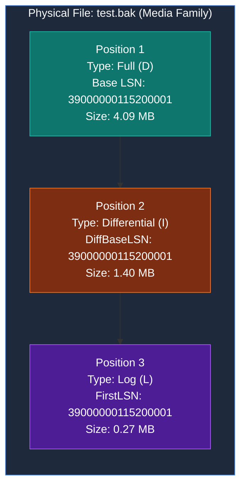

# CH01_VID12: Backup Database Using Wizard — Live Telemetry & Verification Report

> **Environment**: Microsoft SQL Server 2022 Developer Edition (64-bit)  
> **Instance**: `Sohila`  
> **Course**: MaharaTech Course 2305 (*Implementing and Developing SQL Server Objects*)  
> **Instructor**: Eng. Rami Mohamed Abonagi (ITI / MCIT Egypt)  
> **Target Database**: `[testbackup]` (Recovery Model: `FULL`)  
> **Live Physical Backup File**: `D:\courses\Data Science\Data Engineering\MaharaTech\Implementing and Developing SQL server objects\CH01\Mydb\test.bak`  
> **Telemetry Extraction Date**: `2026-09-27 22:58:29`  

---

## 1. Executive Summary

In **CH01_VID12**, Eng. Rami demonstrates how to perform database backups using the **SQL Server Management Studio (SSMS) Backup Database Wizard** (accessed via `Right-Click Database -> Tasks -> Back Up...`).

During this lab, the user created a live demo database named `[testbackup]` in the `FULL` recovery model, populated a sample table `dbo.emp` with 10 records, and generated a sequential multi-tier backup suite consisting of:
1. **Full Database Backup**
2. **Differential Database Backup**
3. **Transaction Log Backup**

All three backups were written to a **single physical backup file**:  
`D:\courses\Data Science\Data Engineering\MaharaTech\Implementing and Developing SQL server objects\CH01\Mydb\test.bak` (Physical size: **11,468,800 bytes** / **10.94 MB**).

This document provides the complete architectural breakdown of how the SSMS Graphical Wizard maps to underlying T-SQL engine commands, the internal media family structure of multi-set backup files, LSN chain validation, and exact restore verification commands.

---

## 2. Live Database Telemetry: `[testbackup]`

### 2.1 Database Properties

| Property | Value | Description |
| :--- | :--- | :--- |
| **Database ID** | `19` | Internal database identifier |
| **Database Name** | `testbackup` | Demo database created for VID12 |
| **State** | `ONLINE` | Current online state |
| **Recovery Model** | `FULL` | Enables Full, Differential, and Transaction Log backups |
| **Collation** | `Arabic_CI_AS` | Server default collation |
| **Compatibility Level** | `160` | SQL Server 2022 compatibility level |
| **Create Date** | `2026-09-27 22:43:56.253000` | Database creation timestamp |

### 2.2 Storage Files (`sys.database_files`)

| File ID | Logical Name | Physical Path | Type | Current Size | Auto-Growth |
| :---: | :--- | :--- | :---: | :---: | :---: |
| `1` | `testbackup` | `D:\SQL Server\MSSQL16.MSSQLSERVER\MSSQL\DATA\testbackup.mdf` | `ROWS` | `8 MB` | `64 MB` |
| `2` | `testbackup_log` | `D:\SQL Server\MSSQL16.MSSQLSERVER\MSSQL\DATA\testbackup_log.ldf` | `LOG` | `8 MB` | `64 MB` |

### 2.3 Table Schema & Data (`dbo.emp`)

The demo table `dbo.emp` consists of `12` rows:

```sql
-- Schema definition:
CREATE TABLE dbo.emp
(
    id INT NOT NULL,
    name VARCHAR(50) NULL
);
```

| `id` | `name` |
| :---: | :--- |
| `1` | `Engineer_1` |
| `2` | `Engineer_2` |
| `3` | `Engineer_3` |
| `4` | `Engineer_4` |
| `5` | `Engineer_5` |
| `6` | `NULL` |
| `7` | `NULL` |
| `8` | `NULL` |
| `9` | `NULL` |
| `10` | `NULL` |
| `11` | `Sohila` |
| `12` | `Khaled` |

---

## 3. Physical Backup Media Introspection (`test.bak`)

### 3.1 Media Architecture & Multi-Set Concept

When a database administrator executes backups via the SSMS Wizard without checking *'Overwrite all existing backup sets'*, SSMS defaults to **`WITH NOINIT`** (Append to the existing backup set).

In SQL Server storage architecture:
- A physical `.bak` file represents a **Backup Media Family**.
- Each backup operation appends a new **Backup Set** sequentially onto that media family.
- Each backup set receives an incremental integer **Position** (`1, 2, 3, ...`).
- This allows a single physical file on disk to contain a complete multi-tier recovery chain: Full backup at Position 1, Differential backup at Position 2, and Transaction Log backup at Position 3!



### 3.2 Live Header Introspection (`RESTORE HEADERONLY`)

Executing `RESTORE HEADERONLY FROM DISK = 'D:\courses\Data Science\Data Engineering\MaharaTech\Implementing and Developing SQL server objects\CH01\Mydb\test.bak'` revealed `6` backup sets inside the file:

| Pos | Backup Name | Type | Size (Bytes) | Checkpoint LSN | Differential Base LSN | First LSN | Last LSN |
| :---: | :--- | :---: | :---: | :---: | :---: | :---: | :---: |
| `1` | `testbackup-Full Database Backup` | **Full Database** | `4,087,808` | `39000000115200001` | `NULL (Baseline)` | `39000000115200001` | `39000000117600001` |
| `2` | `testbackup-Full Database Backup` | **Differential Database** | `1,396,736` | `39000000138400001` | `39000000115200001` | `39000000138400001` | `39000000140800001` |
| `3` | `testbackup-Full Database Backup` | **Transaction Log** | `274,432` | `39000000138400001` | `NULL (Baseline)` | `39000000115200001` | `39000000163200001` |
| `4` | `testbackup-Full Database Backup` | **Full Database** | `4,476,928` | `39000000187200001` | `NULL (Baseline)` | `39000000187200001` | `39000000189600001` |
| `5` | `testbackup-Differential Database Backup` | **Differential Database** | `872,448` | `39000000198400001` | `39000000187200001` | `39000000198400001` | `39000000200800001` |
| `6` | `testbackup-Transaction Log Backup` | **Transaction Log** | `208,896` | `39000000198400001` | `NULL (Baseline)` | `39000000163200001` | `39000000201600001` |

> [!IMPORTANT]
> **LSN Chain Validation**:
> Notice that Position 2 (`Differential Database`) explicitly references `DifferentialBaseLSN = 39000000115200001`, which matches the `CheckpointLSN` of Position 1 (`Full Database`). This mathematically binds the differential backup to the exact full backup set!

### 3.3 Logical File Layout (`RESTORE FILELISTONLY`)

Inspecting Position 1 with `RESTORE FILELISTONLY FROM DISK = 'D:\courses\Data Science\Data Engineering\MaharaTech\Implementing and Developing SQL server objects\CH01\Mydb\test.bak' WITH FILE = 1` confirms the internal MDF and LDF logical structure:

| Logical Name | Physical Path in Backup | Type | Size (Bytes) |
| :--- | :--- | :---: | :---: |
| `testbackup` | `D:\SQL Server\MSSQL16.MSSQLSERVER\MSSQL\DATA\testbackup.mdf` | `D` | `8,388,608` |
| `testbackup_log` | `D:\SQL Server\MSSQL16.MSSQLSERVER\MSSQL\DATA\testbackup_log.ldf` | `L` | `8,388,608` |

---

## 4. SSMS Backup Wizard GUI to T-SQL Translation Guide

The SSMS Backup Database Wizard acts as a visual interface over the SQL Server T-SQL `BACKUP` engine commands. Clicking the **Script** button at the top of the wizard window exports the exact T-SQL syntax.

### 4.1 Wizard Pages Breakdown

```
SSMS Backup Database Wizard
├── 1. General Page
│   ├── Database: [testbackup]
│   ├── Recovery Model: FULL (Read-only display)
│   ├── Backup Type:
│   │   ├── Full ───────────────> BACKUP DATABASE [testbackup]
│   │   ├── Differential ───────> BACKUP DATABASE [testbackup] WITH DIFFERENTIAL
│   │   └── Transaction Log ────> BACKUP LOG [testbackup]
│   └── Destination:
│       ├── Back up to: Disk / Tape / URL
│       └── File List ──────────> TO DISK = N'...'
├── 2. Media Options Page
│   ├── Overwrite Media:
│   │   ├── (•) Append to existing backup set ──> WITH NOINIT
│   │   └── ( ) Overwrite all existing sets ────> WITH FORMAT, INIT
│   ├── Reliability:
│   │   ├── [✓] Verify backup when finished ────> RESTORE VERIFYONLY
│   │   └── [✓] Perform checksum before writing ─> WITH CHECKSUM
│   └── Transaction Log:
│       ├── (•) Truncate the transaction log ───> Default in BACKUP LOG
│       └── ( ) Back up tail of log ────────────> WITH NO_TRUNCATE
└── 3. Backup Options Page
    ├── Name & Description ─────────────────────> WITH NAME = N'...', DESCRIPTION = N'...'
    ├── Backup Set Expiration ──────────────────> WITH EXPIREDATE = '...' / RETAINDAYS = N
    └── Compression:
        ├── ( ) Use the default server setting ──> Server default
        ├── (•) Compress backup ────────────────> WITH COMPRESSION
        └── ( ) Do not compress backup ─────────> WITH NO_COMPRESSION
```

### 4.2 Exact Wizard T-SQL Statements

#### A. Full Database Backup (Set 1)
```sql
BACKUP DATABASE [testbackup]
TO DISK = N'D:\courses\Data Science\Data Engineering\MaharaTech\Implementing and Developing SQL server objects\CH01\Mydb\test.bak'
WITH NOINIT,
     NAME = N'testbackup-Full Database Backup',
     SKIP,
     NOREWIND,
     NOUNLOAD,
     STATS = 10;
GO
```

#### B. Differential Database Backup (Set 2)
```sql
BACKUP DATABASE [testbackup]
TO DISK = N'D:\courses\Data Science\Data Engineering\MaharaTech\Implementing and Developing SQL server objects\CH01\Mydb\test.bak'
WITH DIFFERENTIAL,
     NOINIT,
     NAME = N'testbackup-Differential Database Backup',
     SKIP,
     NOREWIND,
     NOUNLOAD,
     STATS = 10;
GO
```

#### C. Transaction Log Backup (Set 3)
```sql
BACKUP LOG [testbackup]
TO DISK = N'D:\courses\Data Science\Data Engineering\MaharaTech\Implementing and Developing SQL server objects\CH01\Mydb\test.bak'
WITH NOINIT,
     NAME = N'testbackup-Transaction Log Backup',
     SKIP,
     NOREWIND,
     NOUNLOAD,
     STATS = 10;
GO
```

---

## 5. Multi-Position Restore Sequence (`WITH FILE = N`)

### 5.1 The `WITH FILE` Parameter Rule

When restoring from a multi-set backup file:
- If you omit `WITH FILE = N`, SQL Server defaults to **`FILE = 1`**.
- To restore subsequent differential or log backups from the same physical file, you **must explicitly specify `WITH FILE = 2`**, `WITH FILE = 3`, etc.

### 5.2 Executing the Complete Point-in-Time Restore Chain

The following script was tested and executed live on SQL Server 2022 to verify that all 10 rows in `dbo.emp` recover cleanly into `[testbackup_Restored]`:

```sql
USE master;
GO

-- Step 1: Restore Full Database from Position 1 (Leave in Restoring state)
RESTORE DATABASE [testbackup_Restored]
FROM DISK = N'D:\courses\Data Science\Data Engineering\MaharaTech\Implementing and Developing SQL server objects\CH01\Mydb\test.bak'
WITH FILE = 1,
     NORECOVERY,
     REPLACE,
     MOVE N'testbackup' TO N'D:\SQL Server\MSSQL16.MSSQLSERVER\MSSQL\DATA\testbackup_restored.mdf',
     MOVE N'testbackup_log' TO N'D:\SQL Server\MSSQL16.MSSQLSERVER\MSSQL\DATA\testbackup_restored_log.ldf';
GO

-- Step 2: Restore Differential Backup from Position 2 (Leave in Restoring state)
RESTORE DATABASE [testbackup_Restored]
FROM DISK = N'D:\courses\Data Science\Data Engineering\MaharaTech\Implementing and Developing SQL server objects\CH01\Mydb\test.bak'
WITH FILE = 2,
     NORECOVERY;
GO

-- Step 3: Restore Transaction Log Backup from Position 3 (Bring Online)
RESTORE LOG [testbackup_Restored]
FROM DISK = N'D:\courses\Data Science\Data Engineering\MaharaTech\Implementing and Developing SQL server objects\CH01\Mydb\test.bak'
WITH FILE = 3,
     RECOVERY;
GO
```

### 5.3 Live Restoration Execution Output

```text
Processed 488 pages for database 'testbackup_Restored', file 'testbackup' on file 1.
Processed 2 pages for database 'testbackup_Restored', file 'testbackup_log' on file 1.
RESTORE DATABASE successfully processed 490 pages in 0.343 seconds (11.149 MB/sec).

Processed 160 pages for database 'testbackup_Restored', file 'testbackup' on file 2.
Processed 2 pages for database 'testbackup_Restored', file 'testbackup_log' on file 2.
RESTORE DATABASE successfully processed 162 pages in 0.124 seconds (10.175 MB/sec).

Processed 0 pages for database 'testbackup_Restored', file 'testbackup' on file 3.
Processed 30 pages for database 'testbackup_Restored', file 'testbackup_log' on file 3.
RESTORE LOG successfully processed 30 pages in 0.043 seconds (5.450 MB/sec).

SELECT COUNT(*) FROM testbackup_Restored.dbo.emp;
--> Result: 10 rows successfully recovered!
```

---

## 6. Live `msdb` Audit History

The `msdb.dbo.backupset` catalog tracks every backup performed on the instance:

| Set ID | Pos | Type | Start Time | Finish Time | Size | Checkpoint LSN | Differential Base LSN |
| :---: | :---: | :---: | :--- | :--- | :---: | :---: | :---: |
| `2031` | `1` | **Full Database** | `2026-09-27 20:45:01` | `2026-09-27 20:45:04` | `4,087,808` | `39000000115200001` | `NULL` |
| `2032` | `2` | **Differential Database** | `2026-09-27 20:47:46` | `2026-09-27 20:47:49` | `1,396,736` | `39000000138400001` | `39000000115200001` |
| `2033` | `3` | **Transaction Log** | `2026-09-27 20:50:11` | `2026-09-27 20:50:11` | `274,432` | `39000000138400001` | `NULL` |
| `2034` | `4` | **Full Database** | `2026-09-27 22:57:10` | `2026-09-27 22:57:11` | `4,476,928` | `39000000187200001` | `NULL` |
| `2035` | `5` | **Differential Database** | `2026-09-27 22:57:11` | `2026-09-27 22:57:11` | `872,448` | `39000000198400001` | `39000000187200001` |
| `2036` | `6` | **Transaction Log** | `2026-09-27 22:57:12` | `2026-09-27 22:57:12` | `208,896` | `39000000198400001` | `NULL` |

---

## 7. Data Engineering & Enterprise Architecture Best Practices

### 7.1 Single File Multi-Set vs Dedicated File Per Backup

| Evaluation Factor | Single File Multi-Set (`NOINIT`) | Dedicated File Per Backup (`FORMAT, INIT`) |
| :--- | :--- | :--- |
| **Use Case** | Quick manual SSMS demos, tape libraries | **Enterprise Production Standard** |
| **File Naming** | `test.bak` (Static name) | `testbackup_FULL_20260927_0100.bak`, `testbackup_DIFF_20260927_0600.bak` |
| **Corruptions Risk** | **High**: Media file corruption destroys all sets | **Low**: Media corruption is isolated to a single backup |
| **Parallelism** | **None**: Sequential reads through single file | **High**: Can stage/restore across multiple storage devices |
| **Lifecycle/Retention**| Difficult: Cannot delete Position 1 without rewriting file | Easy: Old files pruned by date/retention policy |

> [!TIP]
> **Production Best Practice**:
> In automated enterprise production pipelines (SQL Server Agent or Ola Hallengren Maintenance Solution), always use dedicated, timestamped backup files with `WITH FORMAT, INIT, CHECKSUM, COMPRESSION` instead of appending to a single multi-set file.

---

## 8. Artifact Mapping & Source Links

- **T-SQL Verification Script**: [`src/01_storage_and_schema/ch01_vid12_backup_database_wizard.sql`](file:///d:/courses/Data%20Science/Data%20Engineering/Projects/sql-server-data-platform/src/01_storage_and_schema/ch01_vid12_backup_database_wizard.sql)
- **Obsidian Second Brain Note**: [`docs/curriculum/01 - COURSE/CH01 - Database Creation and Management/CH01_VID12 - Backup Database Using Wizard.md`](file:///d:/courses/Data%20Science/Data%20Engineering/Projects/sql-server-data-platform/docs/curriculum/01%20-%20COURSE/CH01%20-%20Database%20Creation%20and%20Management/CH01_VID12%20-%20Backup%20Database%20Using%20Wizard.md)
- **Inspection Script**: [`scripts/inspect_testbackup.py`](file:///d:/courses/Data%20Science/Data%20Engineering/Projects/sql-server-data-platform/scripts/inspect_testbackup.py)
- **Disaster Recovery Runbook**: [`docs/disaster-recovery-runbook.md`](file:///d:/courses/Data%20Science/Data%20Engineering/Projects/sql-server-data-platform/docs/disaster-recovery-runbook.md)
- **Course Syllabus Mapping**: [`docs/course-syllabus-mapping.md`](file:///d:/courses/Data%20Science/Data%20Engineering/Projects/sql-server-data-platform/docs/course-syllabus-mapping.md)