# MaharaTech Course Syllabus to Enterprise DBRE Architecture Mapping

This platform codebase directly implements and elevates the complete 101-module curriculum of the official ITI / MaharaTech course:
**[Implementing and Developing SQL Server Objects (Course ID: 2305)](https://maharatech.gov.eg/course/view.php?id=2305)**, taught by **Eng. Rami Mohamed Abonagi**.

Rather than storing isolated lecture scripts, every single lesson is re-engineered as an operational component within an enterprise-grade **Data Engineering & Database Reliability Engineering (DBRE)** data platform.

---

## Executive Chapter Mapping Matrix

| Chapter | Title | Official Modules | Enterprise DBRE Implementation | Primary Code Artifacts |
| :--- | :--- | :---: | :--- | :--- |
| **CH01** | Database Creation and Management | 16 Lessons | **Storage Engine Internals & Multi-Filegroups**: Primary (`.mdf`), Secondary (`.ndf`), Log (`.ldf`) isolation. Live `ITItest` Wizard/Code implementation, custom UDDTs, rules, defaults, clustered/non-clustered B-trees, differential backups, and copy-on-write sparse file snapshots. | [`01_filegroups_and_files.sql`](../src/01_storage_and_schema/01_filegroups_and_files.sql) [`ch01_vid01_ititest_filegroups.sql`](../src/01_storage_and_schema/ch01_vid01_ititest_filegroups.sql) [`ch01_vid02_ititest_case_study_schema.sql`](../src/01_storage_and_schema/ch01_vid02_ititest_case_study_schema.sql) [`ch01_vid03_create_database_code.sql`](../src/01_storage_and_schema/ch01_vid03_create_database_code.sql) [`ch01_vid04_database_integrity.sql`](../src/01_storage_and_schema/ch01_vid04_database_integrity.sql) [`01_clustered_nonclustered.sql`](../src/02_indexing_and_performance/01_clustered_nonclustered.sql) [`02_snapshot_lifecycle.sql`](../src/06_reliability_and_dr/02_snapshot_lifecycle.sql) |
| **CH02** | SQL Programming Essentials | 15 Lessons | **ACID Concurrency & Procedural T-SQL**: Variables, flow control (`IF/ELSE`, `WHILE`), Scalar UDF inlining, Inline Table-Valued Functions (iTVF) vs Multi-Statement TVF (MSTVF) cardinality bottlenecks, system DB internals (`tempdb`), and explicit transactions with savepoints. | [`05_scalar_vs_table_functions.sql`](../src/03_programmability_and_elt/05_scalar_vs_table_functions.sql) [`03_execution_plan_analysis.sql`](../src/02_indexing_and_performance/03_execution_plan_analysis.sql) [`03_stored_procedures_etl.sql`](../src/03_programmability_and_elt/03_stored_procedures_etl.sql) |
| **CH03** | Advanced Query Techniques & High Availability | 23 Lessons | **High-Throughput Ingestion & Disaster Recovery**: Indexed views (`WITH SCHEMABINDING`), sliding-window partition switching (`ALTER TABLE SWITCH`), semi-structured XML shredding (`.nodes()`, `.value()`), hierarchical CTEs, batch TVP streaming, Database Mirroring, and Log Shipping. | [`02_indexed_views.sql`](../src/02_indexing_and_performance/02_indexed_views.sql) [`04_partitioning_scheme.sql`](../src/01_storage_and_schema/04_partitioning_scheme.sql) [`01_tvps_and_bulk_ingestion.sql`](../src/03_programmability_and_elt/01_tvps_and_bulk_ingestion.sql) [`02_xml_shredding_and_generation.sql`](../src/03_programmability_and_elt/02_xml_shredding_and_generation.sql) [`log_shipping_and_ag_guide.md`](../src/06_reliability_and_dr/03_high_availability_docs/log_shipping_and_ag_guide.md) |
| **CH04** | Procedures, Triggers, and SQL Automation | 27 Lessons | **Governance, Extensibility & DevOps Automation**: Idempotent transactional ELT procs with `OUTPUT`, non-locking CDC audit triggers (`inserted`/`deleted`), server-level DDL protection (`EVENTDATA()`), C# SQL CLR functions/types/procs/triggers, and PowerShell/Python SMO automation. | [`03_stored_procedures_etl.sql`](../src/03_programmability_and_elt/03_stored_procedures_etl.sql) [`01_audit_change_capture_triggers.sql`](../src/04_governance_and_audit/01_audit_change_capture_triggers.sql) [`02_ddl_and_server_triggers.sql`](../src/04_governance_and_audit/02_ddl_and_server_triggers.sql) [`SqlClrExtensions.cs`](../src/05_automation_and_smo/clr/SqlClrExtensions.cs) [`BackupDatabase.ps1`](../src/05_automation_and_smo/smo_scripts/BackupDatabase.ps1) |
| **CH05** | Reporting and Data Warehousing | 20 Lessons | **Kimball Dimensional Warehousing & SSRS**: Paginated `.rdl` report design, expressions, grouping, matrix drill-downs, cascading parameters, RDLC integration, 3NF OLTP vs Star Schema OLAP, and Slowly Changing Dimensions (SCD Type 1 & 2). | [`01_oltp_source_schema.sql`](../src/07_warehousing_and_reporting/01_oltp_source_schema.sql) [`02_dimensional_star_schema.sql`](../src/07_warehousing_and_reporting/02_dimensional_star_schema.sql) [`03_etl_staging_to_dw.sql`](../src/07_warehousing_and_reporting/03_etl_staging_to_dw.sql) [`SalesExecutiveSummary.rdl`](../src/07_warehousing_and_reporting/ssrs_reports/SalesExecutiveSummary.rdl) |
| **Final** | Final Project | 1 Lesson | **Unified OmniFlow Data Platform**: Complete end-to-end multi-filegroup, partitioned, automated, and tested platform with automated CI/CD and interactive Web IDE. | [`deploy.ps1`](../deploy.ps1) [`test_stored_procedures.sql`](../tests/tSQLt/test_stored_procedures.sql) [`test_data_platform.py`](../tests/python/test_data_platform.py) |

---

## Complete 101-Module Curriculum Syllabus Breakdown

### CH01: Database Creation and Management

| Video Code | Lesson Title | Duration | Level | MaharaTech Portal Link | Repository Code Artifact |
| :--- | :--- | :---: | :---: | :--- | :--- |
| `CH01_VID01` | Create Database and Filegroups | 19 mins | Foundational | [Watch on MaharaTech](https://maharatech.gov.eg/mod/hvp/view.php?id=17520) | [`ch01_vid01_ititest_filegroups.sql`](../src/01_storage_and_schema/ch01_vid01_ititest_filegroups.sql) |
| `CH01_VID02` | Create Database Using Wizard (ITItest Case Study) | 24 mins | Foundational | [Watch on MaharaTech](https://maharatech.gov.eg/mod/hvp/view.php?id=17521) | [`ch01_vid02_ititest_case_study_schema.sql`](../src/01_storage_and_schema/ch01_vid02_ititest_case_study_schema.sql) |
| `CH01_VID03` | Create Database Using Code (T-SQL) | 22 mins | Foundational | [Watch on MaharaTech](https://maharatech.gov.eg/mod/hvp/view.php?id=17522) | [`ch01_vid03_create_database_code.sql`](../src/01_storage_and_schema/ch01_vid03_create_database_code.sql) |
| `CH01_VID04` | Database Integrity (Domain, Entity & Referential) | 18 mins | Foundational | [Watch on MaharaTech](https://maharatech.gov.eg/mod/hvp/view.php?id=17523) | [`ch01_vid04_database_integrity.sql`](../src/01_storage_and_schema/ch01_vid04_database_integrity.sql) |
| `CH01_VID05` | Integrity Constraints (PK, FK, Unique, Check) | 20 mins | Foundational | [Watch on MaharaTech](https://maharatech.gov.eg/mod/hvp/view.php?id=17524) | [`ch01_vid05_integrity_constraints.sql`](../src/01_storage_and_schema/ch01_vid05_integrity_constraints.sql) [`db2-integrity-constraints-live.md`](db2-integrity-constraints-live.md) |
| `CH01_VID06` | Constraints, Rules, and Default Values | 17 mins | Foundational | [Watch on MaharaTech](https://maharatech.gov.eg/mod/hvp/view.php?id=17525) | [`ch01_vid06_constraints_rules_defaults.sql`](../src/01_storage_and_schema/ch01_vid06_constraints_rules_defaults.sql) [`ch01-vid06-constraints-rules-defaults-live.md`](ch01-vid06-constraints-rules-defaults-live.md) |
| `CH01_VID07` | Creating a Custom Data Type (UDDT) | 16 mins | Foundational | [Watch on MaharaTech](https://maharatech.gov.eg/mod/hvp/view.php?id=17526) | [`ch01_vid07_custom_data_types.sql`](../src/01_storage_and_schema/ch01_vid07_custom_data_types.sql) [`ch01-vid07-custom-data-types-live.md`](ch01-vid07-custom-data-types-live.md) |
| `CH01_VID08` | Clustered Index Architecture & B-Tree Structure | 25 mins | Intermediate | [Watch on MaharaTech](https://maharatech.gov.eg/mod/hvp/view.php?id=17527) | [`ch01_vid08_clustered_index.sql`](../src/01_storage_and_schema/ch01_vid08_clustered_index.sql) [`ch01-vid08-clustered-index-live.md`](ch01-vid08-clustered-index-live.md) |
| `CH01_VID09` | Non-Clustered Index & Covering Index Strategy | 23 mins | Intermediate | [Watch on MaharaTech](https://maharatech.gov.eg/mod/hvp/view.php?id=17528) | [`ch01_vid09_nonclustered_index.sql`](../src/01_storage_and_schema/ch01_vid09_nonclustered_index.sql) [`ch01-vid09-nonclustered-index-live.md`](ch01-vid09-nonclustered-index-live.md) |
| `CH01_VID10` | Demo on Index Performance & Execution Plans | 26 mins | Intermediate | [Watch on MaharaTech](https://maharatech.gov.eg/mod/hvp/view.php?id=17529) | [`03_execution_plan_analysis.sql`](../src/02_indexing_and_performance/03_execution_plan_analysis.sql) |
| `CH01_VID11` | Types of Backup (Full, Differential, Log) | 21 mins | Intermediate | [Watch on MaharaTech](https://maharatech.gov.eg/mod/hvp/view.php?id=17530) | [`01_backup_and_maintenance_jobs.sql`](../src/06_reliability_and_dr/01_backup_and_maintenance_jobs.sql) |
| `CH01_VID12` | Backup Database Using Wizard & SSMS Tasks | 18 mins | Foundational | [Watch on MaharaTech](https://maharatech.gov.eg/mod/hvp/view.php?id=17531) | [`01_backup_and_maintenance_jobs.sql`](../src/06_reliability_and_dr/01_backup_and_maintenance_jobs.sql) |
| `CH01_VID13` | Backup & SQL Server Agent Jobs Automation | 24 mins | Intermediate | [Watch on MaharaTech](https://maharatech.gov.eg/mod/hvp/view.php?id=17532) | [`BackupDatabase.ps1`](../src/05_automation_and_smo/smo_scripts/BackupDatabase.ps1) |
| `CH01_VID14` | Snapshot DB Architecture & Copy-on-Write | 20 mins | Intermediate | [Watch on MaharaTech](https://maharatech.gov.eg/mod/hvp/view.php?id=17533) | [`02_snapshot_lifecycle.sql`](../src/06_reliability_and_dr/02_snapshot_lifecycle.sql) |
| `CH01_VID15` | Demo on Snapshot Creation & Data Recovery | 22 mins | Intermediate | [Watch on MaharaTech](https://maharatech.gov.eg/mod/hvp/view.php?id=17534) | [`02_snapshot_lifecycle.sql`](../src/06_reliability_and_dr/02_snapshot_lifecycle.sql) |
| `CH01_VID16` | Assignment 01: Storage, Integrity & Physical Schema Design | 35 mins | Intermediate | [Watch on MaharaTech](https://maharatech.gov.eg/mod/hvp/view.php?id=17535) | [`05_company_case_study_schema.sql`](../src/01_storage_and_schema/05_company_case_study_schema.sql) |
### CH02: SQL Programming Essentials

| Video Code | Lesson Title | Duration | Level | MaharaTech Portal Link | Repository Code Artifact |
| :--- | :--- | :---: | :---: | :--- | :--- |
| `CH02_VID01` | Variables in T-SQL | 17 mins | Foundational | [Watch on MaharaTech](https://maharatech.gov.eg/mod/hvp/view.php?id=17537) | [`05_scalar_vs_table_functions.sql`](../src/03_programmability_and_elt/05_scalar_vs_table_functions.sql) |
| `CH02_VID02` | Local Variables & In-Memory State | 19 mins | Foundational | [Watch on MaharaTech](https://maharatech.gov.eg/mod/hvp/view.php?id=17538) | [`05_scalar_vs_table_functions.sql`](../src/03_programmability_and_elt/05_scalar_vs_table_functions.sql) |
| `CH02_VID03` | Global Variables (System Configuration & Status) | 16 mins | Foundational | [Watch on MaharaTech](https://maharatech.gov.eg/mod/hvp/view.php?id=17539) | [`03_stored_procedures_etl.sql`](../src/03_programmability_and_elt/03_stored_procedures_etl.sql) |
| `CH02_VID04` | Control of Flow (Part 1: IF...ELSE, BEGIN...END) | 21 mins | Foundational | [Watch on MaharaTech](https://maharatech.gov.eg/mod/hvp/view.php?id=17540) | [`03_stored_procedures_etl.sql`](../src/03_programmability_and_elt/03_stored_procedures_etl.sql) |
| `CH02_VID05` | Control of Flow (Part 2: WHILE, BREAK, CONTINUE, RETURN) | 22 mins | Foundational | [Watch on MaharaTech](https://maharatech.gov.eg/mod/hvp/view.php?id=17541) | [`03_stored_procedures_etl.sql`](../src/03_programmability_and_elt/03_stored_procedures_etl.sql) |
| `CH02_VID06` | User-Defined Functions (UDF) Overview | 20 mins | Intermediate | [Watch on MaharaTech](https://maharatech.gov.eg/mod/hvp/view.php?id=17542) | [`05_scalar_vs_table_functions.sql`](../src/03_programmability_and_elt/05_scalar_vs_table_functions.sql) |
| `CH02_VID07` | Scalar Functions & SQL Server 2022 Inlining | 23 mins | Intermediate | [Watch on MaharaTech](https://maharatech.gov.eg/mod/hvp/view.php?id=17543) | [`05_scalar_vs_table_functions.sql`](../src/03_programmability_and_elt/05_scalar_vs_table_functions.sql) |
| `CH02_VID08` | Inline Statement Table-Valued Functions (iTVF) | 24 mins | Intermediate | [Watch on MaharaTech](https://maharatech.gov.eg/mod/hvp/view.php?id=17544) | [`05_scalar_vs_table_functions.sql`](../src/03_programmability_and_elt/05_scalar_vs_table_functions.sql) |
| `CH02_VID09` | Multi-Statement Table-Valued Functions (MSTVF) | 25 mins | Intermediate | [Watch on MaharaTech](https://maharatech.gov.eg/mod/hvp/view.php?id=17545) | [`05_scalar_vs_table_functions.sql`](../src/03_programmability_and_elt/05_scalar_vs_table_functions.sql) |
| `CH02_VID10` | System Databases Architecture (master, model, msdb, tempdb) | 21 mins | Foundational | [Watch on MaharaTech](https://maharatech.gov.eg/mod/hvp/view.php?id=17546) | [`01_filegroups_and_files.sql`](../src/01_storage_and_schema/01_filegroups_and_files.sql) |
| `CH02_VID11` | Types of Tables (Permanent, #Temp, ##Global, @TableVar) | 22 mins | Intermediate | [Watch on MaharaTech](https://maharatech.gov.eg/mod/hvp/view.php?id=17547) | [`01_tvps_and_bulk_ingestion.sql`](../src/03_programmability_and_elt/01_tvps_and_bulk_ingestion.sql) |
| `CH02_VID12` | Scripts & Batches (GO Separator & Execution Scope) | 18 mins | Foundational | [Watch on MaharaTech](https://maharatech.gov.eg/mod/hvp/view.php?id=17548) | [`03_dynamic_sql_guardrails.sql`](../src/04_governance_and_audit/03_dynamic_sql_guardrails.sql) |
| `CH02_VID13` | Types of Transactions & ACID Boundaries | 24 mins | Intermediate | [Watch on MaharaTech](https://maharatech.gov.eg/mod/hvp/view.php?id=17549) | [`03_stored_procedures_etl.sql`](../src/03_programmability_and_elt/03_stored_procedures_etl.sql) |
| `CH02_VID14` | Demo on Transactions, COMMIT, ROLLBACK & SAVEPOINT | 25 mins | Intermediate | [Watch on MaharaTech](https://maharatech.gov.eg/mod/hvp/view.php?id=17550) | [`03_stored_procedures_etl.sql`](../src/03_programmability_and_elt/03_stored_procedures_etl.sql) |
| `CH02_VID15` | Assignment 02: Functions, Transactions & Flow Control | 35 mins | Intermediate | [Watch on MaharaTech](https://maharatech.gov.eg/mod/hvp/view.php?id=17551) | [`05_scalar_vs_table_functions.sql`](../src/03_programmability_and_elt/05_scalar_vs_table_functions.sql) |
### CH03: Advanced Query Techniques and High Availability

| Video Code | Lesson Title | Duration | Level | MaharaTech Portal Link | Repository Code Artifact |
| :--- | :--- | :---: | :---: | :--- | :--- |
| `CH03_VID01` | Overview of Views & Logical Data Abstraction | 18 mins | Foundational | [Watch on MaharaTech](https://maharatech.gov.eg/mod/hvp/view.php?id=17553) | [`02_indexed_views.sql`](../src/02_indexing_and_performance/02_indexed_views.sql) |
| `CH03_VID02` | Types of Views (Standard, Partitioned, System) | 19 mins | Intermediate | [Watch on MaharaTech](https://maharatech.gov.eg/mod/hvp/view.php?id=17554) | [`02_indexed_views.sql`](../src/02_indexing_and_performance/02_indexed_views.sql) |
| `CH03_VID03` | Creating and Using Views (WITH SCHEMABINDING & ENCRYPTION) | 22 mins | Intermediate | [Watch on MaharaTech](https://maharatech.gov.eg/mod/hvp/view.php?id=17555) | [`02_indexed_views.sql`](../src/02_indexing_and_performance/02_indexed_views.sql) |
| `CH03_VID04` | DML Operations on Views (INSERT, UPDATE, DELETE Rules) | 20 mins | Intermediate | [Watch on MaharaTech](https://maharatech.gov.eg/mod/hvp/view.php?id=17556) | [`02_indexed_views.sql`](../src/02_indexing_and_performance/02_indexed_views.sql) |
| `CH03_VID05` | Indexed Views & Materialized Aggregations | 27 mins | Advanced | [Watch on MaharaTech](https://maharatech.gov.eg/mod/hvp/view.php?id=17557) | [`02_indexed_views.sql`](../src/02_indexing_and_performance/02_indexed_views.sql) |
| `CH03_VID06` | Partitioning (Horizontal Range Schemes & Sliding Windows) | 28 mins | Advanced | [Watch on MaharaTech](https://maharatech.gov.eg/mod/hvp/view.php?id=17558) | [`04_partitioning_scheme.sql`](../src/01_storage_and_schema/04_partitioning_scheme.sql) |
| `CH03_VID07` | Harnessing the Power of XML in SQL Server | 21 mins | Intermediate | [Watch on MaharaTech](https://maharatech.gov.eg/mod/hvp/view.php?id=17559) | [`02_xml_shredding_and_generation.sql`](../src/03_programmability_and_elt/02_xml_shredding_and_generation.sql) |
| `CH03_VID08` | Use RAW and AUTO Mode with FOR XML | 20 mins | Intermediate | [Watch on MaharaTech](https://maharatech.gov.eg/mod/hvp/view.php?id=17560) | [`02_xml_shredding_and_generation.sql`](../src/03_programmability_and_elt/02_xml_shredding_and_generation.sql) |
| `CH03_VID09` | Use PATH Mode with FOR XML | 22 mins | Intermediate | [Watch on MaharaTech](https://maharatech.gov.eg/mod/hvp/view.php?id=17561) | [`02_xml_shredding_and_generation.sql`](../src/03_programmability_and_elt/02_xml_shredding_and_generation.sql) |
| `CH03_VID10` | Querying XML Data (XQuery methods: value, query, exist, nodes) | 26 mins | Advanced | [Watch on MaharaTech](https://maharatech.gov.eg/mod/hvp/view.php?id=17562) | [`02_xml_shredding_and_generation.sql`](../src/03_programmability_and_elt/02_xml_shredding_and_generation.sql) |
| `CH03_VID11` | Hierarchical Data (Self-Referencing Relationships & HierarchyID) | 24 mins | Intermediate | [Watch on MaharaTech](https://maharatech.gov.eg/mod/hvp/view.php?id=17563) | [`04_hierarchical_data_and_ctes.sql`](../src/03_programmability_and_elt/04_hierarchical_data_and_ctes.sql) |
| `CH03_VID12` | CTE: Common Table Expression (Standard & Recursive) | 25 mins | Intermediate | [Watch on MaharaTech](https://maharatech.gov.eg/mod/hvp/view.php?id=17564) | [`04_hierarchical_data_and_ctes.sql`](../src/03_programmability_and_elt/04_hierarchical_data_and_ctes.sql) |
| `CH03_VID13` | OFFSET and FETCH Keyword (Deterministic Pagination) | 18 mins | Foundational | [Watch on MaharaTech](https://maharatech.gov.eg/mod/hvp/view.php?id=17565) | [`04_hierarchical_data_and_ctes.sql`](../src/03_programmability_and_elt/04_hierarchical_data_and_ctes.sql) |
| `CH03_VID14` | Sequence Objects vs IDENTITY Columns | 19 mins | Intermediate | [Watch on MaharaTech](https://maharatech.gov.eg/mod/hvp/view.php?id=17566) | [`05_company_case_study_schema.sql`](../src/01_storage_and_schema/05_company_case_study_schema.sql) |
| `CH03_VID15` | Table Valued Parameters (TVPs) & High-Throughput Bulk Ingest | 26 mins | Advanced | [Watch on MaharaTech](https://maharatech.gov.eg/mod/hvp/view.php?id=17567) | [`01_tvps_and_bulk_ingestion.sql`](../src/03_programmability_and_elt/01_tvps_and_bulk_ingestion.sql) |
| `CH03_VID16` | High Availability Concepts (RPO, RTO & Disaster Recovery) | 22 mins | Intermediate | [Watch on MaharaTech](https://maharatech.gov.eg/mod/hvp/view.php?id=17568) | [`log_shipping_and_ag_guide.md`](../src/06_reliability_and_dr/03_high_availability_docs/log_shipping_and_ag_guide.md) |
| `CH03_VID17` | Set Up SQL Server Instances for Replication & HA | 23 mins | Intermediate | [Watch on MaharaTech](https://maharatech.gov.eg/mod/hvp/view.php?id=17569) | [`log_shipping_and_ag_guide.md`](../src/06_reliability_and_dr/03_high_availability_docs/log_shipping_and_ag_guide.md) |
| `CH03_VID18` | Database Mirroring Architecture & Operating Modes | 24 mins | Intermediate | [Watch on MaharaTech](https://maharatech.gov.eg/mod/hvp/view.php?id=17571) | [`log_shipping_and_ag_guide.md`](../src/06_reliability_and_dr/03_high_availability_docs/log_shipping_and_ag_guide.md) |
| `CH03_VID19` | Demo Database Mirroring Setup & Failover Drill | 26 mins | Advanced | [Watch on MaharaTech](https://maharatech.gov.eg/mod/hvp/view.php?id=17572) | [`log_shipping_and_ag_guide.md`](../src/06_reliability_and_dr/03_high_availability_docs/log_shipping_and_ag_guide.md) |
| `CH03_VID20` | Overview of Shipping Transaction Logs | 21 mins | Intermediate | [Watch on MaharaTech](https://maharatech.gov.eg/mod/hvp/view.php?id=17573) | [`log_shipping_and_ag_guide.md`](../src/06_reliability_and_dr/03_high_availability_docs/log_shipping_and_ag_guide.md) |
| `CH03_VID21` | Steps to Configure SQL Server Log Shipping | 25 mins | Intermediate | [Watch on MaharaTech](https://maharatech.gov.eg/mod/hvp/view.php?id=17574) | [`log_shipping_and_ag_guide.md`](../src/06_reliability_and_dr/03_high_availability_docs/log_shipping_and_ag_guide.md) |
| `CH03_VID22` | Log Shipping vs Mirroring vs Always On Comparison | 22 mins | Intermediate | [Watch on MaharaTech](https://maharatech.gov.eg/mod/hvp/view.php?id=17575) | [`log_shipping_and_ag_guide.md`](../src/06_reliability_and_dr/03_high_availability_docs/log_shipping_and_ag_guide.md) |
| `CH03_VID23` | Assignment 03: Scalability, Ingestion & High Availability | 35 mins | Advanced | [Watch on MaharaTech](https://maharatech.gov.eg/mod/hvp/view.php?id=17576) | [`04_partitioning_scheme.sql`](../src/01_storage_and_schema/04_partitioning_scheme.sql) |
### CH04: Procedures, Triggers, and SQL Automation

| Video Code | Lesson Title | Duration | Level | MaharaTech Portal Link | Repository Code Artifact |
| :--- | :--- | :---: | :---: | :--- | :--- |
| `CH04_VID01` | Overview of Stored Procedures | 19 mins | Foundational | [Watch on MaharaTech](https://maharatech.gov.eg/mod/hvp/view.php?id=17577) | [`03_stored_procedures_etl.sql`](../src/03_programmability_and_elt/03_stored_procedures_etl.sql) |
| `CH04_VID02` | Advantages of Stored Procedures (Performance & Security) | 20 mins | Intermediate | [Watch on MaharaTech](https://maharatech.gov.eg/mod/hvp/view.php?id=17579) | [`03_stored_procedures_etl.sql`](../src/03_programmability_and_elt/03_stored_procedures_etl.sql) |
| `CH04_VID03` | Demo on Creating & Executing Stored Procedures | 22 mins | Intermediate | [Watch on MaharaTech](https://maharatech.gov.eg/mod/hvp/view.php?id=17580) | [`03_stored_procedures_etl.sql`](../src/03_programmability_and_elt/03_stored_procedures_etl.sql) |
| `CH04_VID04` | DML Statements in Stored Procedures | 21 mins | Intermediate | [Watch on MaharaTech](https://maharatech.gov.eg/mod/hvp/view.php?id=17581) | [`03_stored_procedures_etl.sql`](../src/03_programmability_and_elt/03_stored_procedures_etl.sql) |
| `CH04_VID05` | Stored Procedure with Parameters and Return Values | 23 mins | Intermediate | [Watch on MaharaTech](https://maharatech.gov.eg/mod/hvp/view.php?id=17582) | [`03_stored_procedures_etl.sql`](../src/03_programmability_and_elt/03_stored_procedures_etl.sql) |
| `CH04_VID06` | Functions vs Stored Procedures (Architectural Trade-offs) | 20 mins | Intermediate | [Watch on MaharaTech](https://maharatech.gov.eg/mod/hvp/view.php?id=17583) | [`05_scalar_vs_table_functions.sql`](../src/03_programmability_and_elt/05_scalar_vs_table_functions.sql) |
| `CH04_VID07` | Dynamic Query in Stored Procedure (sp_executesql Guardrails) | 25 mins | Advanced | [Watch on MaharaTech](https://maharatech.gov.eg/mod/hvp/view.php?id=17584) | [`03_dynamic_sql_guardrails.sql`](../src/04_governance_and_audit/03_dynamic_sql_guardrails.sql) |
| `CH04_VID08` | Stored Procedures and Triggers Types Overview | 21 mins | Intermediate | [Watch on MaharaTech](https://maharatech.gov.eg/mod/hvp/view.php?id=17585) | [`01_audit_change_capture_triggers.sql`](../src/04_governance_and_audit/01_audit_change_capture_triggers.sql) |
| `CH04_VID09` | Creating a Table Level Trigger (AFTER INSERT, UPDATE) | 24 mins | Intermediate | [Watch on MaharaTech](https://maharatech.gov.eg/mod/hvp/view.php?id=17586) | [`01_audit_change_capture_triggers.sql`](../src/04_governance_and_audit/01_audit_change_capture_triggers.sql) |
| `CH04_VID10` | Triggers Features (INSTEAD OF & Recursive Settings) | 23 mins | Intermediate | [Watch on MaharaTech](https://maharatech.gov.eg/mod/hvp/view.php?id=17587) | [`01_audit_change_capture_triggers.sql`](../src/04_governance_and_audit/01_audit_change_capture_triggers.sql) |
| `CH04_VID11` | Using INSERTED and DELETED Tables Within Triggers | 26 mins | Advanced | [Watch on MaharaTech](https://maharatech.gov.eg/mod/hvp/view.php?id=17588) | [`01_audit_change_capture_triggers.sql`](../src/04_governance_and_audit/01_audit_change_capture_triggers.sql) |
| `CH04_VID12` | Track User Activity Using Audit Table (CDC Pattern) | 27 mins | Advanced | [Watch on MaharaTech](https://maharatech.gov.eg/mod/hvp/view.php?id=17589) | [`01_audit_change_capture_triggers.sql`](../src/04_governance_and_audit/01_audit_change_capture_triggers.sql) |
| `CH04_VID13` | Creating Server-Level and Database-Level Triggers (DDL Governance) | 25 mins | Advanced | [Watch on MaharaTech](https://maharatech.gov.eg/mod/hvp/view.php?id=17590) | [`02_ddl_and_server_triggers.sql`](../src/04_governance_and_audit/02_ddl_and_server_triggers.sql) |
| `CH04_VID14` | Using OUTPUT with DML Statements (Atomic Auditing & Staging) | 24 mins | Advanced | [Watch on MaharaTech](https://maharatech.gov.eg/mod/hvp/view.php?id=17591) | [`03_stored_procedures_etl.sql`](../src/03_programmability_and_elt/03_stored_procedures_etl.sql) |
| `CH04_VID15` | Cursors Architecture & Mechanics | 20 mins | Intermediate | [Watch on MaharaTech](https://maharatech.gov.eg/mod/hvp/view.php?id=17592) | [`03_execution_plan_analysis.sql`](../src/02_indexing_and_performance/03_execution_plan_analysis.sql) |
| `CH04_VID16` | Create a Database Cursor & Traversal | 22 mins | Intermediate | [Watch on MaharaTech](https://maharatech.gov.eg/mod/hvp/view.php?id=17593) | [`03_execution_plan_analysis.sql`](../src/02_indexing_and_performance/03_execution_plan_analysis.sql) |
| `CH04_VID17` | Practical Applications of SQL Cursors 01 (Administrative Tasks) | 23 mins | Intermediate | [Watch on MaharaTech](https://maharatech.gov.eg/mod/hvp/view.php?id=17594) | [`BackupDatabase.ps1`](../src/05_automation_and_smo/smo_scripts/BackupDatabase.ps1) |
| `CH04_VID18` | Practical Applications of SQL Cursors 02 vs Set-Based Benchmarking | 26 mins | Advanced | [Watch on MaharaTech](https://maharatech.gov.eg/mod/hvp/view.php?id=17595) | [`03_execution_plan_analysis.sql`](../src/02_indexing_and_performance/03_execution_plan_analysis.sql) |
| `CH04_VID19` | Overview of Common Language Runtime (CLR) Integration | 22 mins | Intermediate | [Watch on MaharaTech](https://maharatech.gov.eg/mod/hvp/view.php?id=17600) | [`SqlClrExtensions.cs`](../src/05_automation_and_smo/clr/SqlClrExtensions.cs) |
| `CH04_VID20` | Create SQL CLR C# User-Defined Function (Regex & Algorithms) | 25 mins | Advanced | [Watch on MaharaTech](https://maharatech.gov.eg/mod/hvp/view.php?id=17602) | [`SqlClrExtensions.cs`](../src/05_automation_and_smo/clr/SqlClrExtensions.cs) |
| `CH04_VID21` | Create SQL CLR C# User-Defined Type (UDT) | 27 mins | Advanced | [Watch on MaharaTech](https://maharatech.gov.eg/mod/hvp/view.php?id=17603) | [`SqlClrExtensions.cs`](../src/05_automation_and_smo/clr/SqlClrExtensions.cs) |
| `CH04_VID22` | Create SQL CLR C# Stored Procedure | 26 mins | Advanced | [Watch on MaharaTech](https://maharatech.gov.eg/mod/hvp/view.php?id=17604) | [`SqlClrExtensions.cs`](../src/05_automation_and_smo/clr/SqlClrExtensions.cs) |
| `CH04_VID23` | Create SQL CLR C# Trigger & Publish with Right Permissions | 28 mins | Advanced | [Watch on MaharaTech](https://maharatech.gov.eg/mod/hvp/view.php?id=17605) | [`Deploy-ClrAssembly.sql`](../src/05_automation_and_smo/clr/Deploy-ClrAssembly.sql) |
| `CH04_VID24` | Overview of SQL Server Management Objects (SMO) | 22 mins | Intermediate | [Watch on MaharaTech](https://maharatech.gov.eg/mod/hvp/view.php?id=17606) | [`BackupDatabase.ps1`](../src/05_automation_and_smo/smo_scripts/BackupDatabase.ps1) |
| `CH04_VID25` | Create Simple Custom Application for End User Using SMO | 27 mins | Advanced | [Watch on MaharaTech](https://maharatech.gov.eg/mod/hvp/view.php?id=17607) | [`ScriptDatabaseObjects.py`](../src/05_automation_and_smo/smo_scripts/ScriptDatabaseObjects.py) |
| `CH04_VID26` | Create & Backup Database Programmatically with SMO through App | 29 mins | Advanced | [Watch on MaharaTech](https://maharatech.gov.eg/mod/hvp/view.php?id=17608) | [`BackupDatabase.ps1`](../src/05_automation_and_smo/smo_scripts/BackupDatabase.ps1) |
| `CH04_VID27` | Assignment 04: Procedures, Triggers, CLR & Automation | 40 mins | Advanced | [Watch on MaharaTech](https://maharatech.gov.eg/mod/hvp/view.php?id=17609) | [`01_audit_change_capture_triggers.sql`](../src/04_governance_and_audit/01_audit_change_capture_triggers.sql) |
### CH05: Reporting and Data Warehousing

| Video Code | Lesson Title | Duration | Level | MaharaTech Portal Link | Repository Code Artifact |
| :--- | :--- | :---: | :---: | :--- | :--- |
| `CH05_VID01` | Overview of SQL Server Reporting Services (SSRS) & Installation | 22 mins | Foundational | [Watch on MaharaTech](https://maharatech.gov.eg/mod/hvp/view.php?id=17610) | [`SalesExecutiveSummary.rdl`](../src/07_warehousing_and_reporting/ssrs_reports/SalesExecutiveSummary.rdl) |
| `CH05_VID02` | Create a Report Server Project in Visual Studio / SSDT | 21 mins | Foundational | [Watch on MaharaTech](https://maharatech.gov.eg/mod/hvp/view.php?id=17611) | [`SalesExecutiveSummary.rdl`](../src/07_warehousing_and_reporting/ssrs_reports/SalesExecutiveSummary.rdl) |
| `CH05_VID03` | Add Items to Your Report & Edit SSRS Expressions | 23 mins | Intermediate | [Watch on MaharaTech](https://maharatech.gov.eg/mod/hvp/view.php?id=17612) | [`SalesExecutiveSummary.rdl`](../src/07_warehousing_and_reporting/ssrs_reports/SalesExecutiveSummary.rdl) |
| `CH05_VID04` | Change Report Properties & Professional Styling | 20 mins | Intermediate | [Watch on MaharaTech](https://maharatech.gov.eg/mod/hvp/view.php?id=17613) | [`SalesExecutiveSummary.rdl`](../src/07_warehousing_and_reporting/ssrs_reports/SalesExecutiveSummary.rdl) |
| `CH05_VID05` | Use COUNT and Interactive Sorting Functions | 22 mins | Intermediate | [Watch on MaharaTech](https://maharatech.gov.eg/mod/hvp/view.php?id=17614) | [`SalesExecutiveSummary.rdl`](../src/07_warehousing_and_reporting/ssrs_reports/SalesExecutiveSummary.rdl) |
| `CH05_VID06` | Choose How to Group Data in Table, Matrix and Chart Reports | 25 mins | Intermediate | [Watch on MaharaTech](https://maharatech.gov.eg/mod/hvp/view.php?id=17615) | [`SalesExecutiveSummary.rdl`](../src/07_warehousing_and_reporting/ssrs_reports/SalesExecutiveSummary.rdl) |
| `CH05_VID07` | Create a Free-Form Report Layout | 24 mins | Intermediate | [Watch on MaharaTech](https://maharatech.gov.eg/mod/hvp/view.php?id=17616) | [`SalesExecutiveSummary.rdl`](../src/07_warehousing_and_reporting/ssrs_reports/SalesExecutiveSummary.rdl) |
| `CH05_VID08` | Join Many Tables Using Query Designer & Add Indicators | 25 mins | Intermediate | [Watch on MaharaTech](https://maharatech.gov.eg/mod/hvp/view.php?id=17617) | [`03_etl_staging_to_dw.sql`](../src/07_warehousing_and_reporting/03_etl_staging_to_dw.sql) |
| `CH05_VID09` | Using Stored Procedures & Map Dataset to Report Parameter | 26 mins | Advanced | [Watch on MaharaTech](https://maharatech.gov.eg/mod/hvp/view.php?id=17618) | [`SalesExecutiveSummary.rdl`](../src/07_warehousing_and_reporting/ssrs_reports/SalesExecutiveSummary.rdl) |
| `CH05_VID10` | Go to Another Report Action (Drill-Through Navigation) | 24 mins | Advanced | [Watch on MaharaTech](https://maharatech.gov.eg/mod/hvp/view.php?id=17619) | [`SalesExecutiveSummary.rdl`](../src/07_warehousing_and_reporting/ssrs_reports/SalesExecutiveSummary.rdl) |
| `CH05_VID11` | Link Datasets with Cascading Parameters | 25 mins | Advanced | [Watch on MaharaTech](https://maharatech.gov.eg/mod/hvp/view.php?id=17620) | [`SalesExecutiveSummary.rdl`](../src/07_warehousing_and_reporting/ssrs_reports/SalesExecutiveSummary.rdl) |
| `CH05_VID12` | Add a Sparkline & Data Bar to Your Report | 20 mins | Intermediate | [Watch on MaharaTech](https://maharatech.gov.eg/mod/hvp/view.php?id=17621) | [`SalesExecutiveSummary.rdl`](../src/07_warehousing_and_reporting/ssrs_reports/SalesExecutiveSummary.rdl) |
| `CH05_VID13` | How to Deploy Reports & Configure Report Server | 23 mins | Intermediate | [Watch on MaharaTech](https://maharatech.gov.eg/mod/hvp/view.php?id=17622) | [`SalesExecutiveSummary.rdl`](../src/07_warehousing_and_reporting/ssrs_reports/SalesExecutiveSummary.rdl) |
| `CH05_VID14` | View Reports with a Browser (Report Builder and SSRS Portal) | 21 mins | Foundational | [Watch on MaharaTech](https://maharatech.gov.eg/mod/hvp/view.php?id=17623) | [`SalesExecutiveSummary.rdl`](../src/07_warehousing_and_reporting/ssrs_reports/SalesExecutiveSummary.rdl) |
| `CH05_VID15` | Create Custom Reports Using Microsoft RDLC Report Designer | 24 mins | Intermediate | [Watch on MaharaTech](https://maharatech.gov.eg/mod/hvp/view.php?id=17624) | [`SalesExecutiveSummary.rdl`](../src/07_warehousing_and_reporting/ssrs_reports/SalesExecutiveSummary.rdl) |
| `CH05_VID16` | Link Parameters to Your Custom Report (RDLC & Code-Behind) | 23 mins | Intermediate | [Watch on MaharaTech](https://maharatech.gov.eg/mod/hvp/view.php?id=17625) | [`SalesExecutiveSummary.rdl`](../src/07_warehousing_and_reporting/ssrs_reports/SalesExecutiveSummary.rdl) |
| `CH05_VID17` | Data Warehousing Architecture & Enterprise Fundamentals | 26 mins | Foundational | [Watch on MaharaTech](https://maharatech.gov.eg/mod/hvp/view.php?id=17626) | [`02_dimensional_star_schema.sql`](../src/07_warehousing_and_reporting/02_dimensional_star_schema.sql) |
| `CH05_VID18` | Difference Between OLAP and OLTP Systems | 22 mins | Foundational | [Watch on MaharaTech](https://maharatech.gov.eg/mod/hvp/view.php?id=17627) | [`01_oltp_source_schema.sql`](../src/07_warehousing_and_reporting/01_oltp_source_schema.sql) |
| `CH05_VID19` | Dimensional Modeling (Facts, Dimensions & Kimball Star) | 28 mins | Advanced | [Watch on MaharaTech](https://maharatech.gov.eg/mod/hvp/view.php?id=17628) | [`02_dimensional_star_schema.sql`](../src/07_warehousing_and_reporting/02_dimensional_star_schema.sql) |
| `CH05_VID20` | Assignment 05: Data Warehouse & Paginated Report Delivery | 40 mins | Advanced | [Watch on MaharaTech](https://maharatech.gov.eg/mod/hvp/view.php?id=17629) | [`03_etl_staging_to_dw.sql`](../src/07_warehousing_and_reporting/03_etl_staging_to_dw.sql) |
### Final Project: Enterprise Capstone Platform

| Video Code | Lesson Title | Duration | Level | MaharaTech Portal Link | Repository Code Artifact |
| :--- | :--- | :---: | :---: | :--- | :--- |
| `FinalProject` | Final Enterprise Capstone Project: End-to-End Data Platform | 60 mins | Capstone | [Watch on MaharaTech](https://maharatech.gov.eg/mod/hvp/view.php?id=17630) | [`deploy.ps1`](../deploy.ps1) |

---

## Architectural Progression Diagram

```mermaid
flowchart LR
    subgraph CH01 ["CH01: Storage & Schemas (16 Lessons)"]
        direction TB
        FGs["Multi-Filegroups<br/>(PRIMARY, fg1, fg2, ARCHIVE)"]
        Constraints["PK / FK / Rules / Defaults / UDDTs"]
        Indexes["Clustered & Non-Clustered B-Trees"]
        Snapshots["Sparse Snapshot Isolation & Backups"]
    end

    subgraph CH02 ["CH02: Programming & Tuning (15 Lessons)"]
        direction TB
        Variables["Local / Global Variables & Flow Control"]
        Funcs["Scalar Inlining vs iTVF vs MSTVF"]
        TempT["Permanent vs #Temp vs @TableVariable"]
        ACID["ACID Boundaries, Transactions & Savepoints"]
    end

    subgraph CH03 ["CH03: Advanced Scalability (23 Lessons)"]
        direction TB
        Views_P["Indexed Views (SCHEMABINDING)"]
        Part["Range Partitioning & Sliding Windows"]
        XML_P["XQuery .nodes() & FOR XML"]
        HA_Spec["Database Mirroring & Log Shipping"]
    end

    subgraph CH04 ["CH04: Procedures & Automation (27 Lessons)"]
        direction TB
        SP_ETL["Idempotent ETL (OUTPUT clause)"]
        Trig["Set-Based CDC Triggers (inserted/deleted)"]
        CLR["Managed C# SQL CLR Assemblies"]
        SMO["SMO Automation (PowerShell & Python)"]
    end

    subgraph CH05 ["CH05: Data Warehousing & BI (20 Lessons)"]
        direction TB
        Kimball["Kimball Star Schema (OmniFlowDW)"]
        SCD["SCD Type 1 & Type 2 Pipelines"]
        SSRS_Rep["SSRS Paginated Matrix Reports (.rdl)"]
        RDLC["Local Embedded Client RDLC Reports"]
    end

    subgraph Capstone ["Final Project: OmniFlow Platform"]
        direction TB
        Unified["End-to-End Enterprise Deployment"]
        Tests["tSQLt & Python Test Suite"]
        WebIDE["Interactive SSMS & WASM Web App"]
    end

    CH01 --> CH02 --> CH03 --> CH04 --> CH05 --> Capstone
```

