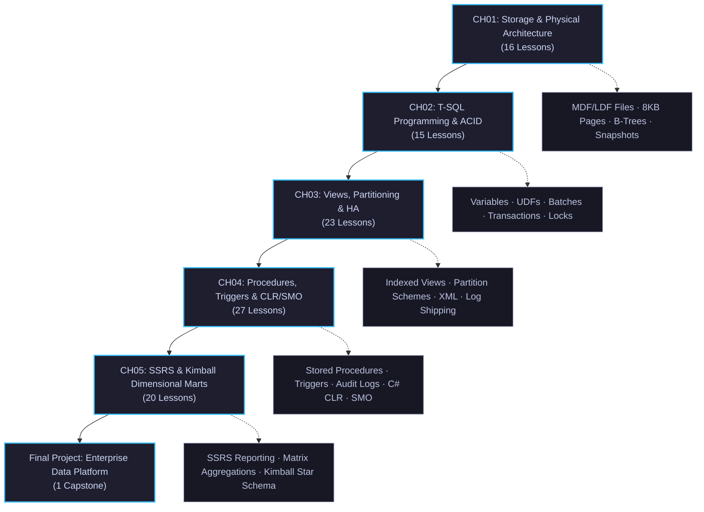

# 🗺️ SQL Server Data Platform Learning Roadmap

---

## 🎯 8-Week Milestone Schedule
- **Week 01–02**: Storage Internals, Filegroups, Relational Integrity & B-Tree Indexes (CH01)
- **Week 03**: T-SQL Programming, Functions, Batch Scoping & Transactions (CH02)
- **Week 04–05**: Schema-Bound Views, Table Partitioning, XML & High Availability (CH03)
- **Week 06–07**: Stored Procedures, Audit Triggers, C# SQL CLR & PowerShell SMO (CH04)
- **Week 08**: SSRS Reporting & Kimball Dimensional Data Warehousing (CH05 + Capstone)
