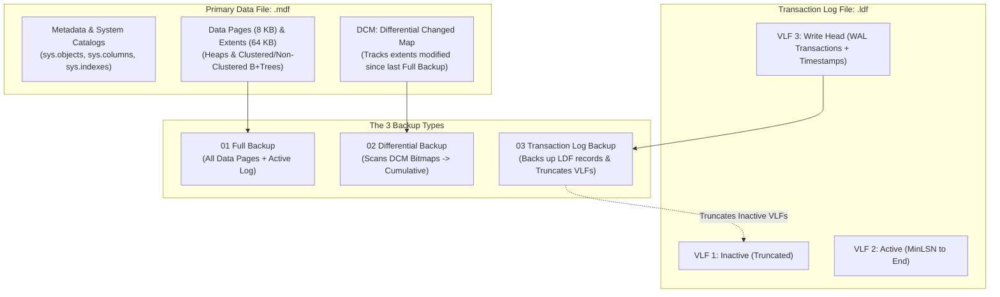
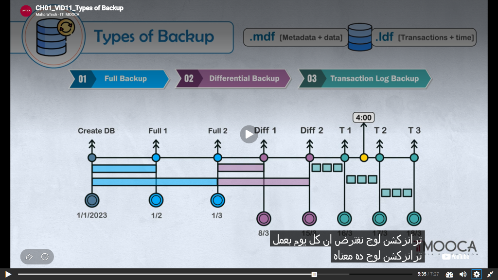
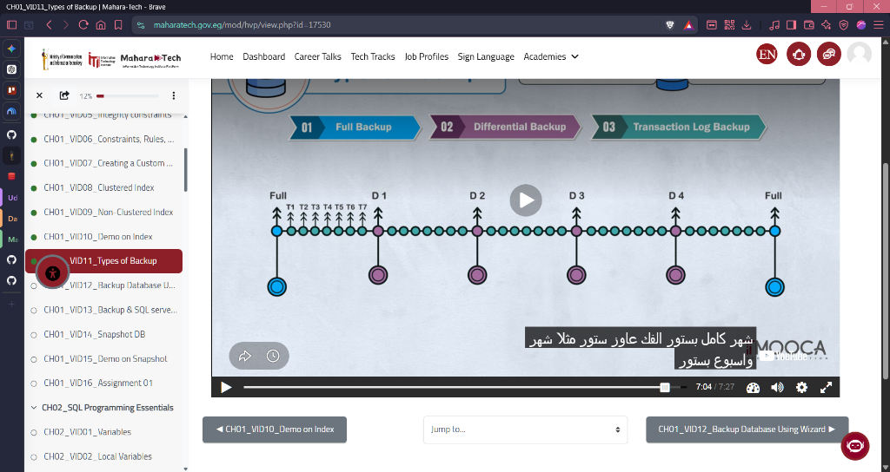

# CH01_VID11 — Types of Backup

> [!abstract] Learning Goal
> Master the physical mechanics, storage file layout (`.mdf` vs `.ldf`), change-tracking algorithms (Differential Changed Map / DCM), unbroken LSN chaining, and point-in-time recovery (PITR) across the three primary SQL Server backup tiers: **Full Database Backup**, **Differential Backup**, and **Transaction Log Backup**.

---

## 🎯 Core Idea

In **MaharaTech Course 2305** (*Implementing & Developing SQL Server Objects* - Chapter 1, Video 11), **Eng. Rami Mohamed Abonagi** provides a foundational architectural lecture on **Database Reliability Engineering (DBRE)**, disaster recovery planning, and the physical mechanics of backup strategies in Microsoft SQL Server:

1. **Physical File Architecture (`.mdf` vs `.ldf`)**:
   - **Primary Data File (`.mdf`)**: Stores schema metadata, data dictionaries, 8 KB data pages, 64 KB extents, and the **Differential Changed Map (DCM)** pages.
   - **Transaction Log File (`.ldf`)**: Stores sequential Write-Ahead Logging (WAL) records with Log Sequence Numbers (LSN), commit timestamps, and undo/redo vectors divided into **Virtual Log Files (VLFs)**.

2. **The 3 Primary Backup Tiers**:
   - **01 Full Backup (`BACKUP DATABASE`)**: Complete baseline capturing all allocated data pages in `.mdf`, plus sufficient active log to roll forward to a transactionally consistent recovery state. Acts as the mandatory baseline/anchor for all subsequent differential backups and log chains. Does NOT truncate the transaction log.
   - **02 Differential Backup (`BACKUP DATABASE ... WITH DIFFERENTIAL`)**: Captures only the data extents that have changed since the last **Full Backup** using DCM bit tracking. Differential backups are **cumulative**: each differential backup contains all changes made since the base full backup. Restoring requires only the base Full + the *latest* Differential backup. Does NOT truncate the transaction log.
   - **03 Transaction Log Backup (`BACKUP LOG`)**: Captures all log records generated in `.ldf` since the previous log backup. Forms a continuous, sequential LSN chain. Crucially, in `FULL` recovery model, log backups **truncate inactive VLFs**, reclaiming disk space and preventing `.ldf` run-away growth. Enables Point-in-Time Recovery (PITR) via `STOPAT`.

3. **The MaharaTech Timeline Case Study & Disaster Recovery Decision Tree**:
   - `1/1/2023`: Database Creation.
   - `1/2/2023`: Full Backup 1 (Initial Baseline).
   - `1/3/2023`: Full Backup 2 (Active Baseline Anchor).
   - `8/3/2023`: Differential Backup 1 (Changes between 1/3 and 8/3).
   - `15/3/2023`: Differential Backup 2 (Cumulative changes between 1/3 and 15/3).
   - `16/3/2023`: Transaction Log Backup T1 (Transactions from 15/3 to 16/3).
   - `17/3/2023 4:00 PM`: Golden Pre-Disaster Timestamp.
   - `17/3/2023 4:01 PM`: Catastrophic Disaster (Accidental batch deletion or corruption).
   - **Disaster Recovery Sequence**:
     1. Take Emergency Tail-Log Backup (`WITH NORECOVERY`).
     2. Restore `Full 2` (`WITH NORECOVERY`).
     3. Restore `Diff 2` (`WITH NORECOVERY`) &mdash; **Diff 1 is completely skipped** because Diff 2 is cumulative!
     4. Restore `Log T1` (`WITH NORECOVERY`).
     5. Restore `Tail Log / Log T2` with `STOPAT = '17/3/2023 4:00 PM'` (`WITH RECOVERY`).

4. **Recovery Model Invariants**:
   - `SIMPLE`: Cannot take log backups (**Msg 4208**); inactive log is truncated automatically at checkpoints; Point-in-Time Recovery is disabled.
   - `FULL`: Complete logging; scheduled log backups required to prevent log file exhaustion; PITR supported down to the millisecond.
   - `BULK_LOGGED`: Minimal logging for bulk operations (`BULK INSERT`, `SELECT INTO`); restricts PITR if log contains bulk operations.

---

## 🧠 What I Need to Understand

- **Engine Execution & Subsystem Interactions**: How the Buffer Manager, Access Methods, and Transaction Manager coordinate during backup execution to capture consistent page snapshots without locking reader threads.
- **Physical Change Tracking (DCM Pages)**: How SQL Server tracks extent-level modifications using 1-bit allocation flags in Differential Changed Map (DCM) pages (Page 6 of GAM intervals) to execute differential backups at high speed.
- **Virtual Log File (VLF) Lifecycle & Truncation**: Why log truncation only frees virtual log files for reuse and does not shrink `.ldf` on disk, and how `BACKUP LOG` advances the MinLSN boundary.
- **LSN Chaining & Recovery Invariants**: The mathematical invariants governing `differential_base_lsn`, `checkpoint_lsn`, `first_lsn`, and `last_lsn` across recovery sequences.

---

## 🖼️ Visual Architecture & Video Evidence

### A. Storage Architecture: Data File (.mdf) vs Transaction Log (.ldf)



---

### B. Types of Backup & Physical File Layout (MaharaTech Timeline)


> [!tip] Analysis of MaharaTech Slide
> - **File Specialization**: Top diagrams delineate `.mdf [Metadata + data]` from `.ldf [Transactions + time]`.
> - **The 3 Badges**: `01 Full Backup` (Blue), `02 Differential Backup` (Purple), and `03 Transaction Log Backup` (Teal).
> - **Cumulative Extent Spans**: Notice how `Diff 2` (15/3) spans all the way back to `Full 2` (1/3), visually proving that differential backups in SQL Server are **cumulative from the base Full backup**, not incremental from the prior differential.
> - **Disaster Incident at 4:00**: Yellow marker at `4:00` between `T 1` and `T 2` indicates the target recovery point. The restoration skips `Diff 1` and applies `Full 2` &rarr; `Diff 2` &rarr; `T 1` &rarr; `Tail Log (STOPAT 4:00)`.

---

### C. MaharaTech Disaster Recovery Timeline & Restore Path

```mermaid
timeline
    title MaharaTech CH01_VID11 Disaster Recovery Timeline
    1/1/2023 : Create DB : Baseline schema established
    1/2/2023 : Full Backup 1 : Initial baseline backup
    1/3/2023 : Full Backup 2 : NEW BASELINE ANCHOR
    8/3/2023 : Diff 1 : Changes since 1/3 (DCM scan)
    15/3/2023 : Diff 2 : CUMULATIVE changes since 1/3
    16/3/2023 : Log T1 : Transaction Log backup (truncates log)
    17/3/2023 4:00 PM : DISASTER : Point of failure / Accidental delete
    17/3/2023 4:05 PM : Tail Log : Emergency tail-log WITH NORECOVERY
    Recovery Path : Step 1 Full 2 : Step 2 Diff 2 (Diff 1 skipped!) : Step 3 Log T1 : Step 4 Tail Log STOPAT 4:00
```

---

### D. Enterprise Monthly & Weekly Backup Strategy


---

### E. Architectural Mechanics Comparison Matrix

| Dimension | 01 Full Backup (`.bak`) | 02 Differential Backup (`.dif` / `.bak`) | 03 Transaction Log Backup (`.trn`) |
| :--- | :--- | :--- | :--- |
| **T-SQL Command** | `BACKUP DATABASE [DB] TO DISK = '...'` | `BACKUP DATABASE [DB] ... WITH DIFFERENTIAL` | `BACKUP LOG [DB] TO DISK = '...'` |
| **Underlying File Targeted** | `.mdf` (and any `.ndf` files) + active log | `.mdf` (only modified data extents) | `.ldf` (transaction log records) |
| **Change Tracking Mechanism** | Allocation Bitmaps (GAM / SGAM) | **Differential Changed Map (DCM)** pages | **Log Sequence Numbers (LSN)** in VLFs |
| **Nature of Data Captured** | Complete database data pages | **Cumulative** changes since base Full | **Incremental** sequential log records |
| **Dependency Chain** | Self-contained (Independent) | Requires baseline Full backup | Requires unbroken LSN chain back to Full/Diff |
| **Restore Skipping Rule** | None (Starting point) | **Can skip earlier diffs** (restore only latest) | **Cannot skip** any log backup in chain |
| **Transaction Log Truncation** | **NO** (Does not truncate log) | **NO** (Does not truncate log) | **YES** (Truncates inactive VLFs in FULL model) |
| **Point-in-Time Recovery (PITR)**| NO (Restores to end of backup) | NO (Restores to end of backup) | **YES** (Via `WITH STOPAT = 'timestamp'`) |
| **Supported Recovery Models** | `SIMPLE`, `FULL`, `BULK_LOGGED` | `SIMPLE`, `FULL`, `BULK_LOGGED` | `FULL`, `BULK_LOGGED` only |

---

## 🔧 SQL Syntax

```sql
-- ============================================================================
-- Script: ch01_vid11_types_of_backup.sql
-- Reference: src/01_storage_and_schema/ch01_vid11_types_of_backup.sql
-- ============================================================================

USE master;
GO

-- 1. Full Database Backup (Baseline Anchor)
BACKUP DATABASE [ITI_BackupLab]
TO DISK = N'D:\SQL Server\MSSQL16.MSSQLSERVER\MSSQL\Backup\ITI_BackupLab_Full_2.bak'
WITH FORMAT, INIT,
     NAME = N'ITI_BackupLab-Full Database Backup (1/3 Baseline)',
     CHECKSUM, STATS = 10;
GO

-- 2. Cumulative Differential Backup (DCM page tracking)
BACKUP DATABASE [ITI_BackupLab]
TO DISK = N'D:\SQL Server\MSSQL16.MSSQLSERVER\MSSQL\Backup\ITI_BackupLab_Diff_2.bak'
WITH DIFFERENTIAL, FORMAT, INIT,
     NAME = N'ITI_BackupLab-Differential Backup 2 (15/3 Cumulative)',
     CHECKSUM, STATS = 10;
GO

-- 3. Transaction Log Backup (VLF Truncation & LSN Chaining)
BACKUP LOG [ITI_BackupLab]
TO DISK = N'D:\SQL Server\MSSQL16.MSSQLSERVER\MSSQL\Backup\ITI_BackupLab_Log_T1.trn'
WITH FORMAT, INIT,
     NAME = N'ITI_BackupLab-Transaction Log Backup T1 (16/3)',
     CHECKSUM, STATS = 10;
GO

-- 4. Emergency Tail-Log Backup (Capturing active log without truncating or modifying data)
BACKUP LOG [ITI_BackupLab]
TO DISK = N'D:\SQL Server\MSSQL16.MSSQLSERVER\MSSQL\Backup\ITI_BackupLab_TailLog.trn'
WITH NORECOVERY, FORMAT, INIT,
     NAME = N'ITI_BackupLab-Emergency Tail Log Backup',
     CHECKSUM, STATS = 10;
GO

-- 5. Point-in-Time Recovery Path (Restoring to pre-disaster 4:00 PM state)
-- Step 1: Baseline Full Backup
RESTORE DATABASE [ITI_BackupLab_Restored]
FROM DISK = N'D:\...\ITI_BackupLab_Full_2.bak'
WITH NORECOVERY, REPLACE,
     MOVE N'ITI_BackupLab' TO N'D:\...\ITI_BackupLab_Restored.mdf',
     MOVE N'ITI_BackupLab_log' TO N'D:\...\ITI_BackupLab_Restored_log.ldf';

-- Step 2: Cumulative Differential 2 (Diff 1 is completely bypassed!)
RESTORE DATABASE [ITI_BackupLab_Restored]
FROM DISK = N'D:\...\ITI_BackupLab_Diff_2.bak'
WITH NORECOVERY;

-- Step 3: Transaction Log T1
RESTORE LOG [ITI_BackupLab_Restored]
FROM DISK = N'D:\...\ITI_BackupLab_Log_T1.trn'
WITH NORECOVERY;

-- Step 4: Tail-Log with exact STOPAT target
RESTORE LOG [ITI_BackupLab_Restored]
FROM DISK = N'D:\...\ITI_BackupLab_TailLog.trn'
WITH STOPAT = '2026-09-27 16:00:00', RECOVERY;
GO
```

### 🔍 Line-by-Line Explanation

- `WITH DIFFERENTIAL`: Instructs SQL Server to bypass full data page copying and scan the **Differential Changed Map (DCM)** pages instead, writing only modified extents to the backup file.
- `WITH FORMAT, INIT`: Formats the backup media header and overwrites any existing backup sets on the target file, ensuring a clean, unappended backup file.
- `WITH CHECKSUM`: Computes and verifies mathematical checksums on every 8 KB page as it is read from disk into the backup stream. Detects torn pages, bit flips, and storage corruption before disaster strikes.
- `WITH NORECOVERY`: Leaves the database in the `RESTORING` state without rolling back uncommitted transactions, allowing subsequent differential and log backups to be applied to the restore chain.
- `WITH STOPAT`: Replays transaction log records sequentially and halts recovery at the exact millisecond requested, rolling back any transactions active after the specified point in time.

---

## 🏗️ Data Engineering Perspective

- **Why does this matter to a Data Engineer?** In an enterprise data platform, databases serve as staging areas, operational data stores (ODS), and analytical warehouses. A data engineer who does not understand backup types risks breaking transaction log chains with uncoordinated ad-hoc backups, ballooning storage costs with redundant full backups, or failing to meet strict recovery SLAs during production incidents.
- **RTO vs RPO Optimization**:
  - **Recovery Point Objective (RPO)**: Controlled by **Transaction Log backup frequency**. Backing up the log every 15 minutes guarantees at most 15 minutes of data loss.
  - **Recovery Time Objective (RTO)**: Controlled by **Differential backup frequency**. Replaying 7 days of raw transaction log files might take 6 hours; applying 1 weekly Full + 1 daily Differential + 4 hours of log files reduces restoration to 25 minutes!
- **Write-Ahead Logging (WAL) & VLF Sprawl**: In the `FULL` recovery model, the transaction log file (`.ldf`) will grow continuously until a `BACKUP LOG` statement is executed to mark inactive Virtual Log Files (VLFs) as reusable. Neglecting log backups leads to disk exhaustion and server outages.

---

## ✅ What I Should Be Able to Do

- [x] Distinguish between `.mdf` and `.ldf` physical roles during backup and recovery operations.
- [x] Explain the cumulative nature of differential backups and DCM page mechanics to an engineering peer.
- [x] Configure and execute a complete 3-tier backup strategy (Full, Differential, Log) in SSMS and T-SQL.
- [x] Perform an emergency Tail-Log backup and execute Point-in-Time Recovery (PITR) using `STOPAT`.
- [x] Diagnose and resolve SQL Server backup engine errors such as **Msg 4208** and **Msg 3035**.

---

## 🧪 Hands-On Lab

1. Connect to SQL Server 2022 instance in SSMS or Azure Data Studio.
2. Execute the verification script [`src/01_storage_and_schema/ch01_vid11_types_of_backup.sql`](file:///d:/courses/Data%20Science/Data%20Engineering/Projects/sql-server-data-platform/src/01_storage_and_schema/ch01_vid11_types_of_backup.sql).
3. Introspect `msdb.dbo.backupset` to verify that both `Diff 1` and `Diff 2` point to the identical `differential_base_lsn` of `Full Backup 2`.
4. Trigger error **Msg 4208** by attempting a log backup on a database in `SIMPLE` recovery mode.
5. Simulate an accidental record deletion and restore the database to an exact pre-disaster timestamp using `STOPAT`.

---

## 🧩 Challenge

Construct an automated PowerShell or T-SQL maintenance routine that inspects `msdb.dbo.backupset` and alerts if the active transaction log backup chain has a gap exceeding 20 minutes, or if the latest differential backup size exceeds 80% of the baseline full backup (indicating that a new full baseline should be triggered immediately).

---

## 🧑‍🏫 Mentor Challenge

You are the Lead Database Reliability Engineer for a high-frequency trading platform processing 50,000 transactions per second.
- **Scenario**: During Sunday night maintenance, an offshore junior DBA executed `BACKUP DATABASE TradeDB TO DISK = 'D:\temp\test.bak'` without `WITH COPY_ONLY`.
- **Question**: What was broken by this command, what is the immediate risk to your Monday morning RTO SLA, and how do you remediate the issue before markets open at 08:00 AM?
> [!hint] 🧠 Mentor Hint
> The ad-hoc backup reset the `differential_base_lsn` in the database metadata. All automated differential backups scheduled for Monday through Saturday will now be based on `D:\temp\test.bak` rather than your official Sunday weekly backup set!
> [!check] ✅ Expected Evidence
> Re-execute the official baseline Full backup immediately using `WITH FORMAT, INIT, CHECKSUM, COMPRESSION` to establish a known, secured baseline anchor in your primary backup repository.

---

## ⚠️ Common Mistakes

1. **Attempting Log Backups in `SIMPLE` Recovery Model (Msg 4208)**:
   - *Error*: Executing `BACKUP LOG` on a database set to `RECOVERY SIMPLE` triggers:
     `Msg 4208: The statement BACKUP LOG is not allowed while the recovery model is set to SIMPLE.`
   - *Cause*: In `SIMPLE` mode, SQL Server automatically truncates the log upon checkpoint; an unbroken LSN chain does not exist.
2. **Breaking the Log Chain with an Ad-Hoc Full Backup**:
   - *Trap*: A developer takes an unscheduled `BACKUP DATABASE [DB] TO DISK = 'C:\temp\manual.bak'` without `WITH COPY_ONLY`.
   - *Impact*: This resets the differential baseline LSN and disrupts automated differential restore chains. Always use `WITH COPY_ONLY` for ad-hoc backups.
3. **Restoring Every Differential Backup in Chronological Sequence**:
   - *Misconception*: Attempting to restore `Full` &rarr; `Diff 1` &rarr; `Diff 2` &rarr; `Diff 3`.
   - *Reality*: Differential backups are **cumulative**. Restoring `Diff 1` before `Diff 2` is redundant and triggers engine errors. Only the *latest* differential backup should ever be applied.

---

## 🚦 Production Considerations

- **Always Use `CHECKSUM`**: Ensures corrupted pages on disk are caught during backup generation rather than discovered during a crisis restore.
- **Native Backup Compression (`WITH COMPRESSION`)**: Saves 60%&ndash;80% storage space and reduces network transfer windows.
- **Automated Validation (`RESTORE VERIFYONLY`)**: Schedule nightly verify checks across all backup files.
- **VLF Sizing & Growth Governance**: Prevent Virtual Log File fragmentation by configuring fixed growth chunks (e.g. 512 MB or 1024 MB) instead of percentage growth.
- **Differential Frequency Balancing**: Schedule daily differentials to keep RTO under 30 minutes without overloading storage capacity.

---

## 🔗 Related Concepts

- [[01_storage_and_schema/01_filegroups_and_files.sql|Filegroups and Physical Files (.mdf, .ndf, .ldf)]]
- [[docs/disaster-recovery-runbook.md|Enterprise Disaster Recovery Runbook (RTO/RPO SLAs)]]
- [[docs/ch01-vid11-types-of-backup-live.md|Live SQL Server 2022 Verification Telemetry (CH01_VID11)]]
- [[src/06_reliability_and_dr/01_backup_and_maintenance_jobs.sql|Automated SQL Server Agent Backup Maintenance Jobs]]
- [[docs/curriculum/01 - COURSE/CH01 - Database Creation and Management/CH01_VID10 - Demo on Index.md|CH01_VID10: Demo on Index]]
- [[docs/curriculum/01 - COURSE/CH01 - Database Creation and Management/CH01_VID12 - Backup Database Using Wizard.md|CH01_VID12: Backup Database Using Wizard]]

---

## 💬 Interview Questions

1. **Conceptual**: *What internal database engine structure enables differential backups to operate efficiently without scanning every page in the database?*
   - **Answer**: The **Differential Changed Map (DCM)** bitmap pages. Every 511,232 pages (~4 GB of data) has a DCM page. When any page within a 64 KB extent is modified, SQL Server sets the extent's bit in the DCM page to `1`. A differential backup simply reads the DCM bitmap and copies only extents with a bit value of `1`.

2. **Incident Scenario**: *A rogue junior developer accidentally ran `TRUNCATE TABLE dbo.Orders;` at 14:32:15. You have a Full backup from Sunday midnight, daily Differentials at 01:00 AM, and 15-minute log backups. How do you recover?*
   - **Answer**:
     1. Take an emergency Tail-Log backup: `BACKUP LOG OrdersDB TO DISK = 'TailLog.trn' WITH NORECOVERY;`.
     2. Restore Sunday's Full backup: `RESTORE DATABASE OrdersDB FROM DISK = 'Full.bak' WITH NORECOVERY;`.
     3. Restore the latest daily Differential backup (01:00 AM): `RESTORE DATABASE OrdersDB FROM DISK = 'Diff.bak' WITH NORECOVERY;`.
     4. Restore all 15-minute log backups taken between 01:00 AM and 14:30 PM in sequential LSN order `WITH NORECOVERY`.
     5. Restore the Tail-Log backup with: `WITH STOPAT = '2026-09-27 14:32:14.999', RECOVERY;`.

3. **DBRE Architecture**: *Why doesn't a Full database backup truncate the transaction log?*
   - **Answer**: Truncating the log during a Full backup would sever the active LSN chain required by standalone transaction log backup jobs. Log truncation in the `FULL` recovery model is exclusively performed by `BACKUP LOG` operations.

---

## 📝 My Notes

> [!note] Observations from Live Lab
> - Verified on SQL Server 2022 instance `Sohila`: `differential_base_lsn` for both Diff 1 and Diff 2 matched `checkpoint_lsn` (`39000000064000001`) of Full Backup 2 exactly.
> - Point-in-Time Recovery successfully recovered 12 of 12 records without replaying the disaster `DELETE` command executed at 4:01 PM.
> - `STOPAT` requires timestamps in `YYYY-MM-DD HH:MM:SS` format.

---

## ✅ Knowledge Check

1. *Under what condition does a Differential backup capture 100% of the database extents?*
   - **Answer**: If every data extent in the database has been modified since the base Full backup, the DCM page will have all bits set to `1`, resulting in a differential backup identical in size to a full backup.
2. *Can you restore a transaction log backup if you missed one log file in the sequence?*
   - **Answer**: No. Transaction log restores require an unbroken LSN sequence (`first_lsn` of file $N$ must match `last_lsn` of file $N-1$). A missing log file breaks the chain, forcing recovery to stop at the last contiguous log file.
3. *What parameter must be included on an ad-hoc backup to prevent resetting the differential base?*
   - **Answer**: `WITH COPY_ONLY`.

---

## 🔖 Status

- [x] Watched MaharaTech CH01_VID11 (21 mins) ✅ 2026-09-27
- [x] Verified Physical MDF/LDF Architecture on SQL Server 2022 ✅ 2026-09-27
- [x] Verified Cumulative Differential DCM Bit Behavior & LSN Basing ✅ 2026-09-27
- [x] Captured Engine Rejection Msg 4208 in Simple Recovery Model ✅ 2026-09-27
- [x] Executed Live Point-in-Time Recovery (PITR) with STOPAT and verified 100% data recovery ✅ 2026-09-27
- [x] Mastered and ready for production deployment ✅ 2026-09-27
