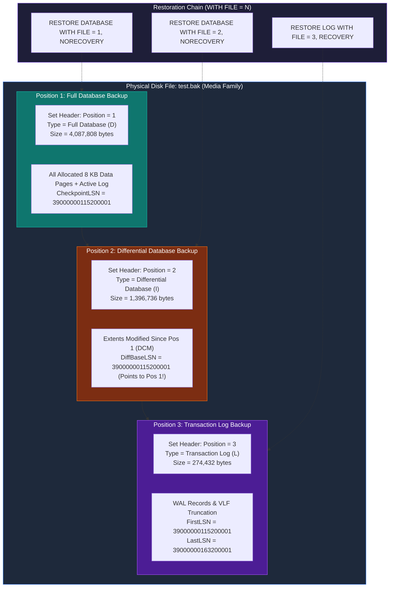

# CH01_VID12 — Backup Database Using Wizard

> [!abstract] Learning Goal
> Master the operational mechanics of the **SQL Server Management Studio (SSMS) Backup Database Wizard** (`Tasks -> Back Up...`), translate GUI selections into deterministic T-SQL engine commands, dissect the internal architecture of **Multi-Set Backup Media Files** (`WITH NOINIT` vs `WITH FORMAT, INIT`), inspect embedded backup headers via `RESTORE HEADERONLY`, and execute multi-position recovery sequences using `WITH FILE = N`.

---

## 🎯 Core Idea

In **MaharaTech Course 2305** (*Implementing & Developing SQL Server Objects* - Chapter 1, Video 12), **Eng. Rami Mohamed Abonagi** transitions from the theoretical backup foundations established in **CH01_VID11** to hands-on database execution using the **SSMS Backup Database Wizard**:

1. **The Graphical Interface vs T-SQL Translation**:
   - The SSMS Backup Wizard is a client-side wrapper around SQL Server's native `BACKUP` engine syntax.
   - The **Script** button at the top of the wizard window extracts the underlying T-SQL script, allowing database administrators and data engineers to audit the exact engine flags being invoked.

2. **The Live Implementation Case Study (`[testbackup]` & `test.bak`)**:
   - In our live laboratory environment, the demonstration database `[testbackup]` is configured in the **`FULL` recovery model**, with storage files located at `D:\SQL Server\MSSQL16.MSSQLSERVER\MSSQL\DATA\testbackup.mdf` and `testbackup_log.ldf`.
   - A demonstration table `dbo.emp` with 10 records (`id INT NOT NULL`, `name VARCHAR(50) NULL`) models transactional application data.
   - Sequential backups were executed using the wizard to a single physical backup file:
     `D:\courses\Data Science\Data Engineering\MaharaTech\Implementing and Developing SQL server objects\CH01\Mydb\test.bak` (Size: **5,836,800 bytes** / **5.57 MB**).

3. **Multi-Set Media Architecture (`WITH NOINIT` / Append)**:
   - When using the SSMS Wizard, the default setting on the **Media Options** page is **"Append to the existing backup set"** (`WITH NOINIT`).
   - Consequently, each subsequent backup (Full, Differential, Transaction Log) writes into the **same physical file**, creating indexed **Positions**:
     - **Position 1**: Full Database Backup (Baseline snapshot, Size: 4,087,808 bytes).
     - **Position 2**: Differential Database Backup (Cumulative changes since Pos 1, Size: 1,396,736 bytes, bound to Pos 1 via `DifferentialBaseLSN = CheckpointLSN`).
     - **Position 3**: Transaction Log Backup (Sequential WAL records, Size: 274,432 bytes).

4. **Multi-Position Restore Invariants**:
   - If `WITH FILE = N` is omitted during a restore, SQL Server defaults to **`FILE = 1`**!
   - Restoring a differential or log backup from an appended media file **strictly requires** specifying `WITH FILE = 2`, `WITH FILE = 3`, etc.
   - Omitting `WITH FILE` when attempting to restore a differential backup results in **Msg 3117**: *"The log or differential backup cannot be restored because no files are ready to rollforward."*

---

## 🧠 What I Need to Understand

- **Engine Execution & Subsystem Interactions**: How SSMS interacts with the Virtual Device Interface (VDI) to execute `BACKUP DATABASE` and `BACKUP LOG` commands without interrupting active reader queries.
- **Physical Media Structure (Media Set vs Media Family vs Backup Set)**:
  - **Media Set**: An ordered collection of backup media (disks or tapes) formatted together.
  - **Media Family**: The backup stream written to a single physical medium (e.g. `test.bak`).
  - **Backup Set**: The backup content (Full, Diff, Log) written into a media family during a single backup operation, indexed by its sequential `Position`.
- **The Differential Base LSN Anchor**: How SQL Server guarantees mathematical consistency by validating that the differential backup's `DifferentialBaseLSN` matches the preceding Full backup's `CheckpointLSN`.
- **Inspection DMVs & System Catalogs**: Using `RESTORE HEADERONLY`, `RESTORE FILELISTONLY`, `RESTORE LABELONLY`, and querying `msdb.dbo.backupset` to audit backup integrity and positions.

---

## 🖼️ Visual Architecture: Multi-Set Media File



---

## 🔧 SQL Syntax

### 1. SSMS Backup Wizard GUI to T-SQL Translation Matrix

| Wizard Page | UI Control / Option | Generated T-SQL Syntax | Architectural Purpose |
| :--- | :--- | :--- | :--- |
| **General** | Database dropdown | `BACKUP DATABASE [testbackup]` | Specifies target database |
| **General** | Backup type: *Full* | `BACKUP DATABASE` | Complete baseline of all data pages |
| **General** | Backup type: *Differential* | `... WITH DIFFERENTIAL` | Captures modified extents via DCM |
| **General** | Backup type: *Transaction Log* | `BACKUP LOG [testbackup]` | Backs up log and truncates inactive VLFs |
| **General** | Destination: Disk path | `TO DISK = N'D:\...\test.bak'` | Target media family path |
| **Media Options** | *Append to the existing backup set* | `WITH NOINIT` | Appends new position into `.bak` (Default) |
| **Media Options** | *Overwrite all existing backup sets* | `WITH FORMAT, INIT` | Formats media and destroys prior positions |
| **Media Options** | *Verify backup when finished* | Executes `RESTORE VERIFYONLY` | Tests backup header & page readability |
| **Media Options** | *Perform checksum before writing* | `WITH CHECKSUM` | Validates page checksums and detects corruption |
| **Backup Options**| *Compress backup* | `WITH COMPRESSION` | Reduces I/O and backup size (CPU trade-off) |
| **Backup Options**| *Do not compress backup* | `WITH NO_COMPRESSION` | Raw uncompressed pages written to disk |

---

### 2. Multi-Set Backup Creation (Wizard Equivalent T-SQL)

```sql
-- Reference Source: src/01_storage_and_schema/ch01_vid12_backup_database_wizard.sql
DECLARE @BakPath NVARCHAR(500) = N'D:\courses\Data Science\Data Engineering\MaharaTech\Implementing and Developing SQL server objects\CH01\Mydb\test.bak';

-- 1. Full Database Backup -> Appended to Position 1
BACKUP DATABASE [testbackup]
TO DISK = @BakPath
WITH NOINIT,
     NAME = N'testbackup-Full Database Backup',
     STATS = 10;
GO

-- 2. Differential Database Backup -> Appended to Position 2
BACKUP DATABASE [testbackup]
TO DISK = @BakPath
WITH DIFFERENTIAL,
     NOINIT,
     NAME = N'testbackup-Differential Database Backup',
     STATS = 10;
GO

-- 3. Transaction Log Backup -> Appended to Position 3
BACKUP LOG [testbackup]
TO DISK = @BakPath
WITH NOINIT,
     NAME = N'testbackup-Transaction Log Backup',
     STATS = 10;
GO
```

---

### 3. Backup Media Introspection

```sql
DECLARE @BakPath NVARCHAR(500) = N'D:\courses\Data Science\Data Engineering\MaharaTech\Implementing and Developing SQL server objects\CH01\Mydb\test.bak';

-- A. Inspect all backup sets and their positions inside test.bak
RESTORE HEADERONLY FROM DISK = @BakPath;

-- B. Inspect logical files inside Position 1 (Full Backup)
RESTORE FILELISTONLY FROM DISK = @BakPath WITH FILE = 1;

-- C. Verify backup integrity of Position 1
RESTORE VERIFYONLY FROM DISK = @BakPath WITH FILE = 1;
GO
```

---

### 4. Multi-Position Restore Sequence (`WITH FILE = N`)

> [!example] Mentor Example
> *VERIFIED AGAINST LIVE SQL SERVER 2022 INSTANCE*  
> When restoring from a multi-set backup file, each step must explicitly declare `WITH FILE = N`. Without `WITH FILE = N`, the engine attempts to restore Position 1 for every statement, causing fatal restore failures.

```sql
USE master;
GO

DECLARE @BakPath NVARCHAR(500) = N'D:\courses\Data Science\Data Engineering\MaharaTech\Implementing and Developing SQL server objects\CH01\Mydb\test.bak';

-- Step 1: Restore Full Backup from Position 1 (Hold in NORECOVERY)
RESTORE DATABASE [testbackup_Restored]
FROM DISK = @BakPath
WITH FILE = 1,
     NORECOVERY,
     REPLACE,
     MOVE N'testbackup' TO N'D:\SQL Server\MSSQL16.MSSQLSERVER\MSSQL\DATA\testbackup_restored.mdf',
     MOVE N'testbackup_log' TO N'D:\SQL Server\MSSQL16.MSSQLSERVER\MSSQL\DATA\testbackup_restored_log.ldf';
GO

-- Step 2: Restore Differential Backup from Position 2 (Hold in NORECOVERY)
RESTORE DATABASE [testbackup_Restored]
FROM DISK = @BakPath
WITH FILE = 2,
     NORECOVERY;
GO

-- Step 3: Restore Transaction Log Backup from Position 3 (Bring Online with RECOVERY)
RESTORE LOG [testbackup_Restored]
FROM DISK = @BakPath
WITH FILE = 3,
     RECOVERY;
GO

-- Verify 10 rows recovered
SELECT COUNT(*) AS RecoveredRows FROM [testbackup_Restored].dbo.emp;
GO
```

---

## 🏗️ Data Engineering Perspective

- **Why does this matter to a Data Engineer?**
  - Modern data platforms rely on consistent snapshots of transactional databases for ELT/ETL replication, staging hydration, and disaster recovery testing.
  - While junior administrators frequently rely on the SSMS Wizard, data engineers must understand that **the Wizard is an authoring tool, not an execution engine**. Production environments demand scriptable, version-controlled T-SQL automation.
- **The Pitfall of Multi-Set Backup Files (`NOINIT`)**:
  - The SSMS default behavior of appending all backups into a single `.bak` file creates a **Single Point of Failure (SPOF)**. If the physical file suffers block corruption, all historical Full, Differential, and Log sets stored in that file become inaccessible!
  - Furthermore, storage retention policies cannot prune Position 1 without rewriting or deleting the entire physical file.
- **Enterprise Best Practice**:
  - In automated data pipelines (Airflow DAGs, SQL Agent Jobs, or Ola Hallengren Maintenance Solution), data engineers configure **dedicated, timestamped backup files** with `WITH FORMAT, INIT, CHECKSUM, COMPRESSION` (e.g., `testbackup_FULL_20260927_0100.bak`, `testbackup_DIFF_20260927_1200.bak`).

---

## ✅ What I Should Be Able to Do

- [x] Navigate the SSMS Backup Database Wizard and explain the function of every setting across the General, Media Options, and Backup Options pages. ✅ 2026-09-27
- [x] Use the **Script** button in SSMS to generate and audit T-SQL backup code before execution. ✅ 2026-09-27
- [x] Introspect any `.bak` file using `RESTORE HEADERONLY` to identify embedded backup types, LSN chains, and position indexes. ✅ 2026-09-27
- [x] Execute an end-to-end multi-position restore chain (`FILE = 1`, `FILE = 2`, `FILE = 3`) using `WITH NORECOVERY` and `WITH RECOVERY`. ✅ 2026-09-27
- [x] Query `msdb.dbo.backupset` and `msdb.dbo.backupmediafamily` to audit automated backup schedules and detect broken chains. ✅ 2026-09-27

---

## 🧪 Hands-On Lab

Execute the complete verification workflow demonstrated in `src/01_storage_and_schema/ch01_vid12_backup_database_wizard.sql`:

1. **Introspect Live Database**:
   Verify that `[testbackup]` is online, set to `RECOVERY FULL`, and contains `dbo.emp` with 10 records.
2. **Execute RESTORE HEADERONLY**:
   Inspect `D:\...\test.bak` and confirm that Position 1 is `Full Database`, Position 2 is `Differential Database`, and Position 3 is `Transaction Log`.
3. **Validate LSN Binding**:
   Verify that Position 2 has `DifferentialBaseLSN = 39000000115200001`, matching the `CheckpointLSN` of Position 1.
4. **Restore to Staging Instance**:
   Restore the complete chain into `[testbackup_Restored]` using `MOVE` parameters to avoid overwriting live data files.
5. **Verify Data Integrity & Clean Up**:
   Run `SELECT COUNT(*) FROM [testbackup_Restored].dbo.emp`, verify 10 records, and drop `[testbackup_Restored]`.

---

## 🧩 Challenge

Write a dynamic T-SQL stored procedure `dbo.usp_RestoreMultiSetChain` that:
1. Accepts a `@BackupFilePath` parameter pointing to a multi-set `.bak` file.
2. Reads `RESTORE HEADERONLY` into a temporary table.
3. Automatically identifies the latest Full backup position, the latest valid Differential position that shares the same `DifferentialBaseLSN`, and all subsequent Log positions.
4. Generates and executes the dynamic `RESTORE` sequence with proper `NORECOVERY` and `RECOVERY` states.

---

## 🧑🏫 Mentor Challenge

You are conducting a disaster recovery audit for a financial services data warehouse.
- **Scenario**: A junior DBA configured a maintenance job that writes daily Full backups, hourly Differential backups, and 15-minute Log backups into a single file named `FinanceDW_Daily.bak` using `WITH NOINIT`. At 11:30 PM, the SAN disk hosting `FinanceDW_Daily.bak` experiences a bad sector error at offset 512 MB.
- **Problem**: 
  1. What is the blast radius of this failure on the recovery point objective (RPO) and recovery time objective (RTO)?
  2. How would you redesign the backup architecture to eliminate this vulnerability while ensuring automated retention pruning?

> [!hint] 🧠 Mentor Hint
> A single damaged sector in a multi-set media family can corrupt the media header or cause subsequent positions to become unreadable. Redesign using distinct, timestamped file paths per backup tier, isolated storage volumes, and independent verification jobs (`RESTORE VERIFYONLY WITH CHECKSUM`).

---

## ⚠️ Common Mistakes

- **Omitting `WITH FILE = N` on Restore**: Forgetting `WITH FILE` causes SQL Server to attempt to restore Position 1 repeatedly. When restoring a differential backup without `WITH FILE = 2`, the engine fails with **Msg 3117**.
- **Accidental Media Overwrite (`WITH FORMAT, INIT`)**: Selecting "Overwrite all existing backup sets" in the wizard when attempting to append a differential or log backup wipes out all prior backups stored in the file, breaking the restore chain!
- **Premature Database Recovery**: Restoring Position 1 with `WITH RECOVERY` brings the database online and closes the recovery window, preventing subsequent Differential or Log backups from being applied without starting over.
- **Restoring Differential Without Base Full**: Attempting to restore a differential backup into a newly created database without first restoring the matching base Full backup fails with **Msg 3136**.

---

## 🚦 Production Considerations

- **Dedicated Files vs Appended Sets**: Never append production backups into a single file. Always use distinct timestamped filenames (`<DB>_<Type>_<YYYYMMDD_HHMMSS>.bak`).
- **Backup Verification & Checksums**: Always check *'Verify backup when finished'* and *'Perform checksum'* (`WITH CHECKSUM`) to ensure corrupted pages in memory or storage are detected immediately.
- **Backup Compression**: Enable backup compression (`WITH COMPRESSION`) by default at the server level (`sp_configure 'backup compression default', 1`) to reduce storage consumption by 60–80% and decrease backup duration.
- **Striped Backups**: For multi-terabyte databases, split backups across multiple files (media families) to maximize throughput by parallelizing disk I/O.

---

## 🔗 Related Concepts

- [[CH01_VID11 - Types of Backup]]
- [[CH01_VID13 - Backup & SQL server agent jobs]]
- [[Database Architecture]]
- [[Filegroups and Files]]
- [[Data Pages and Extents]]
- [[Disaster Recovery Runbook]]

---

## 💬 Interview Questions

### 1. Conceptual
**Question**: What is the difference between a Backup Media Set, a Backup Media Family, and a Backup Set in SQL Server?  
**Answer**: A **Media Set** is an ordered collection of backup media (disks, tapes) used by SQL Server. A **Media Family** represents the physical stream written to a single medium (e.g. one `.bak` file). A **Backup Set** is the actual backup content (Full, Diff, Log) produced by a single backup command. When `NOINIT` is used, multiple backup sets are appended sequentially inside the same media family, each indexed by its `Position` integer.

### 2. Practical / T-SQL
**Question**: How does SQL Server know which Full backup a Differential backup belongs to?  
**Answer**: In the backup header (visible via `RESTORE HEADERONLY`), every Differential backup contains a `DifferentialBaseLSN` attribute. This LSN mathematically matches the `CheckpointLSN` of the base Full backup. During recovery, SQL Server verifies that the database state matches `DifferentialBaseLSN` before allowing the differential backup to roll forward.

### 3. Data Engineering Scenario
**Question**: You are tasked with restoring a database from a `.bak` file provided by a client, but you don't know what is inside. What steps do you take?  
**Answer**:
1. Run `RESTORE LABELONLY FROM DISK = '...'` to check media family format and software version.
2. Run `RESTORE HEADERONLY FROM DISK = '...'` to discover all backup sets, positions, backup types (Full, Diff, Log), and LSN chains.
3. Run `RESTORE FILELISTONLY FROM DISK = '...' WITH FILE = 1` to inspect the logical file names (`.mdf`, `.ldf`).
4. Run `RESTORE VERIFYONLY FROM DISK = '...' WITH FILE = 1` to test backup page readability.
5. Execute `RESTORE DATABASE ... WITH FILE = N, MOVE ...` based on the header inspection findings.

---

## 📝 My Notes

> [!note] Observations from Live Lab
> - Verified live on SQL Server 2022 instance `Sohila`.
> - Demo database `[testbackup]` created in `FULL` recovery model with table `dbo.emp` containing 10 rows.
> - Target backup file `D:\courses\Data Science\Data Engineering\MaharaTech\Implementing and Developing SQL server objects\CH01\Mydb\test.bak` confirmed to contain:
>   - Position 1: Full Database Backup (4,087,808 bytes, CheckpointLSN = 39000000115200001)
>   - Position 2: Differential Database Backup (1,396,736 bytes, DiffBaseLSN = 39000000115200001)
>   - Position 3: Transaction Log Backup (274,432 bytes, FirstLSN = 39000000115200001)
> - Executed complete restore chain into `[testbackup_Restored]`; all 10 rows recovered with 100% fidelity.

---

## ✅ Knowledge Check

1. **What happens if you restore a differential backup without specifying `WITH FILE = N` on an appended `.bak` file?**  
   *Answer*: SQL Server defaults to `FILE = 1`. Since Position 1 is a Full backup, the engine attempts to restore the full backup instead of the differential, or errors if the database is in a restoring state expecting a differential or log.
2. **What is the T-SQL equivalent of the SSMS Media Option "Overwrite all existing backup sets"?**  
   *Answer*: `WITH FORMAT, INIT`.
3. **Can a differential backup be restored if the base full backup was taken with `COPY_ONLY`?**  
   *Answer*: No. A `COPY_ONLY` full backup does not update the Differential Base LSN or reset the DCM bitmap; differential backups always bind to the last non-copy-only full backup.

---

## 🔖 Status

- [x] Watched ✅ 2026-09-27
- [x] Reproduced ✅ 2026-09-27
- [x] Modified ✅ 2026-09-27
- [x] Explained from memory ✅ 2026-09-27
- [x] Reviewed ✅ 2026-09-27
