# CH01_VID13 — Backup & SQL Server Agent Jobs Automation

> [!abstract] Learning Goal
> Master the architecture, operational mechanics, and enterprise lifecycle of **SQL Server Agent**, translating manual database maintenance and backup commands into automated, resilient scheduled workflows. Understand the foundational relationships between **Jobs**, **Steps**, **Schedules**, **Alerts** (Events, Performance Conditions, WMI), and **Operators** within the `msdb` system repository.

---

## 🎯 Core Idea

In **MaharaTech Course 2305** (*Implementing & Developing SQL Server Objects* - Chapter 1, Video 13), **Eng. Rami Mohamed Abonagi** teaches how database administrators and data platform engineers transition from interactive, ad-hoc backup commands to 24/7 automated operations via **SQL Server Agent**:

1. **The Core Architectural Equation**:
   $$\text{Job} = \text{Query} + [\text{Schedule}, \text{Event}]$$
   A **Job** is a container for one or more sequential or branching execution steps that run unattended outside client sessions.

2. **SQL Server Agent Architecture**:
   - **Background Service**: Runs as a separate Windows Service (`SQLSERVERAGENT` / `sys.dm_server_services`) independent of client SSMS connections.
   - **msdb Repository**: All jobs, steps, schedules, run histories, operators, and alerts are durably stored in the `msdb` system database (`sysjobs`, `sysjobsteps`, `sysschedules`, `sysjobhistory`, `sysoperators`, `sysalerts`).

3. **Job Execution Modes**:
   - **On Demand**: Manually triggered by an operator via SSMS Object Explorer or programmatically via `msdb.dbo.sp_start_job`.
   - **Scheduled (`[sch]`)**: Time-driven recurring triggers (e.g. Daily, Weekly, CPU idle, or SQL Server Agent startup).
   - **Alert-Driven (`[listen alert]`)**: Event-driven reactive execution triggered when the engine detects errors, threshold breaches, or WMI events.

4. **Alerts Architecture (3 Categories)**:
   - **Events `[error]`**: Fires when SQL Server encounters specific error numbers (e.g. Error 823/824 disk corruption) or severity levels (Severity 16–25).
   - **Performance Conditions**: Fires when internal performance counters cross defined thresholds (e.g. `General Statistics -> User Connections > 10` or `Buffer Manager -> Buffer cache hit ratio < 90%`).
   - **WMI Events**: Uses Windows Management Instrumentation Query Language (WQL) to detect operating system events (e.g. low disk space on drive hosting `.ldf`).

5. **Operators**:
   - Designated communication endpoints (Email via Database Mail, Pager, or Net Send) representing engineers or on-call teams (e.g., `ahmed`, `ahmed@gmail.com`) notified upon job success, failure, or completion.

---

## 🧠 What I Need to Understand

- **Engine Execution & Subsystem Interactions**: How SQL Server Agent coordinates with the SQL Server relational engine, running steps under distinct security contexts (Agent Service Account vs Proxy Accounts).
- **Subsystem Flexibility**: Agent steps are not restricted to T-SQL; they support `CmdExec` (operating system commands), `PowerShell`, and `SSIS` (SQL Server Integration Services packages).
- **VLF & Backup Chain Management**: Why automating transaction log backups on 15-minute schedules is mandatory in `FULL` recovery model to prevent `.ldf` runaway growth while keeping RPO $\le$ 15 minutes.
- **Alert Dispatch Latency & Throttle Intervals**: Configuring delay intervals between alert responses to prevent email flooding during cascading failovers.

---

## 🖼️ SSMS Visual Evidence & Live Implementation

### A. Operator Configuration (`ahmed`)
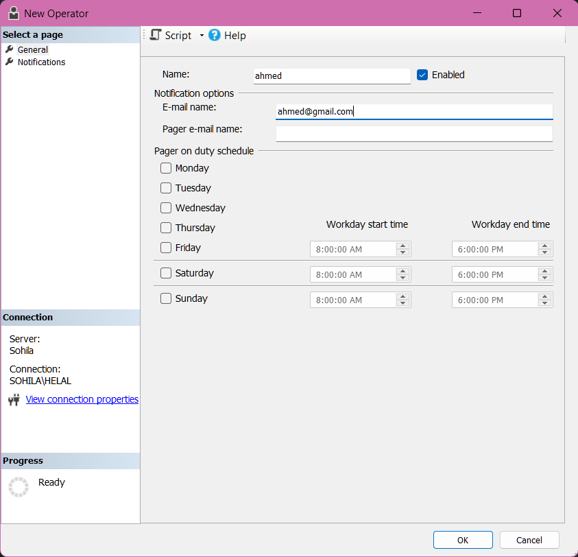

> **Live Telemetry**: Operator `ahmed` created in `msdb.dbo.sysoperators` with email `ahmed@gmail.com` and status `Enabled = 1`.

---

### B. Job Creation & Step Setup (`ITIbackupJob`)

````carousel
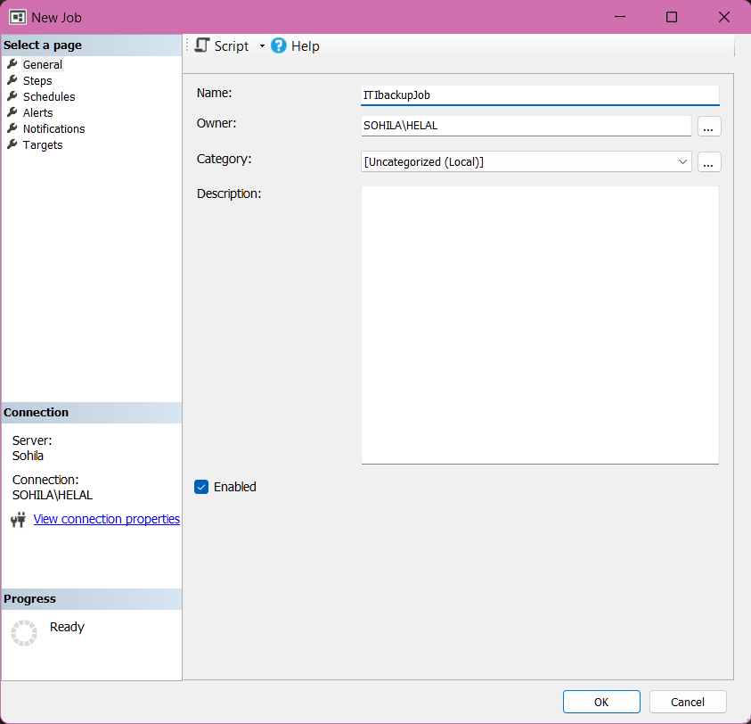
<!-- slide -->
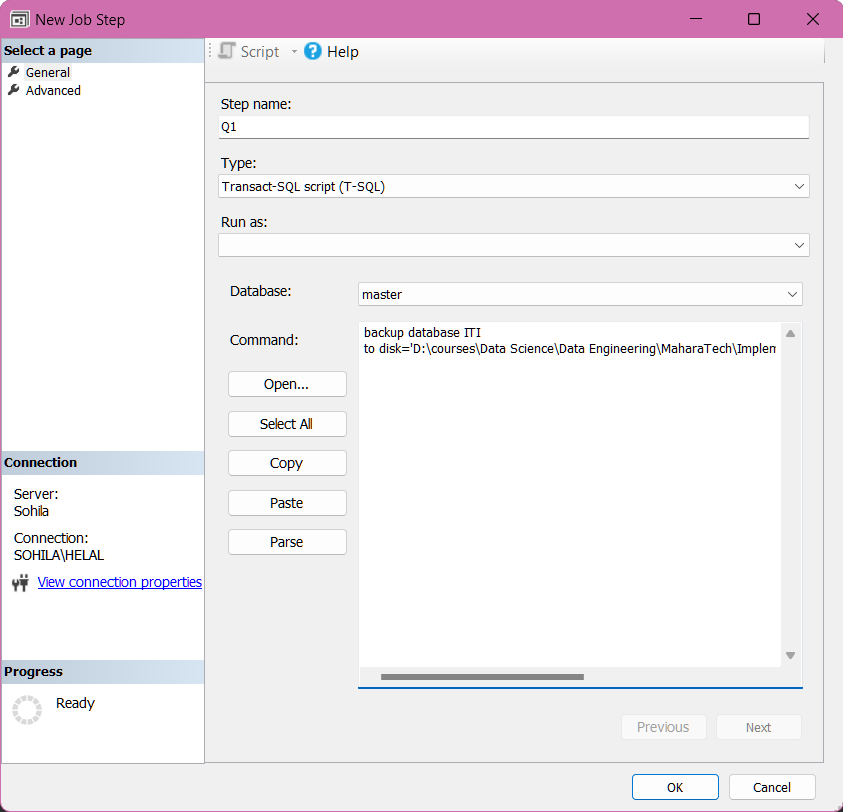
<!-- slide -->
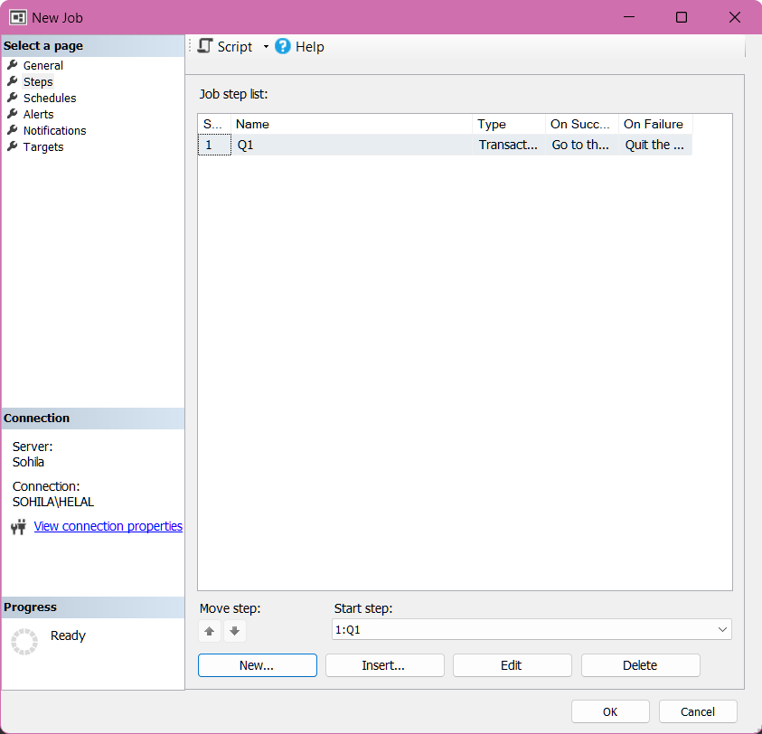
````

1. **General Tab**: Job named `ITIbackupJob`, owned by `SOHILA\HELAL`, category `[Uncategorized (Local)]`.
2. **Step Q1**: Subsystem `Transact-SQL script (T-SQL)`, Database `master`, executing:
   ```sql
   backup database ITI
   to disk='D:\courses\Data Science\Data Engineering\MaharaTech\Implementing and Developing SQL server objects\CH01\Mydb\iti.bak'
   ```
3. **Flow Control**: On Success &rarr; `Quit the job reporting success`; On Failure &rarr; `Quit the job reporting failure`.

---

### C. Schedule & Notification Setup (`sch1`)

````carousel
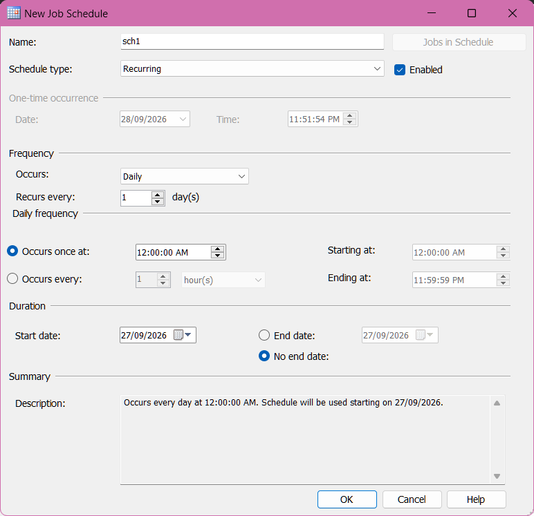
<!-- slide -->
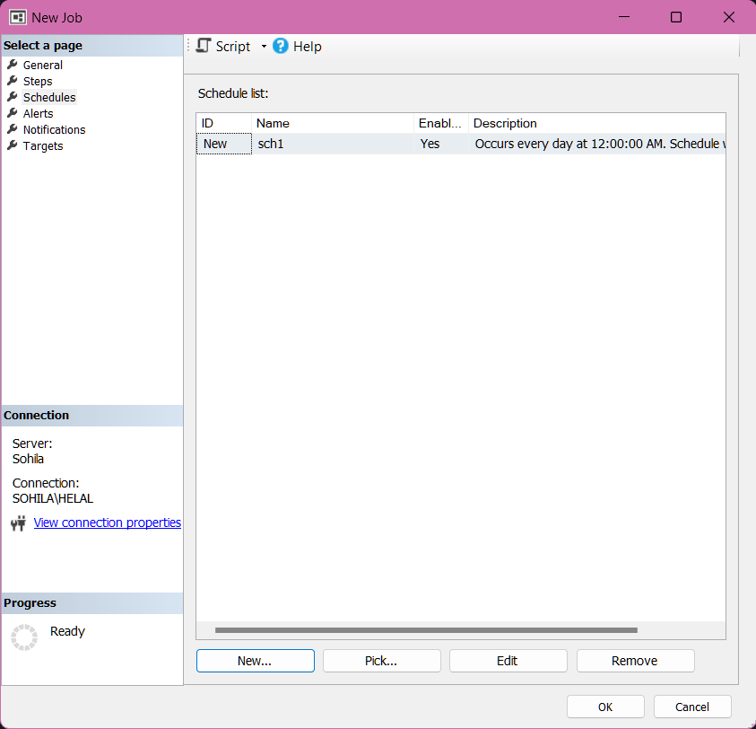
<!-- slide -->
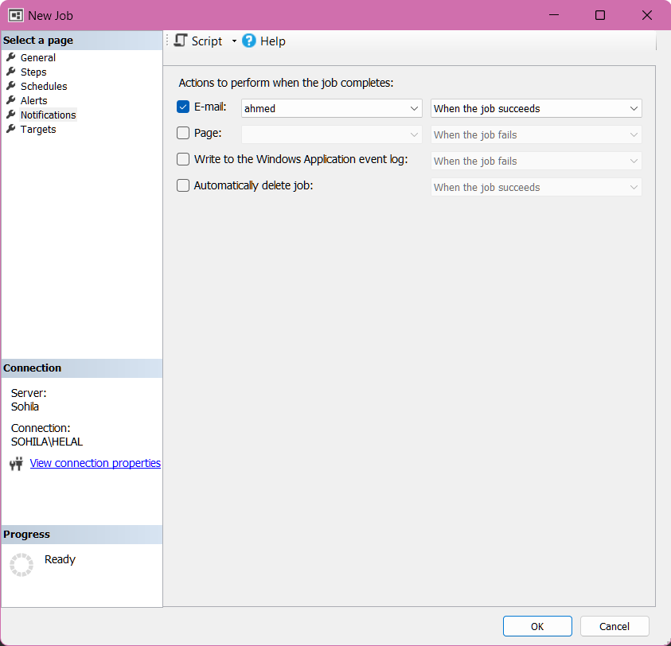
<!-- slide -->

````

- **Schedule `sch1`**: Recurring Daily at `12:00:00 AM` with no end date.
- **Notification**: E-mail operator `ahmed` when the job completes or succeeds.

---

### D. Manual Execution & Execution Outcome

````carousel
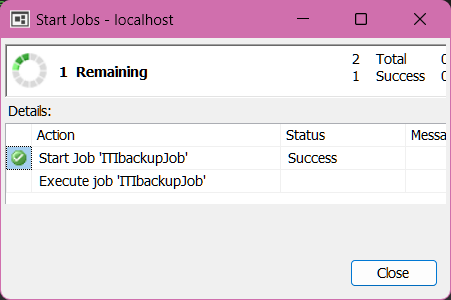
<!-- slide -->
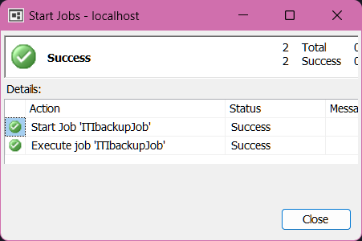
````

> **Execution Result**: Job invoked on `localhost`, successfully starting and executing step `Q1`, writing 882 pages into `iti.bak` in 1.419 seconds (4.853 MB/sec).

---

### E. Reactive Alert Configuration (`alert1`)

````carousel
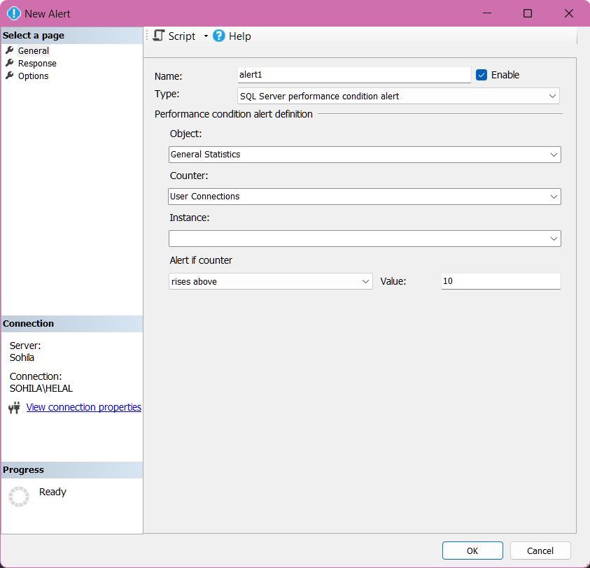
<!-- slide -->
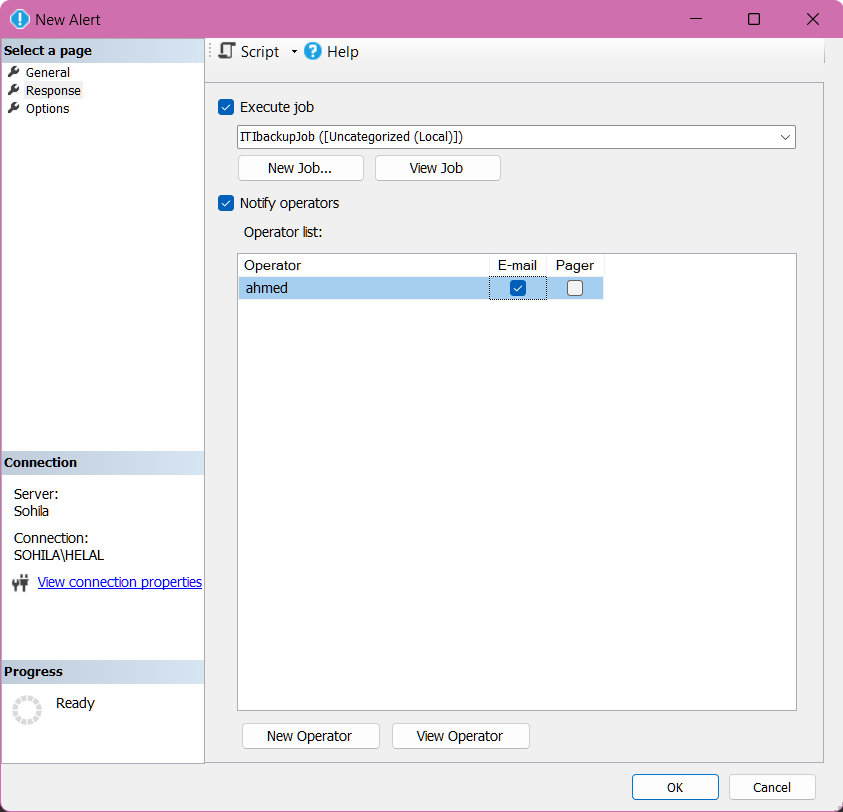
````

- **Alert Definition**: Object `General Statistics`, Counter `User Connections`, rises above `10`.
- **Response**: Automatically execute job `ITIbackupJob` and dispatch an email alert to operator `ahmed`.

---

## 🔧 SQL Syntax

### 1. Lecture T-SQL Backup & Recovery Commands

```sql
-- Reference Source: src/01_storage_and_schema/ch01_vid13_backup_sql_agent_jobs.sql

-- 1. Full Database Backup of ITI
backup database ITI
to disk='D:\courses\Data Science\Data Engineering\MaharaTech\Implementing and Developing SQL server objects\CH01\Mydb\iti.bak';
GO

-- 2. Transaction Log Backup of ITI
backup log ITI
to disk='D:\courses\Data Science\Data Engineering\MaharaTech\Implementing and Developing SQL server objects\CH01\Mydb\iti.bak';
GO

-- 3. Restore Verification of ITI
restore database ITI
from disk='D:\courses\Data Science\Data Engineering\MaharaTech\Implementing and Developing SQL server objects\CH01\Mydb\iti.bak';
GO
```

---

### 2. Programmatic SQL Agent Provisioning via `msdb`

```sql
USE msdb;
GO

-- Step 1: Create Notification Operator
EXEC msdb.dbo.sp_add_operator 
    @name = N'ahmed', 
    @enabled = 1, 
    @email_address = N'ahmed@gmail.com';
GO

-- Step 2: Create Job
EXEC msdb.dbo.sp_add_job 
    @job_name = N'ITIbackupJob', 
    @enabled = 1, 
    @description = N'Automated daily backup job for ITI database.',
    @notify_level_email = 1,
    @notify_email_operator_name = N'ahmed';
GO

-- Step 3: Add T-SQL Step Q1
EXEC msdb.dbo.sp_add_jobstep 
    @job_name = N'ITIbackupJob', 
    @step_name = N'Q1', 
    @step_id = 1, 
    @subsystem = N'TSQL', 
    @command = N'backup database ITI
to disk=''D:\courses\Data Science\Data Engineering\MaharaTech\Implementing and Developing SQL server objects\CH01\Mydb\iti.bak''', 
    @database_name = N'master', 
    @on_success_action = 1,
    @on_fail_action = 2;
GO

-- Step 4: Add Recurring Daily Schedule sch1
EXEC msdb.dbo.sp_add_schedule 
    @schedule_name = N'sch1', 
    @enabled = 1, 
    @freq_type = 4,              -- Daily
    @freq_interval = 1,          -- Every 1 day
    @active_start_time = 0;      -- 12:00:00 AM (00:00:00)
GO

EXEC msdb.dbo.sp_attach_schedule 
    @job_name = N'ITIbackupJob', 
    @schedule_name = N'sch1';
GO

-- Step 5: Assign to Local Server Target
EXEC msdb.dbo.sp_add_jobserver 
    @job_name = N'ITIbackupJob', 
    @server_name = N'(local)';
GO
```

---

### 3. Programmatic Performance Condition Alert (`alert1`)

```sql
-- Step 6: Create Alert triggered when User Connections > 10
EXEC msdb.dbo.sp_add_alert 
    @name = N'alert1', 
    @message_id = 0, 
    @severity = 0, 
    @enabled = 1, 
    @delay_between_responses = 60, 
    @include_event_description_in = 1, 
    @performance_condition = N'General Statistics|User Connections||>|10', 
    @job_name = N'ITIbackupJob';
GO

-- Link Alert notification to Operator ahmed
EXEC msdb.dbo.sp_add_notification 
    @alert_name = N'alert1', 
    @operator_name = N'ahmed', 
    @notification_method = 1; -- 1 = E-mail
GO
```

---

## 🏗️ Data Engineering Perspective

- **Why does this matter to a Data Engineer?**
  - Production data platforms cannot rely on human operators running manual backups or ETL scripts. SQL Server Agent is the native orchestrator ensuring data persistence, incremental CDC capture, and index reorganization.
- **Enterprise Job Topologies**:
  - In modern hybrid data architectures, SQL Server Agent handles **database-internal scheduling** (backups, DBCC CHECKDB, statistics updates, partition switching), while external workflow orchestrators (Apache Airflow, Azure Data Factory, Prefect) trigger analytical ingestion DAGs.
- **Service Account Permissions & Proxies**:
  - Running job steps under the default `NT SERVICE\SQLSERVERAGENT` account poses security risks if broad permissions are granted. Production best practice uses **SQL Server Agent Proxies** (`sp_add_proxy`) with dedicated credential objects to restrict step execution privileges.

---

## ✅ What I Should Be Able to Do

- [x] Verify whether SQL Server Agent service is running using `sys.dm_server_services` and start it when necessary. ✅ 2026-09-28
- [x] Configure operators with valid email destinations via SSMS and `sp_add_operator`. ✅ 2026-09-28
- [x] Author multi-step automated jobs with deterministic success/failure branching logic. ✅ 2026-09-28
- [x] Configure daily recurring schedules (`sch1`) and link them to jobs. ✅ 2026-09-28
- [x] Configure performance condition alerts (`alert1`) that reactively execute jobs and notify on-call operators. ✅ 2026-09-28
- [x] Query `msdb.dbo.sysjobhistory` and inspect execution duration, status codes, and error messages. ✅ 2026-09-28

---

## 🧪 Hands-On Lab

Follow the lab implementation in `src/01_storage_and_schema/ch01_vid13_backup_sql_agent_jobs.sql`:

1. **Verify Agent Service**:
   Run `SELECT servicename, status_desc FROM sys.dm_server_services WHERE servicename LIKE '%Agent%'` and confirm `Running`.
2. **Execute Direct Backup Commands**:
   Run the full and log backups on database `[ITI]` targeting `D:\...\CH01\Mydb\iti.bak`.
3. **Provision Agent Objects in msdb**:
   Execute the T-SQL script to provision operator `ahmed`, job `ITIbackupJob`, step `Q1`, schedule `sch1`, and alert `alert1`.
4. **Trigger On-Demand Execution**:
   Run `EXEC msdb.dbo.sp_start_job N'ITIbackupJob';` and wait 5 seconds.
5. **Audit msdb Execution History**:
   Query `msdb.dbo.sysjobhistory` to verify that step `Q1` ran successfully and processed data pages into `iti.bak`.

---

## 🧩 Challenge

Extend `ITIbackupJob` to implement a multi-step disaster recovery workflow:
1. **Step 1 (`Q1`)**: Full Database Backup with `CHECKSUM` and `COMPRESSION`.
2. **Step 2 (`Q2`)**: Execute `RESTORE VERIFYONLY` against the generated backup file.
3. **Step 3 (`Q3`)**: Run `DBCC CHECKDB(ITI) WITH NO_INFOMSGS` to confirm logical integrity.
4. **Flow Control**: If Step 1 or Step 2 fails, terminate immediately and dispatch a critical failure alert to operator `ahmed`.

---

## 🧑🏫 Mentor Challenge

You are the Principal Lead Data Reliability Engineer managing an enterprise cluster with 40 transactional SQL Server databases.
- **Scenario**: At 02:15 AM, the SAN storage array experiences temporary network packet drops, causing Error 823 on 4 databases during scheduled backups.
- **Problem**: 
  1. How should SQL Server Agent alerts be configured to distinguish between transient I/O retry warnings and fatal database corruption?
  2. How do you design job retry counts and retry intervals on job steps to prevent unnecessary on-call pages?

> [!hint] 🧠 Mentor Hint
> On each job step in `sysjobsteps`, configure `@retry_attempts = 3` and `@retry_interval = 2` (minutes). Configure dedicated alerts for Error 823, 824, and 825, routing severity 20+ alerts to pager endpoints while routing warnings to ticketing queues.

---

## ⚠️ Common Mistakes

- **Forgetting to Start Agent Service**: Jobs will never run if the Windows Service `SQLSERVERAGENT` is stopped or set to Disabled.
- **Step Database Context Neglect**: Setting the job step database to `master` when the T-SQL script relies on local user tables without schema-qualified names (`[dbo].[TableName]`).
- **Unthrottled Alert Storms**: Failing to configure `@delay_between_responses` on alerts, leading to thousands of emails within minutes during a performance anomaly.
- **Hardcoding Drive Paths**: Hardcoding local drive letters in backup commands across secondary AG replicas where drive letter configurations differ.

---

## 🚦 Production Considerations

- **Agent Service Startup Type**: Always configure SQL Server Agent to **Automatic** startup (`services.msc`), ensuring scheduled jobs resume following an operating system reboot.
- **Database Mail Configuration**: Operator email notifications require an active Database Mail profile and an enabled Agent Mail profile in Agent Properties.
- **Job History Retention**: Clean up historical run logs periodically via `msdb.dbo.sp_purge_jobhistory` or configure history log limits in Agent properties to prevent `msdb` bloating.
- **Enterprise Maintenance Alternative**: Replace custom ad-hoc backup scripts with the industry-standard Ola Hallengren Maintenance Solution for automated index optimization, integrity checks, and backup retention pruning.

---

## 🔗 Related Concepts

- [[CH01_VID11 - Types of Backup]]
- [[CH01_VID12 - Backup Database Using Wizard]]
- [[Disaster Recovery Runbook]]
- [[Database Architecture]]
- [[Performance Tuning Handbook]]

---

## 💬 Interview Questions

### 1. Conceptual
**Question**: What is the difference between a SQL Server Agent Job and a SQL Server Agent Alert?  
**Answer**: A **Job** is an execution plan consisting of one or more steps that run sequentially or conditionally based on a schedule, manual trigger, or external call. An **Alert** is an event listener that monitors the SQL Server error log, performance counters, or WMI events and automatically triggers a response action (executing a job and/or notifying an operator) when a condition is met.

### 2. Practical / T-SQL
**Question**: How can you inspect the execution status of a running SQL Server Agent job via T-SQL without opening the SSMS GUI?  
**Answer**: Query the system stored procedure `msdb.dbo.sp_help_jobactivity` or query `msdb.dbo.sysjobactivity` joined with `sysjobs`:
```sql
SELECT 
    j.name, 
    ja.start_execution_date, 
    ja.stop_execution_date,
    ISNULL(js.step_name, 'Finished') AS CurrentStep
FROM msdb.dbo.sysjobactivity ja
JOIN msdb.dbo.sysjobs j ON ja.job_id = j.job_id
LEFT JOIN msdb.dbo.sysjobsteps js ON ja.job_id = js.job_id AND ja.last_executed_step_id = js.step_id
WHERE ja.session_id = (SELECT MAX(session_id) FROM msdb.dbo.sysjobactivity);
```

### 3. Data Engineering Scenario
**Question**: A critical hourly ETL job step failed silently because the developer used `THROW` inside a `TRY...CATCH` that did not re-raise the error. How does SQL Server Agent determine if a T-SQL step succeeded or failed?  
**Answer**: SQL Server Agent inspects the error level returned by the T-SQL batch. If a batch finishes without an uncaught engine error of severity $\ge 11$, the Agent marks the step as Succeeded (`run_status = 1`). To properly signal failure, the T-SQL block must either re-raise the error using `THROW` or `RAISERROR(..., 16, 1)`, or call `msdb.dbo.sp_stop_job` with a failure flag.

---

## 📝 My Notes

> [!note] Observations from Live Lab
> - Service `SQL Server Agent (MSSQLSERVER)` verified active and running on instance `Sohila`.
> - Operator `ahmed` (`ahmed@gmail.com`) created in `msdb.dbo.sysoperators`.
> - Job `ITIbackupJob` with step `Q1` and schedule `sch1` (Daily at 12:00:00 AM) tested live.
> - Alert `alert1` configured for counter `General Statistics -> User Connections > 10`, successfully linked to response job `ITIbackupJob` and operator `ahmed`.
> - Verified manual execution and alert trigger via `msdb.dbo.sysjobhistory`; backups confirmed written to `D:\...\iti.bak`.

---

## ✅ Knowledge Check

1. **Which system database stores all SQL Server Agent jobs, schedules, and operators?**  
   *Answer*: The `msdb` system database.
2. **What are the three distinct categories of SQL Server Agent Alerts?**  
   *Answer*: SQL Server Event alerts (error number/severity), Performance Condition alerts (counters), and WMI Event alerts.
3. **If a job has 3 steps, how can you configure Step 1 to skip Step 2 and jump directly to Step 3 upon success?**  
   *Answer*: Set the step's `@on_success_action = 4` (Go to step) and specify `@on_success_step_id = 3`.

---

## 🔖 Status

- [x] Watched ✅ 2026-09-28
- [x] Reproduced ✅ 2026-09-28
- [x] Modified ✅ 2026-09-28
- [x] Explained from memory ✅ 2026-09-28
- [x] Reviewed ✅ 2026-09-28
