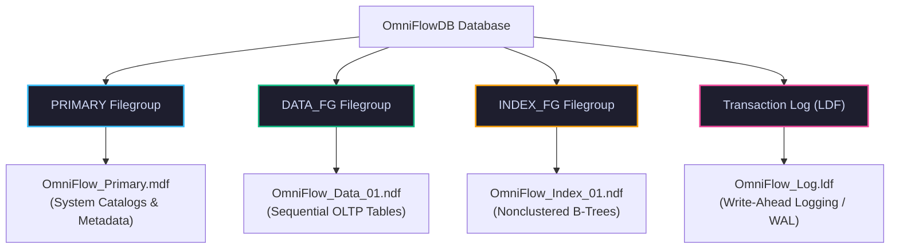

# Database Physical Architecture Diagram

```mermaid
graph TD
    classDef primary fill:#1e1e2e,stroke:#38bdf8,stroke-width:2px,color:#cdd6f4;
    classDef data fill:#1e1e2e,stroke:#10b981,stroke-width:2px,color:#cdd6f4;
    classDef index fill:#1e1e2e,stroke:#f59e0b,stroke-width:2px,color:#cdd6f4;
    classDef log fill:#1e1e2e,stroke:#ec4899,stroke-width:2px,color:#cdd6f4;

    DB["OmniFlowDB Database"] --> FG_PRI["PRIMARY Filegroup"]:::primary
    DB --> FG_DATA["DATA_FG Filegroup"]:::data
    DB --> FG_IDX["INDEX_FG Filegroup"]:::index
    DB --> LOG["Transaction Log (LDF)"]:::log

    FG_PRI --> F_MDF["OmniFlow_Primary.mdf<br/>(System Catalogs & Metadata)"]
    FG_DATA --> F_NDF1["OmniFlow_Data_01.ndf<br/>(Sequential OLTP Tables)"]
    FG_IDX --> F_NDF2["OmniFlow_Index_01.ndf<br/>(Nonclustered B-Trees)"]
    LOG --> F_LDF["OmniFlow_Log.ldf<br/>(Write-Ahead Logging / WAL)"]
```
