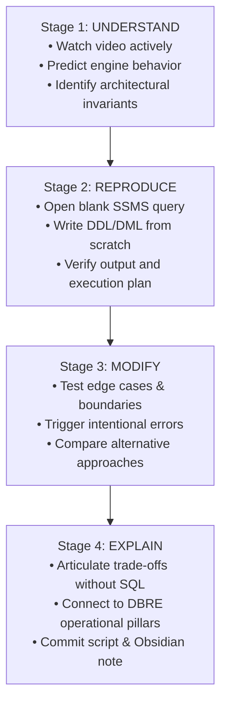

# The 4-Stage Mentor Engineering Workflow

> [!abstract] Methodology Overview
> 📑 **Navigation:** [Curriculum Overview](README.md) · [Learning Tracker](LEARNING_TRACKER.md) · [8-Week Study Plan](8-WEEK-STUDY-PLAN.md) · [102 Video Index](VIDEO_INDEX.md)  
> 🎯 **Core Law:** A lecture is never marked complete by merely viewing the video. Mastery requires active verification across four non-negotiable engineering stages.

---

## The 4-Stage Mastery Framework

---

## Detailed Stage Execution Guidelines

### Stage 1 — Understand
* Watch the lesson actively without multitasking.
* Pause the video before the instructor executes an action in SSMS or runs a query.
* **Predict:** What will SQL Server do? Will this result in an index seek, index scan, or lock escalation? Will a constraint fail?
* Distinguish transient UI clicks in SSMS from fundamental database engine mechanics.

### Stage 2 — Reproduce
* Open a blank query editor in SQL Server Management Studio or Azure Data Studio.
* Write and execute the code **from memory without copying and pasting line-by-line**.
* Inspect execution plans (`Ctrl + M`) and logical I/O statistics (`SET STATISTICS IO, TIME ON`).
* Confirm that the relational tables, constraints, or stored procedures behave identically to expected specifications.

### Stage 3 — Modify
* Introduce an intentional change:
  * What happens if you insert an invalid foreign key or NULL value?
  * What happens if two concurrent transactions attempt to update the same row?
  * How does the execution plan change when an index column is wrapped in a scalar function?
* Benchmark the change to verify the performance impact.

### Stage 4 — Explain
* Formulate a clear, 2-minute verbal explanation or write the synthesis note in Obsidian:
  * *What problem does this solve in an enterprise data platform?*
  * *What is the operational cost (locking, memory grant, CPU, I/O)?*
  * *When would this feature be the WRONG tool, and what alternative would you choose?*
* Link the reproducible SQL script to the Obsidian study note and commit to version control.

---

## Definition of Done (Quality Gate)

> [!check] Verification Checklist
> - [ ] I can define the architectural concept in one sentence.
> - [ ] I wrote and executed the working implementation from scratch.
> - [ ] I tested at least one failure condition or edge case.
> - [ ] I can articulate the performance and operational trade-offs without looking at notes.
> - [ ] The study note and production script are linked in the repository.
