# SQL Server Objects — Enterprise Learning Companion & Curriculum

> [!abstract] Companion Overview
> 📑 **Navigation:** [Interactive Learning Tracker](LEARNING_TRACKER.md) · [102 Video Index](VIDEO_INDEX.md) · [8-Week Study Plan](8-WEEK-STUDY-PLAN.md) · [Mentor Workflow](MENTOR_WORKFLOW.md) · [Engineering Roadmap](STUDY_PLAN.md)  
> 🎓 **Official Source:** [MaharaTech Implementing and Developing SQL Server Objects (Course 2305)](https://maharatech.gov.eg/course/view.php?id=2305)  
> 🏛️ **Institution:** Information Technology Institute (ITI) · **Instructor:** Eng. Rami Mohamed Abonagi  
> ⏱️ **Scope:** 5 Chapters · **102 Comprehensive Video Study Notes** · 11h 47m Video Content · Complete Production Codebase in [`src/`](../../src/)

---

## 1. Curriculum Architecture & Implementation Mapping

```mermaid
flowchart TD
    subgraph Curriculum ["docs/curriculum/ (Study Companion)"]
        CH01_Notes["CH01: Database Creation & Storage (16 Notes)"]
        CH02_Notes["CH02: SQL Programming & ACID (15 Notes)"]
        CH03_Notes["CH03: Views, Partitioning & HA (23 Notes)"]
        CH04_Notes["CH04: Procedures, Triggers & CLR (27 Notes)"]
        CH05_Notes["CH05: SSRS & Kimball Warehousing (20 Notes)"]
        Final_Brief["Final Capstone Integration (1 Brief)"]
    end

    subgraph Production ["src/ & tests/ (Enterprise Codebase)"]
        Src01["src/01_storage_and_schema/ (Filegroups, Schemas, Constraints)"]
        Src02["src/02_indexing_and_performance/ (B-Trees, Indexed Views)"]
        Src03["src/03_programmability_and_elt/ (TVPs, Procs, XML, CTEs)"]
        Src04["src/04_governance_and_audit/ (CDC Audit, DDL Triggers)"]
        Src05["src/05_automation_and_smo/ (C# CLR Assembly, SMO Scripts)"]
        Src06["src/06_reliability_and_dr/ (Backups, Snapshots, DR)"]
        Src07["src/07_warehousing_and_reporting/ (Star Schema, SSRS RDL)"]
        Tests["tests/ (pytest DBRE harness + in-engine tSQLt)"]
    end

    CH01_Notes --> Src01
    CH01_Notes --> Src06
    CH02_Notes --> Src03
    CH03_Notes --> Src02
    CH03_Notes --> Src01
    CH04_Notes --> Src03
    CH04_Notes --> Src04
    CH04_Notes --> Src05
    CH05_Notes --> Src07
    Final_Brief --> Tests
```



---

## 2. Chapter Overviews & Study Portals

| Chapter | Topic Focus | Lessons | Chapter Guide | Production Implementation |
| :--- | :--- | :---: | :--- | :--- |
| **CH01** | Database Creation, Multi-Filegroups & Storage Internals | 16 | [CH01 Mastery Guide](chapters/ch01-readme.md) | [`src/01_storage_and_schema/`](../../src/01_storage_and_schema/) |
| **CH02** | SQL Programming, Functions & Transaction Boundaries | 15 | [CH02 Mastery Guide](chapters/ch02-readme.md) | [`src/03_programmability_and_elt/`](../../src/03_programmability_and_elt/) |
| **CH03** | Indexed Views, Partitioning, XML & Log Shipping HA | 23 | [CH03 Mastery Guide](chapters/ch03-readme.md) | [`src/02_indexing_and_performance/`](../../src/02_indexing_and_performance/) |
| **CH04** | Stored Procedures, Audit Triggers, CLR & SMO Automation | 27 | [CH04 Mastery Guide](chapters/ch04-readme.md) | [`src/04_governance_and_audit/`](../../src/04_governance_and_audit/) |
| **CH05** | SSRS Paginated Reporting & Kimball Star Schema Marts | 20 | [CH05 Mastery Guide](chapters/ch05-readme.md) | [`src/07_warehousing_and_reporting/`](../../src/07_warehousing_and_reporting/) |
| **Final** | Capstone Case Study: Integrated Data Platform | 1 | [Final Project Brief](projects/final-project-brief.md) | [`deploy.ps1`](../../deploy.ps1) · [`tests/`](../../tests/) |

---

## 3. Obsidian Second Brain Live Dashboards & Queries

> [!tip] Obsidian Second Brain Dynamic Telemetry
> If viewing this vault inside Obsidian with **Dataview** enabled, these dynamic dashboards query and calculate curriculum completion metrics in real time:

### 📊 Curriculum Chapter Progress Matrix
```dataview
TABLE length(rows) AS "Total Lessons", 
      length(filter(rows, (r) => r.status = "completed")) AS "Completed ✅", 
      length(filter(rows, (r) => r.status = "in-progress")) AS "In Progress ⏳", 
      length(filter(rows, (r) => r.status = "planned" OR !r.status)) AS "Planned 📋"
FROM "video-notes"
GROUP BY chapter
```

### ⚡ Active Focus & In-Progress Lessons
```dataview
TABLE chapter AS "Chapter", code_reference AS "Production Implementation", last_modified AS "Last Revised"
FROM "video-notes"
WHERE status = "in-progress"
SORT last_modified DESC
```

### 📋 Pending Action Items & Next Tasks
```dataview
TASK
WHERE !completed AND contains(file.path, "video-notes")
GROUP BY file.link
LIMIT 15
```

---

## 4. Obsidian Second Brain Ecosystem & Plugins

This vault is fully configured with an enterprise-grade **Personal Knowledge Management (PKM) / Second Brain** architecture, loaded with 60+ pre-installed plugins, themes, and CSS snippets:

> [!check] Pre-Configured Second Brain Capabilities
> * 🔍 **Semantic & Neural Search:** **Omnisearch** (full-text indexation) & **Smart Connections** (local vector embeddings & AI chat over your database notes).
> * 📊 **Dynamic Data Engine:** **Dataview** & **Obsidian Charts View** for SQL-like metadata queries across all frontmatter properties.
> * 🗂️ **Task & Productivity Hub:** **TaskNotes** (with integrated Agenda, Calendar, Kanban, Pomodoro stats, and Bases), **Obsidian Tasks**, and **FlowTask**.
> * 📝 **Rich Writing & Linting:** **Obsidian Linter** (automated markdown standardizer), **Editing Toolbar**, **Table Editor**, **Admonition Callouts**, and **Templater**.
> * 🎨 **Aesthetics & Visual Identity:** Curated themes (**Obsidian Nord**, **Catppuccin**, **Obsidianite**), **Pretty Properties**, **Iconic**, **Shard Icons**, and **Metadata Icon Auto-Gen**.
> * 🖼️ **Visual Architecture & ERDs:** **Obsidian Excalidraw**, **Extended Graph**, and **Folders2Graph** for spatial relationship modeling.

---

## 5. Key Curriculum Documents & Live Showcase

* 🌐 **[Launch OmniFlow Live Web Studio](https://sohila-khaled-abbas.github.io/sql-server-data-platform/):** Interactive in-browser WASM T-SQL sandbox, ERD visualizer, and curriculum lesson navigator.
* 🗺️ **[Interactive Learning Tracker](LEARNING_TRACKER.md):** 102-lesson checklist tracking *Watched*, *Reproduced*, *Modified*, and *Explained*.
* 📑 **[102 Video Notes Index](VIDEO_INDEX.md):** Complete catalog with direct links to official MaharaTech lectures.
* 📅 **[8-Week Study Plan](8-WEEK-STUDY-PLAN.md):** Weekly sprint breakdown with milestone deliverables and checkpoints.
* 🛡️ **[The Mentor Workflow](MENTOR_WORKFLOW.md):** 4-stage engineering mastery framework.
* 🏗️ **[Capstone Project Brief](projects/final-project-brief.md):** Comprehensive data platform architecture requirements.
