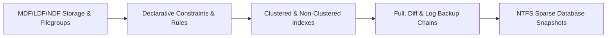

# CH01 — Database Creation and Management

> [!abstract] Navigation & Chapter Overview
> 📑 **Curriculum Overview:** [Curriculum README](../README.md) | ➡️ **Next:** [CH02 — SQL Programming Essentials](ch02-readme.md)

> [!info] 🏗️ Physical storage architecture, 8 KB pages, 64 KB extents, multi-filegroup I/O isolation, relational constraints, B-Tree indexes, backup chains, and sparse database snapshots.

---

## Learning Path Roadmap



---

## Lesson Checklist

- [x] **CH01_VID01**: [[vid01-create-database-and-filegroups|Create Database and Filegroups]] · `src/01_storage_and_schema/01_filegroups_and_files.sql`
- [x] **CH01_VID02**: [[vid02-create-database-using-wizard|Create Database Using Wizard]]
- [x] **CH01_VID03**: [[vid03-create-database-using-code|Create Database Using Code]] · `src/01_storage_and_schema/01_filegroups_and_files.sql`
- [x] **CH01_VID04**: [[vid04-database-integrity|Database Integrity]] · `src/02_data_integrity_and_ddl/01_declarative_constraints.sql`
- [x] **CH01_VID05**: [[vid05-integrity-constraints|Integrity constraints]] · `src/02_data_integrity_and_ddl/01_declarative_constraints.sql`
- [x] **CH01_VID06**: [[vid06-constraints-rules-and-default-values|Constraints, Rules, and Default Values]] · `src/02_data_integrity_and_ddl/02_check_constraints_and_defaults.sql`
- [ ] **CH01_VID07**: [[vid07-creating-a-custom-data-type|Creating a Custom Data Type]] · `src/01_storage_and_schema/04_user_defined_types.sql`
- [ ] **CH01_VID08**: [[vid08-clustered-index|Clustered Index]] · `src/05_indexing_and_performance/01_clustered_indexes.sql`
- [ ] **CH01_VID09**: [[vid09-non-clustered-index|Non-Clustered Index]] · `src/05_indexing_and_performance/02_nonclustered_indexes.sql`
- [ ] **CH01_VID10**: [[vid10-demo-on-index|Demo on Index]] · `src/05_indexing_and_performance/03_index_maintenance.sql`
- [ ] **CH01_VID11**: [[vid11-types-of-backup|Types of Backup]] · `src/06_reliability_and_dr/01_backup_and_maintenance_jobs.sql`
- [ ] **CH01_VID12**: [[vid12-backup-database-using-wizard|Backup Database Using Wizard]] · `src/06_reliability_and_dr/01_backup_and_maintenance_jobs.sql`
- [ ] **CH01_VID13**: [[vid13-backup-sql-server-agent-jobs|Backup & SQL server agent jobs]] · `src/06_reliability_and_dr/01_backup_and_maintenance_jobs.sql`
- [ ] **CH01_VID14**: [[vid14-snapshot-db|Snapshot DB]] · `src/06_reliability_and_dr/02_snapshot_lifecycle.sql`
- [ ] **CH01_VID15**: [[vid15-demo-on-snapshot|Demo on Snapshot]] · `src/06_reliability_and_dr/02_snapshot_lifecycle.sql`
- [ ] **CH01_VID16**: [[vid16-assignment-01|Assignment 01]] · `src/01_storage_and_schema/05_company_case_study_schema.sql`

---

## Progress Dashboard

```dataview
TABLE WITHOUT ID
  file.link AS "Lesson",
  choice(status = "completed", "✅", choice(status = "in-progress", "🔄", "⏳")) AS "Status",
  code_reference AS "Code"
FROM "video-notes/ch01"
SORT file.name ASC
```

## Open Tasks

```dataview
TASK
FROM "video-notes/ch01"
WHERE !completed
GROUP BY file.link
LIMIT 15
```

---

## Links

| Resource | Link |
| :--- | :--- |
| Curriculum Overview | [README](../README.md) |
| Learning Tracker | [Tracker](../LEARNING_TRACKER.md) |
| 8-Week Plan | [Study Plan](../8-WEEK-STUDY-PLAN.md) |
| Live Platform Target | [OmniFlow Physical Storage Architecture](https://sohila-khaled-abbas.github.io/sql-server-data-platform/#architecture) |
| Platform Curriculum | [OmniFlow Curriculum & Second Brain](https://sohila-khaled-abbas.github.io/sql-server-data-platform/#curriculum) |
