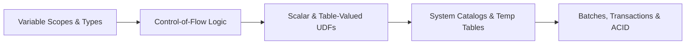

# CH02 — SQL Programming Essentials

> [!abstract] Navigation & Chapter Overview
> ⬅️ **Previous:** [CH01 — Database Creation and Management](ch01-readme.md) | 📑 **Curriculum Overview:** [Curriculum README](../README.md) | ➡️ **Next:** [CH03 — Advanced Query Techniques and High Availability](ch03-readme.md)

> [!info] ⚙️ Procedural T-SQL without row-by-row anti-patterns: variable scoping, control flow, functions (Scalar vs Inline TVF vs MSTVF), system databases, temporary tables, batches, and ACID transaction boundaries.

---

## Learning Path Roadmap



---

## Lesson Checklist

- [ ] **CH02_VID01**: [[vid01-variables|Variables]] · `src/03_programmability_and_elt/01_user_defined_functions.sql`
- [ ] **CH02_VID02**: [[vid02-local-variables|Local Variables]] · `src/03_programmability_and_elt/01_user_defined_functions.sql`
- [ ] **CH02_VID03**: [[vid03-global-variables|Global Variables]] · `src/03_programmability_and_elt/01_user_defined_functions.sql`
- [ ] **CH02_VID04**: [[vid04-control-of-flow-part-1|Control of Flow Part 1]] · `src/03_programmability_and_elt/01_user_defined_functions.sql`
- [ ] **CH02_VID05**: [[vid05-control-of-flow-part-2|Control of Flow Part 2]] · `src/03_programmability_and_elt/01_user_defined_functions.sql`
- [ ] **CH02_VID06**: [[vid06-functions|Functions Overview]] · `src/03_programmability_and_elt/01_user_defined_functions.sql`
- [ ] **CH02_VID07**: [[vid07-scalar-function|Scalar Functions]] · `src/03_programmability_and_elt/01_user_defined_functions.sql`
- [ ] **CH02_VID08**: [[vid08-inline-statement-table-valued-functions|Inline Table-Valued Functions (iTVF)]] · `src/03_programmability_and_elt/01_user_defined_functions.sql`
- [ ] **CH02_VID09**: [[vid09-multi-statement-table-valued-functions|Multi-Statement Table-Valued Functions (mTVF)]] · `src/03_programmability_and_elt/01_user_defined_functions.sql`
- [ ] **CH02_VID10**: [[vid10-system-databases|System Databases (master, msdb, tempdb, model)]]
- [ ] **CH02_VID11**: [[vid11-types-of-table|Types of Tables (#Temp, ##Global, @Table)]]
- [ ] **CH02_VID12**: [[vid12-script-batch|Scripts, Batches & GO Delimiters]]
- [ ] **CH02_VID13**: [[vid13-types-of-transactions|Types of Transactions & ACID Isolation]] · `src/03_programmability_and_elt/03_stored_procedures_etl.sql`
- [ ] **CH02_VID14**: [[vid14-demo-on-transactions|Demo on Transactions & Rollbacks]] · `src/03_programmability_and_elt/03_stored_procedures_etl.sql`
- [ ] **CH02_VID15**: [[vid15-assignment-02|Assignment 02: Transactional Pipeline Engineering]]

---

## Progress Dashboard

```dataview
TABLE WITHOUT ID
  file.link AS "Lesson",
  choice(status = "completed", "✅", choice(status = "in-progress", "🔄", "⏳")) AS "Status",
  code_reference AS "Code"
FROM "video-notes/ch02"
SORT file.name ASC
```

## Open Tasks

```dataview
TASK
FROM "video-notes/ch02"
WHERE !completed
GROUP BY file.link
LIMIT 15
```

---

## Links

| Resource | Link |
| :--- | :--- |
| Curriculum Overview | [README](../README.md) |
| Learning Tracker | [Tracker](../LEARNING_TRACKER.md) |
| 8-Week Plan | [Study Plan](../8-WEEK-STUDY-PLAN.md) |
| Live Platform Target | [OmniFlow SQL Engineering Showcase](https://sohila-khaled-abbas.github.io/sql-server-data-platform/#sql-engineering) |
| Platform Curriculum | [OmniFlow Curriculum & Second Brain](https://sohila-khaled-abbas.github.io/sql-server-data-platform/#curriculum) |
