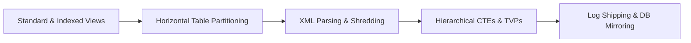

# CH03 — Advanced Query Techniques and High Availability

> [!abstract] Navigation & Chapter Overview
> ⬅️ **Previous:** [CH02 — SQL Programming Essentials](ch02-readme.md) | 📑 **Curriculum Overview:** [Curriculum README](../README.md) | ➡️ **Next:** [CH04 — Procedures, Triggers, and SQL Automation](ch04-readme.md)

> [!info] 🔄 High-throughput data access and disaster recovery: standard and indexed views with SCHEMABINDING, horizontal table partitioning, XML shredding (nodes/value), recursive CTEs, sequences, TVPs, and Log Shipping / Mirroring.

---

## Learning Path Roadmap



---

## Lesson Checklist

- [ ] **CH03_VID01**: [[vid01-overview-of-views|Overview of Views]] · `src/04_views_and_partitioning/01_materialized_indexed_views.sql`
- [ ] **CH03_VID02**: [[vid02-types-of-views|Types of Views]] · `src/04_views_and_partitioning/01_materialized_indexed_views.sql`
- [ ] **CH03_VID03**: [[vid03-creating-and-using-views|Creating and Using Views]] · `src/04_views_and_partitioning/01_materialized_indexed_views.sql`
- [ ] **CH03_VID04**: [[vid04-dml-operations-on-views|DML Operations on Views]] · `src/04_views_and_partitioning/01_materialized_indexed_views.sql`
- [ ] **CH03_VID05**: [[vid05-indexed-view|Schemabound Materialized Indexed Views]] · `src/04_views_and_partitioning/01_materialized_indexed_views.sql`
- [ ] **CH03_VID06**: [[vid06-partitioning|Partitioning & Sliding Windows]] · `src/04_views_and_partitioning/02_sliding_window_partitioning.sql`
- [ ] **CH03_VID07**: [[vid07-harnessing-the-power-of-xml|Harnessing the Power of XML in SQL]] · `src/03_programmability_and_elt/02_xml_and_json_processing.sql`
- [ ] **CH03_VID08**: [[vid08-use-raw-and-auto-mode-with-for-xml|Raw and Auto Mode with FOR XML]] · `src/03_programmability_and_elt/02_xml_and_json_processing.sql`
- [ ] **CH03_VID09**: [[vid09-use-path-mode-with-for-xml|Path Mode with FOR XML]] · `src/03_programmability_and_elt/02_xml_and_json_processing.sql`
- [ ] **CH03_VID10**: [[vid10-querying-xml-data|Querying XML Data using XQuery nodes() and value()]] · `src/03_programmability_and_elt/02_xml_and_json_processing.sql`
- [ ] **CH03_VID11**: [[vid11-hierarchical-data|Hierarchical Data Modeling]] · `src/03_programmability_and_elt/01_user_defined_functions.sql`
- [ ] **CH03_VID12**: [[vid12-cte-common-table-expression|Recursive Common Table Expressions (CTE)]] · `src/03_programmability_and_elt/01_user_defined_functions.sql`
- [ ] **CH03_VID13**: [[vid13-offset-and-fetch-keyword|OFFSET-FETCH Paging]] · `src/03_programmability_and_elt/01_user_defined_functions.sql`
- [ ] **CH03_VID14**: [[vid14-sequence|Sequences vs IDENTITY Generation]]
- [ ] **CH03_VID15**: [[vid15-table-valued-parameters|Table-Valued Parameters (TVP) High-Throughput Ingestion]] · `src/03_programmability_and_elt/03_stored_procedures_etl.sql`
- [ ] **CH03_VID16**: [[vid16-high-availability|High Availability Architecture Overview]]
- [ ] **CH03_VID17**: [[vid17-set-up-instances|Setting Up SQL Server Instances]]
- [ ] **CH03_VID18**: [[vid18-db-mirroring|Database Mirroring Concepts]]
- [ ] **CH03_VID19**: [[vid19-demo-database-mirroring|Demo Database Mirroring]]
- [ ] **CH03_VID20**: [[vid20-overview-of-ship-transaction-log|Transaction Log Shipping Mechanics]]
- [ ] **CH03_VID21**: [[vid21-steps-to-configure-sql-server-log-shipping|Steps to Configure SQL Server Log Shipping]]
- [ ] **CH03_VID22**: [[vid22-log-shipping-vs-mirroring|Log Shipping vs Mirroring vs Always On AGs]]
- [ ] **CH03_VID23**: [[vid23-assignment-03|Assignment 03: High-Availability & Partitioning]]

---

## Progress Dashboard

```dataview
TABLE WITHOUT ID
  file.link AS "Lesson",
  choice(status = "completed", "✅", choice(status = "in-progress", "🔄", "⏳")) AS "Status",
  code_reference AS "Code"
FROM "video-notes/ch03"
SORT file.name ASC
```

## Open Tasks

```dataview
TASK
FROM "video-notes/ch03"
WHERE !completed
GROUP BY file.link
LIMIT 15
```

---

## Links

| Resource | Link |
| :--- | :--- |
| Curriculum Overview | [README](../README.md) |
| Learning Tracker | [Tracker](../LEARNING_TRACKER.md) |
| 8-Week Plan | [Study Plan](../8-WEEK-STUDY-PLAN.md) |
| Live Platform Target | [OmniFlow High-Throughput Data Flow](https://sohila-khaled-abbas.github.io/sql-server-data-platform/#data-flow) |
| Platform Curriculum | [OmniFlow Curriculum & Second Brain](https://sohila-khaled-abbas.github.io/sql-server-data-platform/#curriculum) |
