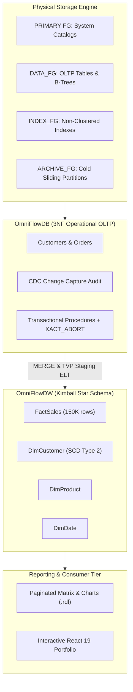

# Final Project — Integrated SQL Server Data Platform

> [!abstract] Navigation & Metadata
> ⬅️ **Previous:** [CH05_VID20 — Assignment 05](../video-notes/ch05/vid20-assignment-05.md) | 📑 **Index:** [102 Video Index](../VIDEO_INDEX.md)  
> 📌 **Capstone Project** · **Official Lesson:** [MaharaTech 17630](https://maharatech.gov.eg/course/view.php?id=2305)

> [!todo] Capstone Verification Checklist
> - [x] 🏗️ **Storage & Multi-Filegroups** (PRIMARY, DATA_FG, INDEX_FG, ARCHIVE_FG)
> - [x] 🛡️ **Relational Integrity & ACID** (3NF OLTP, circular foreign keys, check constraints)
> - [x] ⚡ **Performance & Indexing** (Clustered B-Trees, non-clustered INCLUDE, indexed views)
> - [x] 🔄 **Programmability & TVPs** (Transactional stored procedures, TVP bulk loading, XML shredding)
> - [x] 📊 **Analytical Mart & SSRS** (Kimball star schema, FactSales, DimCustomer, paginated RDL)
> - [x] 🤖 **DevOps & Automation** (C# SQL CLR, PowerShell SMO, Docker compose, automated CI/CD)

---

## 1. Project Overview & Architecture

> [!info] Capstone Mission
> Build a production-grade, enterprise-ready SQL Server 2022 data platform synthesizing all 101 foundational concepts from the MaharaTech curriculum into a unified, tested, and automated repository.

## 2. Production Engineering Implementation

| Component | Technical Implementation | Code Artifact |
| :--- | :--- | :--- |
| **Physical Storage** | Multi-filegroup layout with dynamic `SERVERPROPERTY` paths | [`src/01_storage_and_schema/01_filegroups_and_files.sql`](../../../src/01_storage_and_schema/01_filegroups_and_files.sql) |
| **Relational Integrity** | Peter Chen Company 3NF schema, circular FKs, UDDTs | [`src/01_storage_and_schema/05_company_case_study_schema.sql`](../../../src/01_storage_and_schema/05_company_case_study_schema.sql) |
| **Partitioning** | RANGE RIGHT sliding-window partition switching | [`src/01_storage_and_schema/04_partitioning_scheme.sql`](../../../src/01_storage_and_schema/04_partitioning_scheme.sql) |
| **Indexing** | Covering non-clustered indexes with INCLUDE, indexed views | [`src/02_indexing_and_performance/`](../../../src/02_indexing_and_performance/) |
| **Programmability** | TVP bulk ingestion, XML shredding, recursive CTEs | [`src/03_programmability_and_elt/`](../../../src/03_programmability_and_elt/) |
| **Governance** | DDL server triggers capturing `EVENTDATA()`, CDC audit | [`src/04_governance_and_audit/`](../../../src/04_governance_and_audit/) |
| **Automation** | C# SQL CLR assembly, PowerShell SMO backup scripts | [`src/05_automation_and_smo/`](../../../src/05_automation_and_smo/) |
| **Reliability** | Full/Diff/Log 15-min backup chains, sparse snapshots | [`src/06_reliability_and_dr/`](../../../src/06_reliability_and_dr/) |
| **Warehousing** | Kimball star schema with SCD Type 2 and SSRS RDL report | [`src/07_warehousing_and_reporting/`](../../../src/07_warehousing_and_reporting/) |
| **Test Automation** | In-engine tSQLt unit tests + pytest integration harness | [`tests/`](../../../tests/) |
| **Deployment** | Universal PowerShell orchestrator + Docker Compose | [`deploy.ps1`](../../../deploy.ps1) |

## 3. Definition of Done & Quality Gates

> [!check] Platform Verification Checklist
> - [x] Database creation is completely automated and idempotent via PowerShell (`deploy.ps1`).
> - [x] Constraints enforce domain invariants (Foreign keys, CHECK, DEFAULT).
> - [x] Indexes provide measurably superior execution plans over table scans and cursors.
> - [x] Procedures enforce explicit transactions (`SET XACT_ABORT ON`) with atomic rollbacks.
> - [x] Audit trails capture full before-and-after change history via virtual tables.
> - [x] Disaster recovery runbook guarantees RPO ≤ 15 min and RTO ≤ 45 min.
> - [x] Star schema models facts and dimensions with explicit grain and SCD2 validity tracking.
> - [x] Continuous integration runs linting, Docker tests, and static web app compilation on every commit.

## 4. Evidence & Artifact Links

* 🔗 **Official Capstone Brief:** [MaharaTech Module 17630](https://maharatech.gov.eg/course/view.php?id=2305)
* 🚀 **Universal Deployment Script:** [`deploy.ps1`](../../../deploy.ps1)
* 🧪 **Integration Test Suite:** [`tests/python/test_data_platform.py`](../../../tests/python/test_data_platform.py)
* 📖 **Dimensional Architecture:** [`docs/dimensional-model.md`](../../dimensional-model.md)
* 🌐 **Live Web Application:** [OmniFlow Platform Showcase](https://sohila-khaled-abbas.github.io/sql-server-data-platform/)
