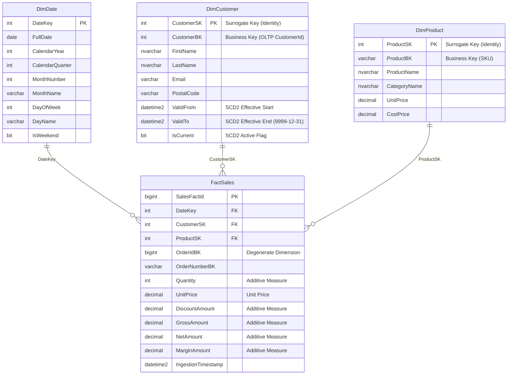

# Dimensional Modeling: Kimball Star Schema Design

This document details the analytical data architecture implemented in `OmniFlowDW`, translating normalized OLTP operational records into a high-performance Kimball dimensional data warehouse.

---

## 1. Enterprise Data Warehouse Bus Matrix

| Business Process | Declared Grain | DimDate | DimCustomer (SCD2) | DimProduct (SCD1) |
| :--- | :--- | :---: | :---: | :---: |
| **Sales Orders** | 1 row per order line item | **X** | **X** | **X** |
| **Inventory Snapshot**| 1 row per product per day | **X** | | **X** |

---

## 2. Kimball Star Schema Architecture

---

## 3. Slowly Changing Dimension (SCD) Strategies

### DimCustomer: SCD Type 2 (History Preserving)
* When a customer changes their geographic postal code or email, the existing record is retired (`ValidTo = SYSUTCDATETIME()`, `IsCurrent = 0`).
* A new row is inserted with a newly generated `CustomerSK`, `ValidFrom = SYSUTCDATETIME()`, `ValidTo = '9999-12-31'`, and `IsCurrent = 1`.
* All historical sales prior to the update retain their relationship to the original `CustomerSK`, preserving historical accuracy.

### DimProduct: SCD Type 1 (In-Place Overwrite)
* Corrections to product naming or categorization overwrite attributes in place.
* Historical facts automatically reflect the updated naming convention.

---

## 4. Surrogate Key Management & Degenerate Dimensions
* **Surrogate Keys**: Integer identities (`CustomerSK`, `ProductSK`, `DateKey`) ensure complete isolation from OLTP key recycling and optimize index seek performance in dimensional joins.
* **Degenerate Dimension**: `OrderIdBK` and `OrderNumberBK` are retained directly in `FactSales` without a parent dimension table, enabling drill-down queries directly to source transactional receipts.
