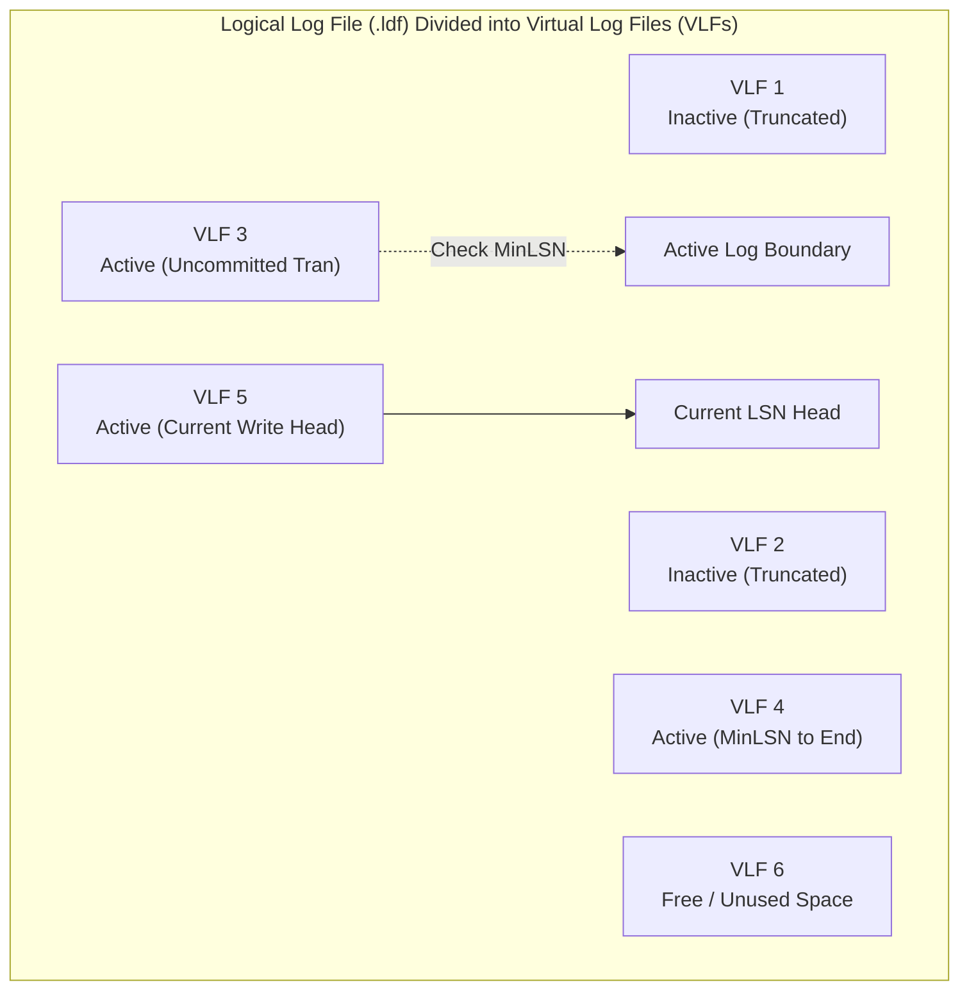
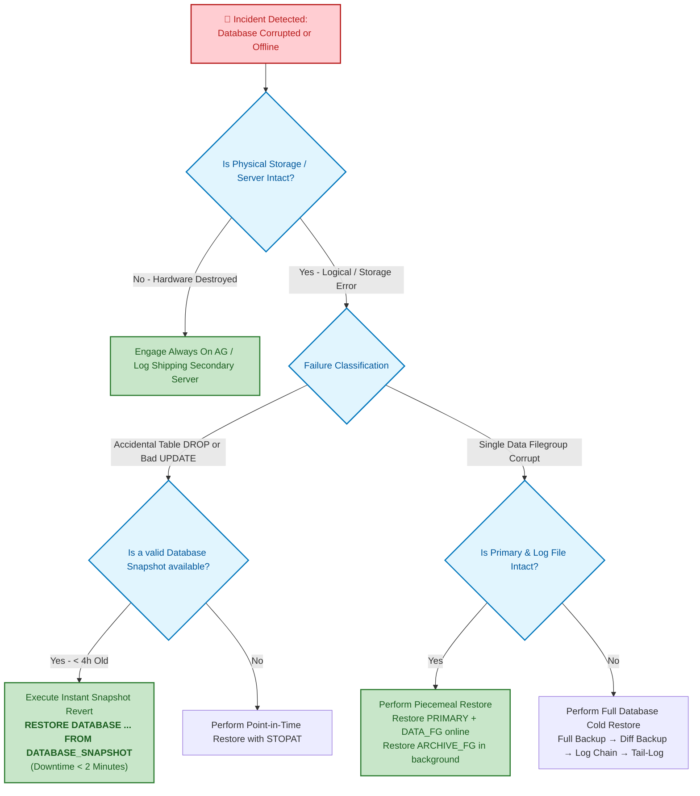

# SQL Server High Availability & Disaster Recovery Runbook

An operational incident response manual and disaster recovery (DR) runbook for the **OmniFlow Data Platform**. Designed as a companion reference for **[MaharaTech: Implementing and Developing SQL Server Objects](https://maharatech.gov.eg/course/view.php?id=2305)**.

---

## 1. Business Continuity Targets: RTO & RPO

```mermaid
graph LR
    subgraph IncidentTimeline ["Incident & Recovery Timeline"]
        LastBackup["Last Transaction Log Backup<br/>(11:45 AM)"]
        Disaster["💥 Disaster Event<br/>(11:58 AM)"]
        RestoreStart["Restore Initiated<br/>(12:05 PM)"]
        SystemOnline["System Fully Online<br/>(12:35 PM)"]
        
        LastBackup ---|<b>RPO &le; 15 Minutes</b><br/>(Maximum Data Loss Window)| Disaster
        Disaster ---|<b>RTO &le; 45 Minutes</b><br/>(Downtime to Restoration)| SystemOnline
    end

    classDef incident fill:#ffebee,stroke:#c62828,stroke-width:2px,color:#b71c1c;
    classDef recovery fill:#e8f5e9,stroke:#2e7d32,stroke-width:2px,color:#1b5e20;
    class Disaster incident;
    class SystemOnline recovery;
```

* **Recovery Point Objective (RPO)**: **15 Minutes**. Guaranteed via automated Transaction Log backups scheduled every 15 minutes.
* **Recovery Time Objective (RTO)**: **45 Minutes**. Guaranteed via multi-filegroup piecemeal restore strategies and weekly automated DR drills.

---

## 2. SQL Server Transaction Log & VLF Architecture

Every modification in SQL Server is written to the Transaction Log (`.ldf`) before it is flushed to data files (Write-Ahead Logging / WAL).



> [!WARNING]
> **VLF Sprawl Penalty**:
> If a transaction log auto-grows by small increments (e.g., 10% or 1 MB), SQL Server creates thousands of small Virtual Log Files (VLFs). High VLF counts (> 1,000) cause severe performance degradation during database startup, backup, and crash recovery.
> **Standard Fix**: Pre-size log files to anticipated peak volume and grow in clean chunks (e.g., `FILEGROWTH = 1024MB`).

---

## 3. Incident Response & Restore Decision Tree

When data corruption or catastrophic failure occurs, use the following operational workflow:



---

## 4. Runbook Procedures

### Procedure A: Emergency Tail-Log Backup (Preventing ANY Data Loss)
Before restoring any database whose data files are corrupted, you **must** back up the active transaction log to capture transactions executed after the last scheduled backup:

```sql
-- Take tail-log backup without checking data files
BACKUP LOG OmniFlowDB
TO DISK = 'D:\SQL Server\MSSQL16.MSSQLSERVER\MSSQL\Backup\OmniFlowDB_TailLog.trn'
WITH NO_TRUNCATE, CONTINUE_AFTER_ERROR, INIT;
```

---

### Procedure B: Complete Point-in-Time Recovery (`STOPAT`)
Restore to exact millisecond before human error (e.g., accidental batch delete executed at 2026-09-17 14:32:10.000):

```sql
USE master;
ALTER DATABASE OmniFlowDB SET SINGLE_USER WITH ROLLBACK IMMEDIATE;

-- 1. Restore Latest Weekly Full Backup
RESTORE DATABASE OmniFlowDB
FROM DISK = 'D:\SQL Server\MSSQL16.MSSQLSERVER\MSSQL\Backup\OmniFlowDB_Full_20260914.bak'
WITH NORECOVERY, REPLACE;

-- 2. Restore Latest Daily Differential Backup
RESTORE DATABASE OmniFlowDB
FROM DISK = 'D:\SQL Server\MSSQL16.MSSQLSERVER\MSSQL\Backup\OmniFlowDB_Diff_20260917_0600.bak'
WITH NORECOVERY;

-- 3. Restore 15-Minute Log Chain up to Target Window
RESTORE LOG OmniFlowDB
FROM DISK = 'D:\SQL Server\MSSQL16.MSSQLSERVER\MSSQL\Backup\OmniFlowDB_Log_20260917_1415.trn'
WITH NORECOVERY;

-- 4. Restore Tail-Log with exact STOPAT Timestamp
RESTORE LOG OmniFlowDB
FROM DISK = 'D:\SQL Server\MSSQL16.MSSQLSERVER\MSSQL\Backup\OmniFlowDB_TailLog.trn'
WITH STOPAT = '2026-09-17 14:32:09.999',
     RECOVERY;

ALTER DATABASE OmniFlowDB SET MULTI_USER;
```

---

### Procedure C: Zero-Downtime Snapshot Reversion
If an engineer drops a table or runs an un-indexed UPDATE on a database where a snapshot was created prior to deployment:

```sql
USE master;
-- Drop any active client connections
ALTER DATABASE OmniFlowDB SET SINGLE_USER WITH ROLLBACK IMMEDIATE;

-- Revert instantaneously using sparse copy-on-write pages
RESTORE DATABASE OmniFlowDB
FROM DATABASE_SNAPSHOT = 'OmniFlowDB_Snapshot_PreRelease';

-- Set back to multi-user mode
ALTER DATABASE OmniFlowDB SET MULTI_USER;
```

---

### Procedure D: Multi-Filegroup Piecemeal Restore
If an unrecoverable disk failure corrupts only the secondary `ARCHIVE_FG` drive, keep production active while recovering:

```sql
-- Step 1: Restore PRIMARY filegroup with PARTIAL
RESTORE DATABASE OmniFlowDB FILEGROUP = 'PRIMARY'
FROM DISK = 'D:\SQL Server\MSSQL16.MSSQLSERVER\MSSQL\Backup\OmniFlowDB_Primary.bak'
WITH PARTIAL, NORECOVERY;

-- Step 2: Restore Active DATA_FG
RESTORE DATABASE OmniFlowDB FILEGROUP = 'DATA_FG'
FROM DISK = 'D:\SQL Server\MSSQL16.MSSQLSERVER\MSSQL\Backup\OmniFlowDB_Data.bak'
WITH NORECOVERY;

-- Step 3: Apply Log to bring core business online!
RESTORE LOG OmniFlowDB FROM DISK = 'D:\...\Log_Tail.trn' WITH RECOVERY;
-- OmniFlowDB is now ONLINE! Customer queries against active orders succeed.

-- Step 4: Restore ARCHIVE_FG online in the background during maintenance window
RESTORE DATABASE OmniFlowDB FILEGROUP = 'ARCHIVE_FG'
FROM DISK = 'D:\...\OmniFlowDB_Archive.bak'
WITH RECOVERY;
```
