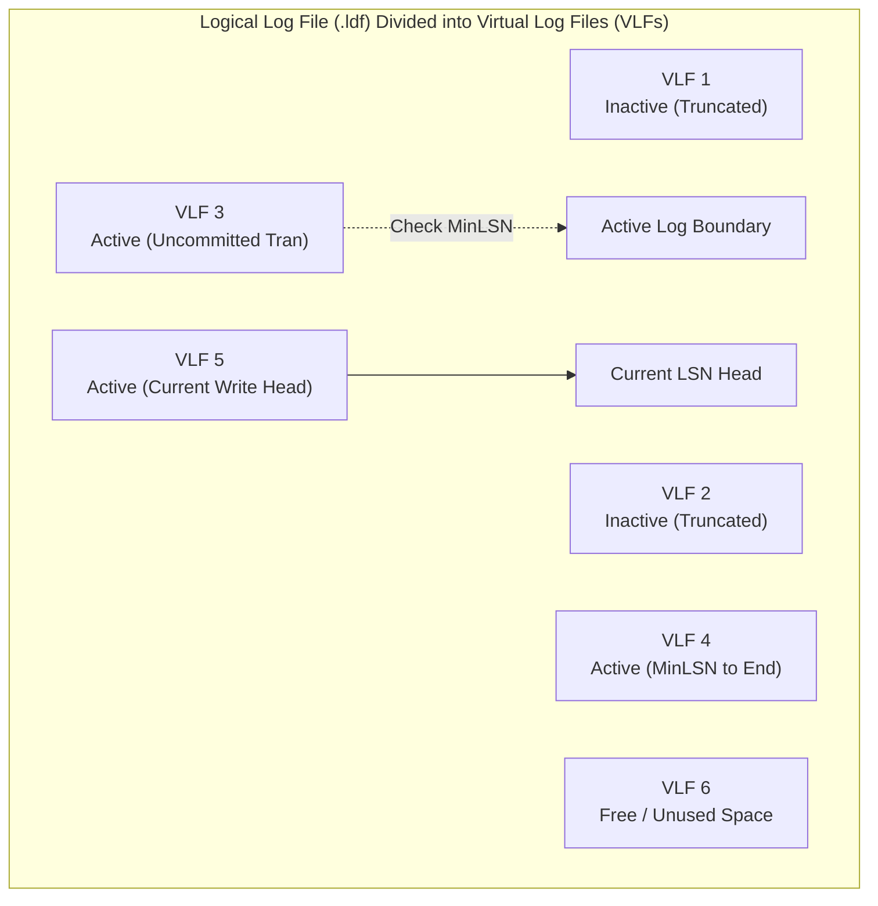
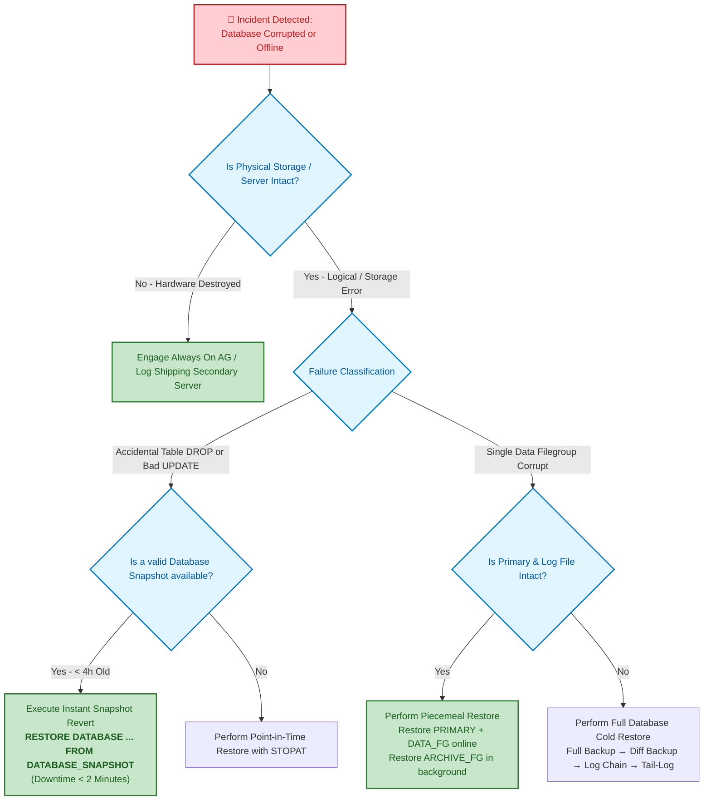

# SQL Server High Availability & Disaster Recovery Runbook

An operational incident response manual and disaster recovery (DR) runbook for the **OmniFlow Data Platform**. Designed as a companion reference for **[MaharaTech: Implementing and Developing SQL Server Objects](https://maharatech.gov.eg/course/view.php?id=2305)**.

---

## 1. Business Continuity Targets: RTO & RPO

```mermaid
graph LR
    subgraph IncidentTimeline ["Incident & Recovery Timeline"]
        LastBackup["Last Transaction Log Backup<br/>(11:45 AM)"]
        Disaster["💥 Disaster Event<br/>(11:58 AM)"]
        RestoreStart["Restore Initiated<br/>(12:05 PM)"]
        SystemOnline["System Fully Online<br/>(12:35 PM)"]
        
        LastBackup ---|<b>RPO &le; 15 Minutes</b><br/>(Maximum Data Loss Window)| Disaster
        Disaster ---|<b>RTO &le; 45 Minutes</b><br/>(Downtime to Restoration)| SystemOnline
    end

    classDef incident fill:#ffebee,stroke:#c62828,stroke-width:2px,color:#b71c1c;
    classDef recovery fill:#e8f5e9,stroke:#2e7d32,stroke-width:2px,color:#1b5e20;
    class Disaster incident;
    class SystemOnline recovery;
```

* **Recovery Point Objective (RPO)**: **15 Minutes**. Guaranteed via automated Transaction Log backups scheduled every 15 minutes.
* **Recovery Time Objective (RTO)**: **45 Minutes**. Guaranteed via multi-filegroup piecemeal restore strategies and weekly automated DR drills.

---

## 2. SQL Server Transaction Log & VLF Architecture

Every modification in SQL Server is written to the Transaction Log (`.ldf`) before it is flushed to data files (Write-Ahead Logging / WAL).


```mermaid
flowchart TD
    subgraph TransactionLogLayout ["Logical Log File (.ldf) Divided into Virtual Log Files (VLFs)"]
        VLF1["VLF 1<br/>Inactive (Truncated)"]
        VLF2["VLF 2<br/>Inactive (Truncated)"]
        VLF3["VLF 3<br/>Active (Uncommitted Tran)"]
        VLF4["VLF 4<br/>Active (MinLSN to End)"]
        VLF5["VLF 5<br/>Active (Current Write Head)"]
        VLF6["VLF 6<br/>Free / Unused Space"]
        
        VLF3 -.->|Check MinLSN| Checkpoint["Active Log Boundary"]
        VLF5 --> WriteHead["Current LSN Head"]
    end
```

> [!WARNING]
> **VLF Sprawl Penalty**:
> If a transaction log auto-grows by small increments (e.g., 10% or 1 MB), SQL Server creates thousands of small Virtual Log Files (VLFs). High VLF counts (> 1,000) cause severe performance degradation during database startup, backup, and crash recovery.
> **Standard Fix**: Pre-size log files to anticipated peak volume and grow in clean chunks (e.g., `FILEGROWTH = 1024MB`).

---

## 3. Incident Response & Restore Decision Tree

When data corruption or catastrophic failure occurs, use the following operational workflow:


```mermaid
flowchart TD
    Alarm["🚨 Incident Detected:<br/>Database Corrupted or Offline"] --> ScopeCheck{"Is Physical Storage / Server Intact?"}
    
    ScopeCheck -->|No - Hardware Destroyed| WarmStandby["Engage Always On AG / Log Shipping Secondary Server"]
    ScopeCheck -->|Yes - Logical / Storage Error| ErrorType{"Failure Classification"}
    
    ErrorType -->|Accidental Table DROP or Bad UPDATE| SnapshotCheck{"Is a valid Database Snapshot available?"}
    SnapshotCheck -->|Yes - < 4h Old| FastRevert["Execute Instant Snapshot Revert<br/><b>RESTORE DATABASE ... FROM DATABASE_SNAPSHOT</b><br/>(Downtime < 2 Minutes)"]
    SnapshotCheck -->|No| PointInTime["Perform Point-in-Time Restore with STOPAT"]
    
    ErrorType -->|Single Data Filegroup Corrupt| PiecemealCheck{"Is Primary & Log File Intact?"}
    PiecemealCheck -->|Yes| PiecemealRestore["Perform Piecemeal Restore<br/>Restore PRIMARY + DATA_FG online<br/>Restore ARCHIVE_FG in background"]
    PiecemealCheck -->|No| FullDisasterRestore["Perform Full Database Cold Restore<br/>Full Backup &rarr; Diff Backup &rarr; Log Chain &rarr; Tail-Log"]

    classDef alert fill:#ffcdd2,stroke:#b71c1c,stroke-width:2px,color:#b71c1c;
    classDef action fill:#e1f5fe,stroke:#0277bd,stroke-width:2px,color:#01579b;
    classDef success fill:#c8e6c9,stroke:#2e7d32,stroke-width:2px,color:#1b5e20;
    class Alarm alert;
    class ScopeCheck,ErrorType,SnapshotCheck,PiecemealCheck action;
    class FastRevert,PiecemealRestore,WarmStandby success;
```

---

## 4. Runbook Procedures

### Procedure A: Emergency Tail-Log Backup (Preventing ANY Data Loss)
Before restoring any database whose data files are corrupted, you **must** back up the active transaction log to capture transactions executed after the last scheduled backup:

```sql
-- Take tail-log backup without checking data files
BACKUP LOG OmniFlowDB
TO DISK = 'D:\SQL Server\MSSQL16.MSSQLSERVER\MSSQL\Backup\OmniFlowDB_TailLog.trn'
WITH NO_TRUNCATE, CONTINUE_AFTER_ERROR, INIT;
```

---

### Procedure B: Complete Point-in-Time Recovery (`STOPAT`)
Restore to exact millisecond before human error (e.g., accidental batch delete executed at 2026-09-17 14:32:10.000):

```sql
USE master;
ALTER DATABASE OmniFlowDB SET SINGLE_USER WITH ROLLBACK IMMEDIATE;

-- 1. Restore Latest Weekly Full Backup
RESTORE DATABASE OmniFlowDB
FROM DISK = 'D:\SQL Server\MSSQL16.MSSQLSERVER\MSSQL\Backup\OmniFlowDB_Full_20260914.bak'
WITH NORECOVERY, REPLACE;

-- 2. Restore Latest Daily Differential Backup
RESTORE DATABASE OmniFlowDB
FROM DISK = 'D:\SQL Server\MSSQL16.MSSQLSERVER\MSSQL\Backup\OmniFlowDB_Diff_20260917_0600.bak'
WITH NORECOVERY;

-- 3. Restore 15-Minute Log Chain up to Target Window
RESTORE LOG OmniFlowDB
FROM DISK = 'D:\SQL Server\MSSQL16.MSSQLSERVER\MSSQL\Backup\OmniFlowDB_Log_20260917_1415.trn'
WITH NORECOVERY;

-- 4. Restore Tail-Log with exact STOPAT Timestamp
RESTORE LOG OmniFlowDB
FROM DISK = 'D:\SQL Server\MSSQL16.MSSQLSERVER\MSSQL\Backup\OmniFlowDB_TailLog.trn'
WITH STOPAT = '2026-09-17 14:32:09.999',
     RECOVERY;

ALTER DATABASE OmniFlowDB SET MULTI_USER;
```

---

### Procedure C: Zero-Downtime Snapshot Reversion
If an engineer drops a table or runs an un-indexed UPDATE on a database where a snapshot was created prior to deployment:

```sql
USE master;
-- Drop any active client connections
ALTER DATABASE OmniFlowDB SET SINGLE_USER WITH ROLLBACK IMMEDIATE;

-- Revert instantaneously using sparse copy-on-write pages
RESTORE DATABASE OmniFlowDB
FROM DATABASE_SNAPSHOT = 'OmniFlowDB_Snapshot_PreRelease';

-- Set back to multi-user mode
ALTER DATABASE OmniFlowDB SET MULTI_USER;
```

---

### Procedure D: Multi-Filegroup Piecemeal Restore
If an unrecoverable disk failure corrupts only the secondary `ARCHIVE_FG` drive, keep production active while recovering:

```sql
-- Step 1: Restore PRIMARY filegroup with PARTIAL
RESTORE DATABASE OmniFlowDB FILEGROUP = 'PRIMARY'
FROM DISK = 'D:\SQL Server\MSSQL16.MSSQLSERVER\MSSQL\Backup\OmniFlowDB_Primary.bak'
WITH PARTIAL, NORECOVERY;

-- Step 2: Restore Active DATA_FG
RESTORE DATABASE OmniFlowDB FILEGROUP = 'DATA_FG'
FROM DISK = 'D:\SQL Server\MSSQL16.MSSQLSERVER\MSSQL\Backup\OmniFlowDB_Data.bak'
WITH NORECOVERY;

-- Step 3: Apply Log to bring core business online!
RESTORE LOG OmniFlowDB FROM DISK = 'D:\...\Log_Tail.trn' WITH RECOVERY;
-- OmniFlowDB is now ONLINE! Customer queries against active orders succeed.

-- Step 4: Restore ARCHIVE_FG online in the background during maintenance window
RESTORE DATABASE OmniFlowDB FILEGROUP = 'ARCHIVE_FG'
FROM DISK = 'D:\...\OmniFlowDB_Archive.bak'
WITH RECOVERY;
```

---

### Procedure E: Restoring from Multi-Set Media Files (`WITH FILE = N`)
When restoring from a single physical backup file that contains multiple appended backup sets (Full, Differential, Transaction Log generated via SSMS Wizard or `WITH NOINIT`):

```sql
USE master;
GO

DECLARE @BakPath NVARCHAR(500) = N'D:\courses\Data Science\Data Engineering\MaharaTech\Implementing and Developing SQL server objects\CH01\Mydb\test.bak';

-- 1. Inspect sets and determine positions
RESTORE HEADERONLY FROM DISK = @BakPath;

-- 2. Restore Full Database from Position 1 (Leave in Restoring state)
RESTORE DATABASE [testbackup_Restored]
FROM DISK = @BakPath
WITH FILE = 1,
     NORECOVERY,
     REPLACE,
     MOVE N'testbackup' TO N'D:\SQL Server\MSSQL16.MSSQLSERVER\MSSQL\DATA\testbackup_restored.mdf',
     MOVE N'testbackup_log' TO N'D:\SQL Server\MSSQL16.MSSQLSERVER\MSSQL\DATA\testbackup_restored_log.ldf';

-- 3. Restore Cumulative Differential from Position 2 (Leave in Restoring state)
RESTORE DATABASE [testbackup_Restored]
FROM DISK = @BakPath
WITH FILE = 2,
     NORECOVERY;

-- 4. Restore Transaction Log from Position 3 (Bring Online)
RESTORE LOG [testbackup_Restored]
FROM DISK = @BakPath
WITH FILE = 3,
     RECOVERY;
GO
```

---

### Procedure F: Automated Scheduling & Alert-Driven Maintenance via SQL Server Agent
In production 24/7 database operations, backups and disaster recovery health checks must execute autonomously via **SQL Server Agent** with operator alerts and reactive performance triggers:

```sql
USE msdb;
GO

-- 1. Create On-Call Operator
EXEC msdb.dbo.sp_add_operator 
    @name = N'ahmed', 
    @enabled = 1, 
    @email_address = N'ahmed@gmail.com';

-- 2. Create Automated Maintenance Job
EXEC msdb.dbo.sp_add_job 
    @job_name = N'ITIbackupJob', 
    @enabled = 1, 
    @notify_level_email = 1,
    @notify_email_operator_name = N'ahmed';

-- 3. Add T-SQL Backup Step
EXEC msdb.dbo.sp_add_jobstep 
    @job_name = N'ITIbackupJob', 
    @step_name = N'Q1', 
    @subsystem = N'TSQL', 
    @command = N'backup database ITI to disk=''D:\courses\...\CH01\Mydb\iti.bak''', 
    @database_name = N'master';

-- 4. Attach Recurring Daily Schedule (sch1 at 12:00 AM)
EXEC msdb.dbo.sp_add_schedule 
    @schedule_name = N'sch1', 
    @enabled = 1, 
    @freq_type = 4, 
    @freq_interval = 1, 
    @active_start_time = 0;

EXEC msdb.dbo.sp_attach_schedule 
    @job_name = N'ITIbackupJob', 
    @schedule_name = N'sch1';

-- 5. Create Reactive Performance Condition Alert (User Connections > 10)
EXEC msdb.dbo.sp_add_alert 
    @name = N'alert1', 
    @performance_condition = N'General Statistics|User Connections||>|10', 
    @job_name = N'ITIbackupJob';

EXEC msdb.dbo.sp_add_notification 
    @alert_name = N'alert1', 
    @operator_name = N'ahmed', 
    @notification_method = 1;
GO
```

---

## 5. Architectural References & Live Verification Telemetry

* **Live Backup Types & PITR Verification Telemetry**: [`docs/ch01-vid11-types-of-backup-live.md`](ch01-vid11-types-of-backup-live.md)
* **Live SSMS Wizard & Multi-Set Backup Telemetry**: [`docs/ch01-vid12-backup-database-wizard-live.md`](ch01-vid12-backup-database-wizard-live.md)
* **Live SQL Server Agent Jobs & Alerts Telemetry**: [`docs/ch01-vid13-backup-sql-agent-jobs-live.md`](ch01-vid13-backup-sql-agent-jobs-live.md)
* **Interactive T-SQL Disaster Recovery Lab (Types)**: [`src/01_storage_and_schema/ch01_vid11_types_of_backup.sql`](../src/01_storage_and_schema/ch01_vid11_types_of_backup.sql)
* **Interactive T-SQL Wizard & Multi-Set Lab**: [`src/01_storage_and_schema/ch01_vid12_backup_database_wizard.sql`](../src/01_storage_and_schema/ch01_vid12_backup_database_wizard.sql)
* **Interactive T-SQL Agent Automation Lab**: [`src/01_storage_and_schema/ch01_vid13_backup_sql_agent_jobs.sql`](../src/01_storage_and_schema/ch01_vid13_backup_sql_agent_jobs.sql)
* **Production SQL Agent Automated Maintenance**: [`src/06_reliability_and_dr/01_backup_and_maintenance_jobs.sql`](../src/06_reliability_and_dr/01_backup_and_maintenance_jobs.sql)
* **Curriculum Mastery Companions**:
  * [`docs/curriculum/01 - COURSE/CH01 - Database Creation and Management/CH01_VID11 - Types of Backup.md`](curriculum/01%20-%20COURSE/CH01%20-%20Database%20Creation%20and%20Management/CH01_VID11%20-%20Types%20of%20Backup.md)
  * [`docs/curriculum/01 - COURSE/CH01 - Database Creation and Management/CH01_VID12 - Backup Database Using Wizard.md`](curriculum/01%20-%20COURSE/CH01%20-%20Database%20Creation%20and%20Management/CH01_VID12%20-%20Backup%20Database%20Using%20Wizard.md)
  * [`docs/curriculum/01 - COURSE/CH01 - Database Creation and Management/CH01_VID13 - Backup & SQL server agent jobs.md`](curriculum/01%20-%20COURSE/CH01%20-%20Database%20Creation%20and%20Management/CH01_VID13%20-%20Backup%20&%20SQL%20server%20agent%20jobs.md)

