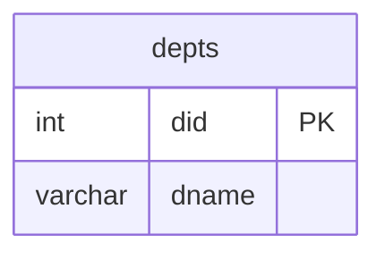

# Database: ITItest — Live Architecture & Case Study Catalog

> [!NOTE]
> **Live Synchronization Status**: Automatically synchronized from local SQL Server instance (`-S .`) at `2026-09-18 17:16:58 UTC`.
> **Database File Storage Root**: `D:\courses\Data Science\Data Engineering\MaharaTech\Implementing and Developing SQL server objects\CH01\Mydb`

---

## 1. Physical Storage Geometry & Filegroups

The `ITItest` database was created via the **SSMS Database Wizard** conforming to enterprise multi-filegroup physical layout:

| File Logical Name | Filegroup | File Type | Current Size | Growth Strategy | Physical Disk Location |
| :--- | :--- | :--- | :--- | :--- | :--- |
| **`ITItest`** | `PRIMARY` | `ROWS` | `8 MB` | `64 MB` | `D:\courses\Data Science\Data Engineering\MaharaTech\Implementing and Developing SQL server objects\CH01\Mydb\ITItest.mdf` |
| **`file2`** | `fg1` | `ROWS` | `8 MB` | `64 MB` | `D:\courses\Data Science\Data Engineering\MaharaTech\Implementing and Developing SQL server objects\CH01\Mydb\file2.ndf` |
| **`file3`** | `fg2` | `ROWS` | `8 MB` | `64 MB` | `D:\courses\Data Science\Data Engineering\MaharaTech\Implementing and Developing SQL server objects\CH01\Mydb\file3.ndf` |
| **`file4`** | `fg3` | `ROWS` | `8 MB` | `64 MB` | `D:\courses\Data Science\Data Engineering\MaharaTech\Implementing and Developing SQL server objects\CH01\Mydb\file4.ndf` |
| **`ITItest_log`** | `N/A (LOG)` | `LOG` | `8 MB` | `64 MB` | `D:\courses\Data Science\Data Engineering\MaharaTech\Implementing and Developing SQL server objects\CH01\Mydb\ITItest_log.ldf` |

### Filegroup Roles & Performance Architecture
- **`PRIMARY` (`ITItest.mdf`)**: Stores master database system catalogs, schema metadata, and default table headers.
- **`fg1` (`file2.ndf`)**: Secondary filegroup designated for active relational entities (`Employee`, `Department`).
- **`fg2` (`file3.ndf`)**: Secondary filegroup designated for operational associations and projects (`Project`, `WorksOn`).
- **`fg3` (`file4.ndf`)**: Secondary filegroup designated for indexes and reporting tables.
- **`ITItest_log.ldf`**: Sequential Write-Ahead Log (WAL) recording ACID transaction lifecycles.

---

## 2. Live Relational Table Inventory
Currently **1 tables** are active in `ITItest`:

| Schema | Table Name | Filegroup | Row Count | Primary Key | Column Count | Foreign Keys |
| :--- | :--- | :--- | :--- | :--- | :--- | :--- |
| `dbo` | **`depts`** | `fg1` | `0` | `did` | `2 cols` | `0 FKs` |

---

## 3. Live Entity-Relationship Diagram (ERD)

---

## 4. Detailed Table Schema Definitions

### Table: `dbo.depts`
- **Storage Filegroup**: `fg1`
- **Current Rows**: `0`

| Column Name | Data Type | Nullable | Identity | Default Value | PK |
| :--- | :--- | :--- | :--- | :--- | :--- |
| `did` | `INT` | `NO` | `NO` | `-` | 🔑 PK |
| `dname` | `VARCHAR(50)` | `YES` | `NO` | `-` |  |
