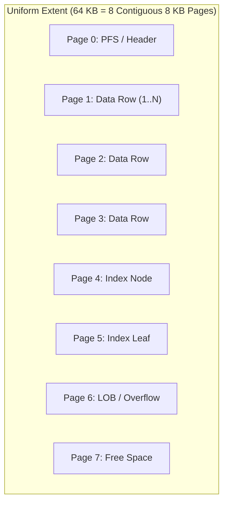
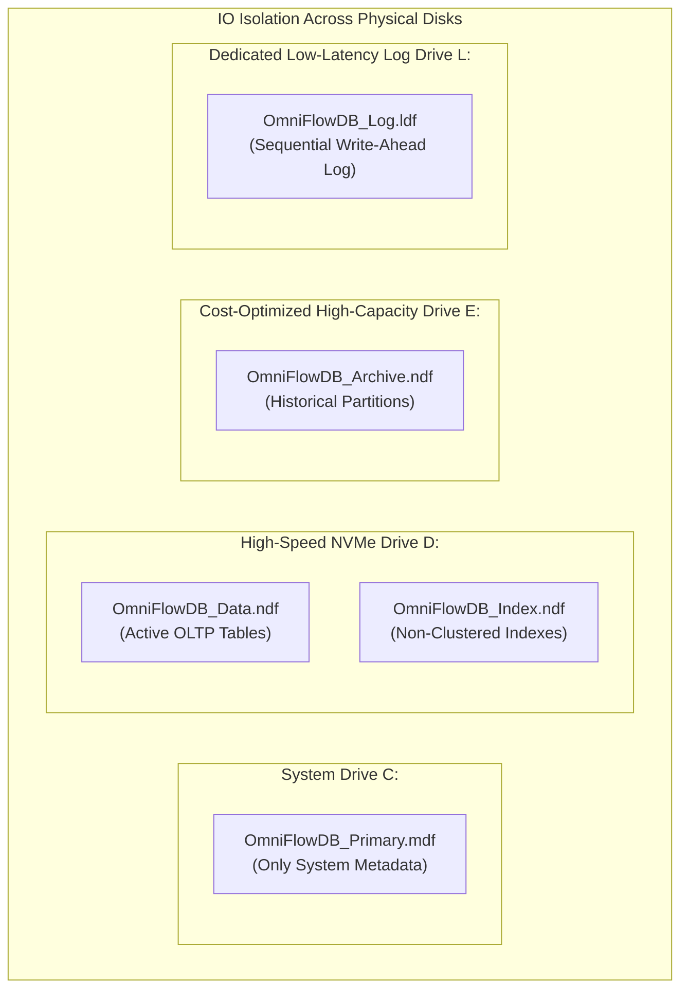
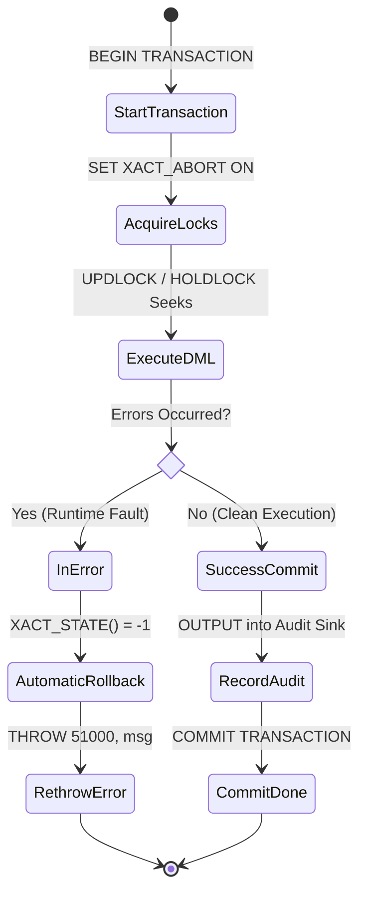
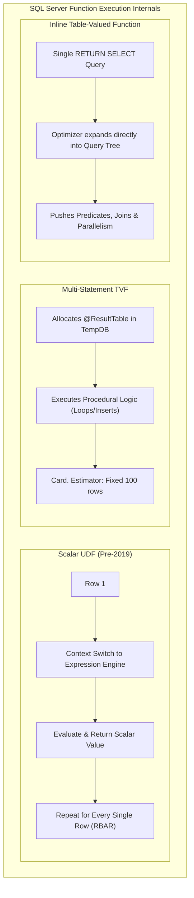
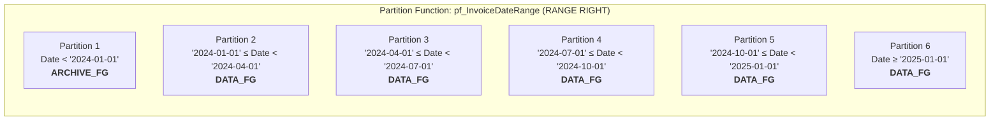
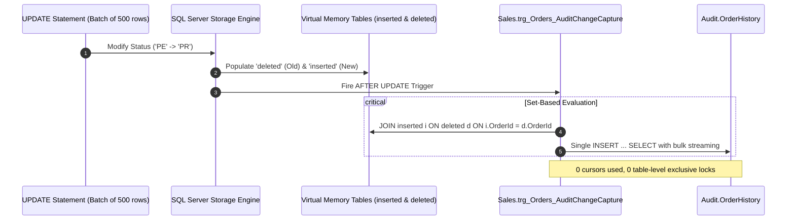
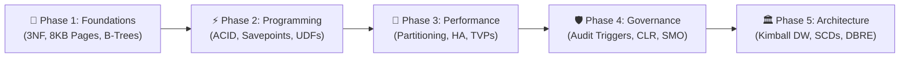

# Enterprise SQL Server Engineering: Learning Guidance & Deep-Dive Handbook

A comprehensive companion guide to the **[MaharaTech: Implementing and Developing SQL Server Objects](https://maharatech.gov.eg/course/view.php?id=2305)** course, engineered from a **Database Reliability Engineering (DBRE)** and **Data Engineering** perspective.

---

## Chapter 1: Physical Storage Architecture & Integrity Constraints

### 1. The Anatomy of SQL Server Physical Storage

At the lowest level, SQL Server organizes data into **8 KB pages** (8,192 bytes). Eight physically contiguous pages form an **Extent** (64 KB).



### 2. Multi-Filegroup Strategy
Placing all user tables on the `PRIMARY` filegroup is an anti-pattern in production environments.



#### Why Separate Indexes from Data?
* **Random vs. Sequential IO**: Index seeks generate random read IOPS across the b-tree hierarchy, whereas table scans and bulk inserts generate sequential IO. Separating them prevents head-contention and disk queue saturation.
* **Piecemeal Restores**: If a non-critical index filegroup is corrupted, the core `DATA_FG` can be brought online immediately while `INDEX_FG` is rebuilt or restored in the background.

---

## Chapter 2: ACID Transactions, Concurrency & Function Internals

### 1. The ACID Boundary & Error Handling Architecture

In production pipelines, an unhandled runtime error can leave transactions orphaned, holding exclusive (`X`) locks and blocking the entire engine.



### 2. Function Internal Execution Models: Scalar vs. MSTVF vs. Inline TVF



> [!TIP]
> **SQL Server 2022 Enhancement**: Scalar UDF Inlining automatically converts qualifying scalar functions into relational subqueries, mitigating the context-switching penalty without code rewrites.

---

## Chapter 3: Table Partitioning & High Availability

### 1. Range Partitioning & Sliding Window Mechanics

Range Right partitioning establishes inclusive upper or lower boundaries:



### 2. Zero-IO Partition Switching (`SWITCH PARTITION`)
Traditional `DELETE FROM Invoices WHERE InvoiceDate < '2024-01-01'` causes massive transaction log growth, row lock escalation, and buffer pool eviction.
`ALTER TABLE Invoices SWITCH PARTITION 1 TO Invoices_ArchiveStage` executes in **< 5 milliseconds** because it is a pure metadata pointer swap in the system catalogs.

---

## Chapter 4: Database Governance, CDC Auditing & SMO

### 1. Set-Based CDC Trigger State Transition



---

## Chapter 5: Dimensional Data Warehousing (Kimball Star Schema)

### 1. Kimball Slowly Changing Dimension (SCD) Type 2 Lifecycle

When customer attributes change (e.g., relocation, email change), SCD Type 2 preserves historical reporting accuracy:

```mermaid
gantt
    title SCD Type 2 Timeline for Customer 101
    dateFormat YYYY-MM-DD
    section Record Version 1 (SK: 501)
    Active (PostalCode: 90210, IsCurrent: 0) :active, v1, 2022-01-01, 2024-06-15
    section Record Version 2 (SK: 842)
    Active (PostalCode: 10001, IsCurrent: 1) :crit, v2, 2024-06-15, 2030-01-01
```

* **Sales prior to 2024-06-15**: Linked to `CustomerSK = 501` (aggregates correctly reflect California revenue).
* **Sales after 2024-06-15**: Linked to `CustomerSK = 842` (aggregates correctly reflect New York revenue).

---

## DBRE Interview Masterclass: Questions & Scenarios

### Q1: Why use `SET XACT_ABORT ON` in production stored procedures?
**Answer**: By default (`XACT_ABORT OFF`), certain T-SQL runtime errors (e.g., data type conversion, foreign key constraint violations) do not abort execution; the batch continues to the next statement while leaving the transaction open. This can result in partial data commits and orphaned locks. `SET XACT_ABORT ON` guarantees that any statement-level error immediately halts execution and flags the transaction as doomed (`XACT_STATE() = -1`), allowing clean rollback in the `CATCH` block.

### Q2: What is the difference between a Filtered Index and an Indexed View?
**Answer**:
* A **Filtered Index** is a non-clustered b-tree containing only rows matching a static `WHERE` predicate (e.g., `WHERE OrderStatus = 'Pending'`). It cannot aggregate data or join tables.
* An **Indexed View** physically materializes computed aggregations (`SUM`, `COUNT_BIG`) or table joins on disk with a unique clustered index, eliminating runtime join/aggregation overhead.

### Q3: Why does `MERGE` fail when a table has a bound `RULE`?
**Answer**: SQL Server rules created via `CREATE RULE` and bound via `sp_bindrule` represent legacy Sybase-era constraints. The modern relational query optimizer's `MERGE` engine does not support evaluating old-style rule objects during execution. Production tables should exclusively use declarative `CHECK` and `DEFAULT` constraints.

---

## 🗺️ DBRE & Data Engineering Career Progression Roadmap

A structured 5-phase professional trajectory bridging relational database fundamentals with enterprise data platform architecture:



| Phase | Seniority Tier | Core Competencies | Course Alignment | Key Target Certification |
| :---: | :--- | :--- | :---: | :--- |
| **01** | **🌱 Foundational (Junior DBA / SQL Dev)** | 3NF Relational Modeling, 8 KB Page Geometry, Filegroups, Constraints (PK/FK/Check), Clustered/Non-Clustered Indexes, Differential Backups | **CH01** | [AZ-900: Azure Fundamentals](https://learn.microsoft.com/en-us/credentials/certifications/azure-fundamentals/) |
| **02** | **⚡ Intermediate (T-SQL Engineer)** | T-SQL Flow Control, Scalar UDF Inlining, Inline vs Multi-Statement TVFs, `tempdb` Mechanics, Explicit ACID Transactions & Savepoints | **CH02** | [DP-900: Azure Data Fundamentals](https://learn.microsoft.com/en-us/credentials/certifications/azure-data-fundamentals/) |
| **03** | **🚀 Advanced (Performance & HA Specialist)** | Horizontal Range Partitioning, Zero-IO Partition Switching (`SWITCH`), Semi-Structured XML/XQuery, TVP Bulk Ingestion, Log Shipping, Mirroring | **CH03** | [DP-300: Azure Database Administrator](https://learn.microsoft.com/en-us/credentials/certifications/azure-database-administrator-associate/) |
| **04** | **🛡️ Expert (DBRE & Automation Engineer)** | DML CDC Audit Triggers, DDL Server Triggers (`EVENTDATA`), Managed C# SQL CLR Assemblies, PowerShell SMO, CI/CD Migrations | **CH04** | [DP-300 / DevOps Engineer](https://learn.microsoft.com/en-us/credentials/certifications/devops-engineer/) |
| **05** | **🏛️ Architect (Data Platform & BI Architect)** | Kimball Dimensional Modeling, Star Schemas, SCD Type 1 & 2, Columnstore Indexes, SSRS Paginated Reports, High-Availability Topology | **CH05 + Capstone** | [DP-203: Azure Data Engineer Associate](https://learn.microsoft.com/en-us/credentials/certifications/azure-data-engineer/) |

---

## 📚 Curated Learning Resources Matrix

All external documentation and study materials verified and mapped to practical engineering applications:

### 📖 Essential Books & Industry Texts
* 📘 **T-SQL Fundamentals** by *Itzik Ben-Gan* — The definitive manual on set-based T-SQL programming, window functions, and relational theory.
* 📗 **Microsoft SQL Server Internals** by *Kalen Delaney* — Deep architectural breakdown of SQL Server storage engine, buffer pool, locking, and memory managers.
* 📙 **The Data Warehouse Toolkit** by *Ralph Kimball* — Industry standard on dimensional modeling, bus matrix architecture, and slowly changing dimensions.
* 📕 **Database Reliability Engineering** by *Laine Campbell & Charity Majors* — Operational design principles, SLOs/SLIs, automated failover, and observability.

### 🏆 Interactive Practice Platforms
* 🎯 **[LeetCode SQL 50 Study Plan](https://leetcode.com/studyplan/top-sql-50/)** — Real-world interview query challenges (window functions, self-joins, CTEs).
* 🎯 **[HackerRank SQL Track](https://www.hackerrank.com/domains/sql)** — Structured skill assessments with automated grading.
* 🎯 **[SQLZoo](https://sqlzoo.net/wiki/SQL_Tutorial)** — Interactive SQL tutorials with immediate live execution.
* 🎯 **[SQLBolt](https://sqlbolt.com/)** — Guided bite-sized exercises for relational concepts.

### 🔧 Production Tooling & Utilities
* 🛠️ **[SQL Server Management Studio (SSMS)](https://learn.microsoft.com/en-us/sql/ssms/download-sql-server-management-studio-ssms)** — Primary enterprise GUI and query engine tool.
* 🛠️ **[Azure Data Studio](https://learn.microsoft.com/en-us/azure-data-studio/download-azure-data-studio)** — Modern cross-platform notebook-first SQL IDE.
* 🛠️ **[sp_WhoIsActive by Adam Machanic](https://github.com/amachanic/sp_whoisactive)** — Industry gold-standard query diagnostic and lock-monitoring procedure.
* 🛠️ **[dbatools PowerShell Module](https://dbatools.io/)** — Community PowerShell automation framework featuring 500+ administrative commands.
* 🛠️ **[SentryOne Plan Explorer](https://www.sentryone.com/plan-explorer)** — Advanced graphical execution plan diagnostics and cost visualization.

