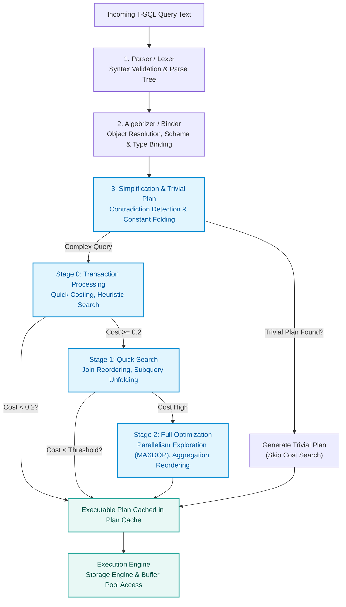
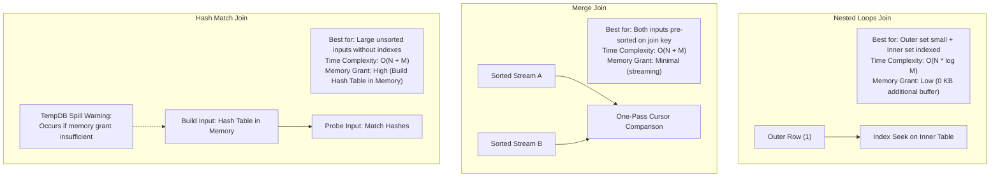
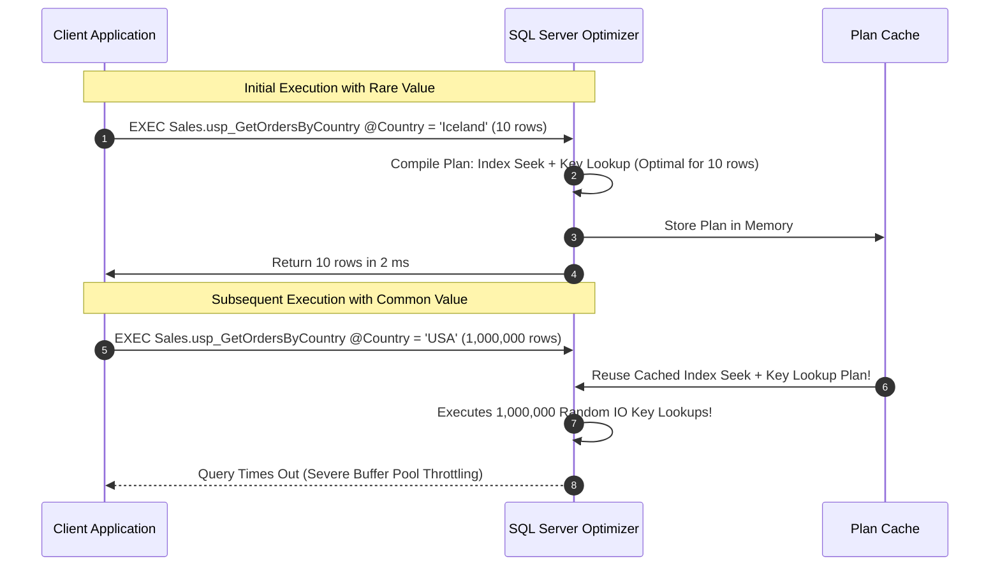
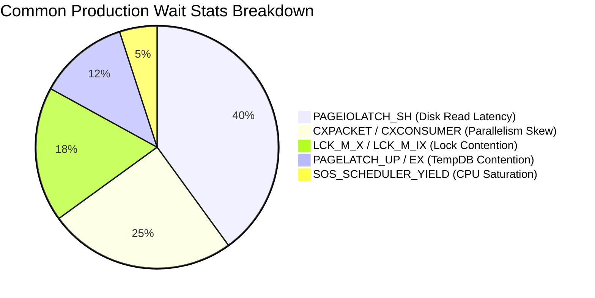
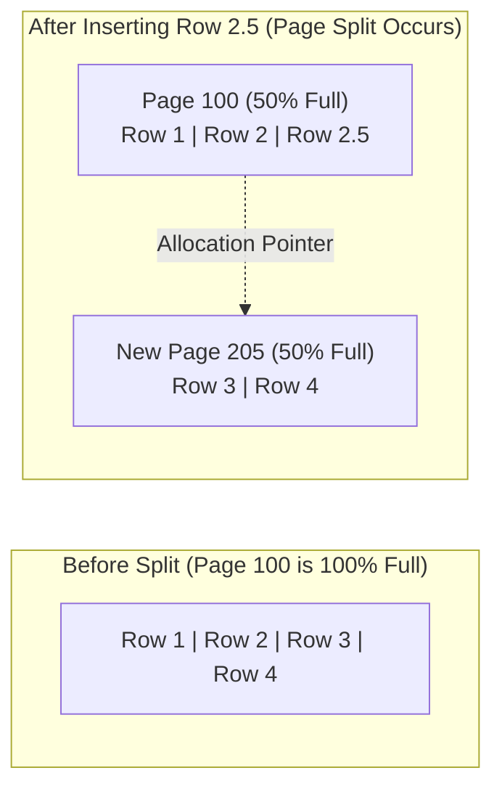

# SQL Server Performance Tuning & Query Optimization Handbook

An advanced, practical engineering guide to query execution internals, indexing mechanics, and database engine diagnostics for the **OmniFlow Data Platform**. Designed as a companion reference for **[MaharaTech: Implementing and Developing SQL Server Objects](https://maharatech.gov.eg/course/view.php?id=2305)**.

---

## 1. Query Optimizer Pipeline & Plan Generation

When a T-SQL query is submitted to SQL Server, it transitions through parsing, binding, and cost-based optimization before execution:



---

## 2. Relational Join Operators: Mechanics & Selection Criteria

The optimizer chooses between three fundamental physical join algorithms:



### Join Selection Matrix

| Join Type | Ideal Input Size | Required Indexing / Ordering | Memory Overhead | Risk of TempDB Spill |
| :--- | :--- | :--- | :--- | :--- |
| **Nested Loops** | One tiny table (< 1,000 rows), one large table | Inner table must have indexed join key | None (streaming) | **Zero** |
| **Merge Join** | Medium to large data sets | Both inputs **must** be sorted on join key | Very low (streaming) | Low (only if many-to-many duplicates) |
| **Hash Match** | Massive un-indexed data sets (Data Warehouse ETL) | No indexing required | **High** (build phase requires RAM) | **High** (spills to TempDB on memory miscalculation) |

---

## 3. Index Seek vs. Scan vs. Key Lookup

Understanding the physical B-tree traversal is crucial for eliminating expensive table scans and key lookups.

```mermaid
flowchart TD
    subgraph NonClusteredSeek ["Non-Clustered Index Seek (Ideal)"]
        Root1["Root Page"] --> Branch1["Intermediate Page"]
        Branch1 --> Leaf1["Leaf Page (Contains Index Keys + INCLUDED Columns)"]
        Leaf1 --> ReturnData["Data returned directly from Index Leaf<br/><b>Covering Index (Zero Base Table Access)</b>"]
    end

    subgraph KeyLookupPenalty ["Index Seek + Key Lookup (Sub-Optimal)"]
        Root2["Root Page"] --> Branch2["Intermediate Page"]
        Branch2 --> Leaf2["Leaf Page (Missing Requested Column)"]
        Leaf2 --> BaseLookup["Clustered Index Seek / RID Lookup<br/><b>Random IO for EVERY matching row!</b>"]
        BaseLookup --> BaseTable["Base Clustered Table Page"]
    end

    classDef ideal fill:#d4edda,stroke:#28a745,stroke-width:2px,color:#155724;
    classDef warning fill:#fff3cd,stroke:#ffc107,stroke-width:2px,color:#856404;
    class ReturnData ideal;
    class BaseLookup warning;
```



> [!TIP]
> **How to Eliminate Key Lookups**:
> If a query selects `CustomerName`, `OrderDate`, and `TotalAmount`, but the index only indexes `CustomerName`, the engine performs a Key Lookup for each row to fetch `OrderDate` and `TotalAmount`.
> Fix this by creating a **Covering Index**:
> ```sql
> CREATE NONCLUSTERED INDEX IX_Orders_Customer_Covering
> ON Sales.Orders (CustomerId)
> INCLUDE (OrderDate, TotalAmount);
> ```

---

## 4. Parameter Sniffing & Query Store

### What is Parameter Sniffing?
On the first execution of a stored procedure, the optimizer compiles a plan tailored specifically to the initial input parameters. If parameter distribution is highly skewed, the cached plan may be catastrophic for subsequent executions with different parameters.



### Remediation Strategies:
1. **`OPTIMIZE FOR (@Param = <Value>)`**: Guides the optimizer to compile for a representative parameter value.
2. **`OPTIMIZE FOR UNKNOWN`**: Forces the optimizer to use standard density-vector statistics instead of sniffing.
3. **`WITH RECOMPILE`**: Recompiles the statement at runtime; ideal for complex reports executed infrequently with wild variations.
4. **SQL Server 2022 Parameter Sensitive Plan (PSP) Optimization**: Automatically caches multiple active plans for different parameter variants without manual code modifications!

---

## 5. Wait Statistics: The DBRE Diagnostic Gold Standard

When queries run slowly, they are almost always waiting on physical resources. SQL Server records these delays in `sys.dm_os_wait_stats`.



### Diagnostic Query for Top Server Waits
```sql
SELECT TOP 10
    wait_type,
    waiting_tasks_count,
    wait_time_ms / 1000.0 AS total_wait_time_sec,
    (wait_time_ms - signal_wait_time_ms) / 1000.0 AS resource_wait_time_sec,
    signal_wait_time_ms / 1000.0 AS signal_cpu_wait_sec,
    100.0 * wait_time_ms / SUM(wait_time_ms) OVER() AS pct_of_total_waits
FROM sys.dm_os_wait_stats
WHERE wait_type NOT IN (
    'CLR_SEMAPHORE', 'LAZYWRITER_SLEEP', 'RESOURCE_QUEUE', 'SLEEP_TASK',
    'SLEEP_SYSTEMTASK', 'SQLTRACE_BUFFER_FLUSH', 'WAITFOR', 'LOGMGR_QUEUE',
    'CHECKPOINT_QUEUE', 'REQUEST_FOR_DEADLOCK_SEARCH', 'XE_TIMER_EVENT',
    'BROKER_TO_FLUSH', 'BROKER_TASK_STOP', 'CLR_MANUAL_EVENT',
    'DISPATCHER_QUEUE_SEMAPHORE', 'FT_IFTS_SCHEDULER_IDLE_WAIT',
    'XE_DISPATCHER_WAIT', 'XE_DISPATCHER_JOIN', 'DIRTY_PAGE_POLL'
)
ORDER BY wait_time_ms DESC;
```

---

## 6. Index Maintenance: Fragmentation & Statistics Rebuild

### Internal Page Splitting
When an `INSERT` or `UPDATE` increases row size on an 8 KB data page that has no remaining space, SQL Server allocates a new page and moves approximately 50% of the data to the new page. This is called a **Page Split**, leading to logical fragmentation and excessive disk IO.



### Maintenance Protocol
* **Fragmentation < 10%**: No action needed.
* **Fragmentation 10% – 30%**: `ALTER INDEX ... REORGANIZE` (Online, low resource impact, defragments leaf nodes and compacts space).
* **Fragmentation > 30%**: `ALTER INDEX ... REBUILD WITH (ONLINE = ON, FILLFACTOR = 85)` (Recreates index from scratch; use `FILLFACTOR` on high-insert write tables to reserve headroom for future updates).
* **Statistics Maintenance**: Ensure statistics are updated with `FULLSCAN` after heavy bulk ETL loads (`UPDATE STATISTICS Sales.Orders WITH FULLSCAN`).
