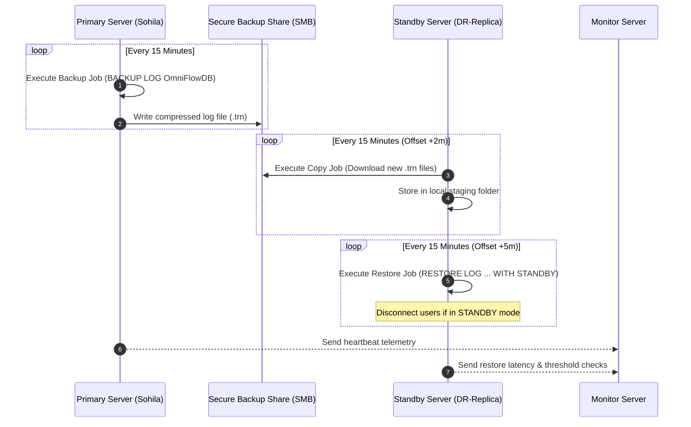
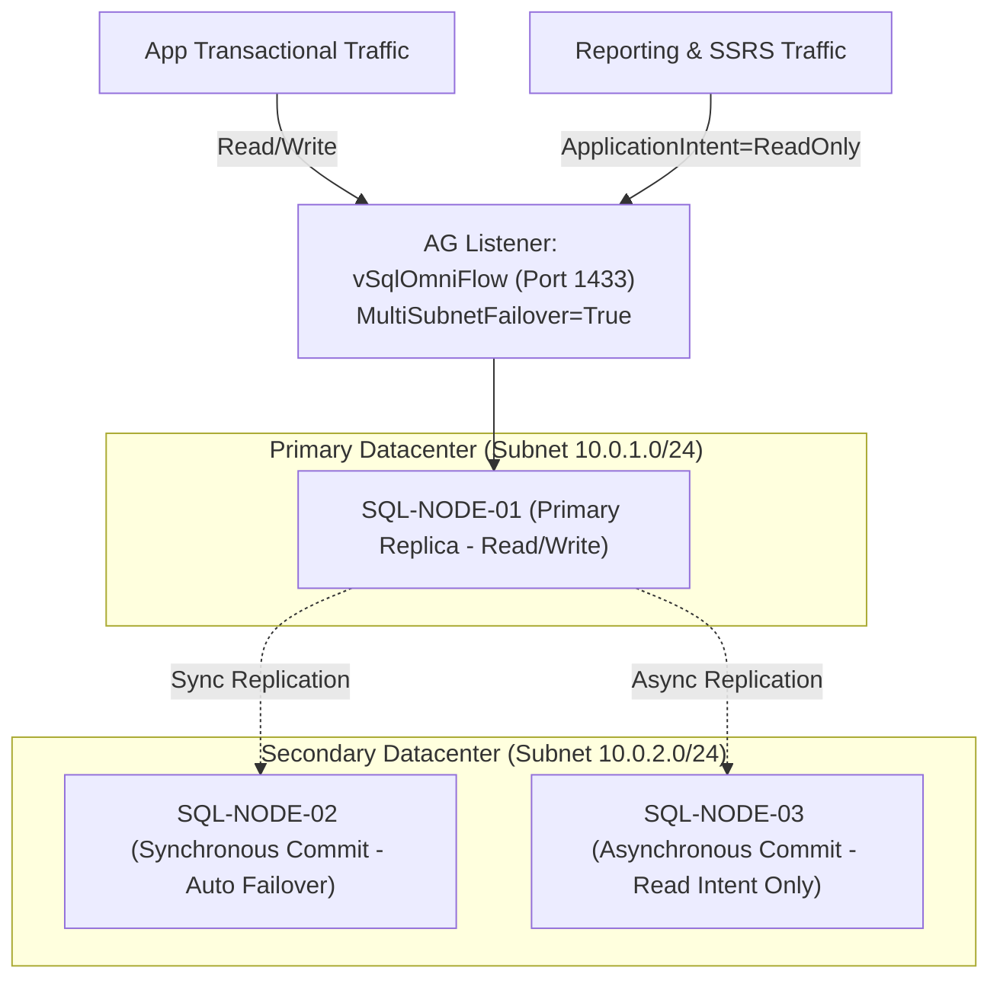

# High Availability & Disaster Recovery Architecture Guide

## 1. High Availability Comparison: Log Shipping vs. Always On AG

| Architecture Dimension | Transaction Log Shipping | Always On Availability Groups |
| :--- | :--- | :--- |
| **SQL Server Edition** | Standard & Enterprise | Enterprise (or Basic AG on Standard) |
| **Replication Level** | Database-level (Transaction log backups) | Database-level (Memory log blocks) |
| **Replication Cadence** | Asynchronous batch (e.g., 5-15 min intervals) | Synchronous (Zero RPO) or Asynchronous |
| **Failover Mechanism** | Manual / Scripted DBRE runbook | Automatic (Cluster quorum) or Manual |
| **Secondary Read Access**| Read-Only (`STANDBY` mode, disconnected during restores) | Active Readable Secondary (Real-time offloading) |
| **Network Overhead** | Low (Compressed log files moved via SMB) | Moderate (Continuous TCP stream on port 5022) |
| **Typical Use Case** | Disaster recovery site across regions / WAN | High availability within datacenter + Read Offloading |

---

## 2. Transaction Log Shipping Architecture & Configuration



### Configuration T-SQL Snippets

#### Primary Instance:
```sql
EXEC master.dbo.sp_add_log_shipping_primary_database
    @database = N'OmniFlowDB',
    @backup_directory = N'\\FileServer\SqlBackups\OmniFlowDB\LogShipping',
    @backup_share = N'\\FileServer\SqlBackups\OmniFlowDB\LogShipping',
    @backup_job_name = N'LSBackup_OmniFlowDB',
    @backup_retention_period = 4320, -- 3 days (minutes)
    @backup_compression = 1;
```

#### Secondary Instance:
```sql
EXEC master.dbo.sp_add_log_shipping_secondary_database
    @secondary_database = N'OmniFlowDB',
    @primary_server = N'Sohila',
    @primary_database = N'OmniFlowDB',
    @restore_delay = 0,
    @restore_mode = 1, -- 1 = STANDBY (Read-Only queries allowed)
    @disconnect_users = 1;
```

---

## 3. Disaster Recovery Failover Runbook (Emergency Failover)

When the Primary Server suffers an unrecoverable failure:

1. **Flush Final Log**: If the primary storage is still accessible, perform a tail-of-the-log backup:
   ```sql
   BACKUP LOG [OmniFlowDB] TO DISK = '\\FileServer\SqlBackups\OmniFlowDB_Tail.trn' 
   WITH NORECOVERY;
   ```
2. **Copy & Apply Remaining Logs on Standby**:
   ```sql
   RESTORE LOG [OmniFlowDB] FROM DISK = '\\FileServer\SqlBackups\OmniFlowDB_Tail.trn'
   WITH NORECOVERY;
   ```
3. **Recover the Standby Database into Production**:
   ```sql
   RESTORE DATABASE [OmniFlowDB] WITH RECOVERY;
   ```
4. **Redirect Applications**: Update DNS alias or connection string to point to the new Primary.

---

## 4. Always On Availability Groups (Multi-Subnet Architecture)


