# 🌐 SQL Server Enterprise Data Platform — Interactive Web Platform

[](https://react.dev/)
[](https://vitejs.dev/)
[](https://sql.js.org/)
[](https://prismjs.com/)
[](https://react-hot-toast.com/)
[](../LICENSE)

An interactive, responsive single-page web application providing an in-browser development, learning, and architectural exploration environment for the **Microsoft SQL Server 2022 Data Platform & DBRE** curriculum.

---

## 🌟 Key Highlights

* ⚡ **In-Browser T-SQL Engine**: Powered by `sql.js` (WebAssembly SQLite) enabling offline, instantaneous query execution without requiring a backend database server.
* 🎨 **Prism.js SQL Editor**: Syntax-highlighted T-SQL editor with keyboard shortcuts (`Ctrl + Enter` / `F5`), auto-indentation, copy actions, and execution feedback via `react-hot-toast`.
* 🗺️ **Interactive DBRE Career Roadmap**: 5-phase career progression guide visualizing skills, milestones, course module alignment, and certification goals (AZ-900 → DP-900 → DP-300 → DP-203).
* 📚 **40+ Curated Learning Resources**: Searchable and categorized learning hub spanning Architecture, Performance Tuning, Coding Standards, Books, YouTube Talks, Practice Platforms, Certifications, and DBA Tools.
* 🧭 **Central 14-View Router & Sidebar**: Complete navigation with SSMS-style Object Explorer tree for interactive table inspection, Challenge Arena, Execution Plan Simulator, and Chen ERD Explorer.

---

## 🏗️ Architecture & Component Topology

```mermaid
flowchart TD
    App["App.jsx (Root Shell & Router)"]
    Nav["Navbar.jsx (Brand, Tabs, Mobile Hamburger, XP Progress)"]
    Sidebar["Sidebar.jsx (14-Tab Nav, SSMS Object Explorer)"]
    Content["Main Content Area"]

    App --> Nav
    App --> Sidebar
    App --> Content

    subgraph Views ["Routed View Components"]
        Content --> Roadmap["RoadmapDiagram.jsx (Flowchart, Stages, Career Roadmap)"]
        Content --> Docs["DocsView.jsx (Curated Resources Hub)"]
        Content --> Lessons["LessonView.jsx (Video Lessons + Live Editor)"]
        Content --> Studio["PracticeStudio.jsx (T-SQL Sandbox)"]
        Content --> Arena["ChallengeArena.jsx (LeetCode-Style SQL Challenges)"]
        Content --> Blueprints["ProjectBlueprints.jsx (Architecture Blueprints)"]
        Content --> Arch["ArchitectureViewer.jsx (Topology Visualizer)"]
        Content --> Migrations["MigrationSimulator.jsx (CI/CD Runner)"]
        Content --> ERD["ErdExplorer.jsx (Chen ERD Explorer)"]
        Content --> PlanSim["PlanSimulator.jsx (Execution Plan Analyzer)"]
        Content --> Quiz["QuizMaster.jsx (DBRE Knowledge Check)"]
        Content --> MSDocs["MicrosoftDocsHub.jsx (MS Learn Docs)"]
    end

    subgraph UI ["Reusable UI Layer (src/components/ui/)"]
        Roadmap -.-> ResCard["ResourceCard.jsx"]
        Docs -.-> ResCard
        Studio -.-> CodeEd["CodeEditor.jsx (Prism.js)"]
        Studio -.-> ResTab["ResultsTable.jsx (Execution Metrics)"]
        Lessons -.-> CodeEd
        Lessons -.-> ResTab
        Arena -.-> CodeEd
        Arena -.-> ResTab
    end
```



---

## 📂 Directory Structure

```text
web/
├── public/
│   └── favicon.ico
├── src/
│   ├── assets/                      # SVG logos and media assets
│   ├── components/
│   │   ├── ui/                      # 🧩 Reusable atomic UI components
│   │   │   ├── CodeEditor.jsx       # Prism.js T-SQL editor with toolbar
│   │   │   ├── ResultsTable.jsx     # Query result table with time/count metrics
│   │   │   └── ResourceCard.jsx     # Curated learning resource card
│   │   ├── AIChatbot.jsx            # Context-aware DBRE AI mentor drawer
│   │   ├── App.jsx                  # Central layout and state router
│   │   ├── ArchitectureViewer.jsx   # Multi-disk IO and filegroup visualizer
│   │   ├── ChallengeArena.jsx       # Interactive SQL challenges with assertions
│   │   ├── DocsView.jsx             # 40+ Curated learning resources hub
│   │   ├── DocsViewer.jsx           # Markdown document reader
│   │   ├── ErdExplorer.jsx          # Peter Chen ERD to 3NF schema explorer
│   │   ├── LessonList.jsx           # 102-lecture curriculum index
│   │   ├── LessonView.jsx           # Single lesson video viewer & code sandbox
│   │   ├── MicrosoftDocsHub.jsx     # Official Microsoft Learn documentation index
│   │   ├── MigrationSimulator.jsx   # SHA-256 migration runner simulator
│   │   ├── Navbar.jsx               # Site header with hamburger & progress bar
│   │   ├── PlanSimulator.jsx        # Graphical execution plan analyzer
│   │   ├── PracticeStudio.jsx       # Standalone T-SQL playground & sandbox
│   │   ├── ProjectBlueprints.jsx    # Enterprise capstone blueprints
│   │   ├── QuizMaster.jsx           # DBRE certification practice quiz
│   │   ├── RoadmapDiagram.jsx       # 3-mode roadmap (Concepts, Stages, Career)
│   │   ├── Sidebar.jsx              # Navigation drawer & SSMS Object Explorer
│   │   └── VideoLearningHub.jsx     # Video lecture search & filtering
│   ├── context/
│   │   ├── DatabaseContext.jsx      # WASM SQLite engine provider & schema metadata
│   │   └── ProgressContext.jsx      # Lesson completion, XP points, and rank tracking
│   ├── data/
│   │   ├── challenges.js            # SQL challenges with automated verification logic
│   │   ├── courseConceptRoadmap.js  # 7-tier architectural concepts dataset
│   │   ├── videoCatalog.js          # 102 MaharaTech lesson metadata & starter SQL
│   │   └── quizQuestions.js         # Knowledge check question bank
│   ├── index.css                    # Base tokens and reset
│   ├── main.jsx                     # Application bootstrap
│   └── style.css                    # Dark-mode design system & component styles
├── index.html                       # HTML5 entrypoint
├── package.json                     # Dependencies & scripts
└── vite.config.js                   # Vite configuration
```

---

## 🚀 Getting Started

### Prerequisites
* **Node.js**: v18.0 or later (v20+ recommended)
* **npm**: v9.0 or later

### Installation
```bash
# Navigate to web directory
cd web

# Install dependencies
npm install
```

### Development Server
```bash
npm run dev
```
Open [http://localhost:5173/](http://localhost:5173/) in your browser.

### Production Build
```bash
npm run build
```
Generates optimized static assets in `web/dist/` ready for hosting on GitHub Pages, Netlify, or Vercel.

### Preview Build
```bash
npm run preview
```

---

## 🛠️ Technology Stack

| Layer | Technology | Rationale |
| :--- | :--- | :--- |
| **Framework** | React 19 | Declarative UI, hooks-based state management, optimal rendering performance. |
| **Bundler** | Vite 6 | Sub-second Hot Module Replacement (HMR) and optimized Rollup production builds. |
| **SQL Engine** | `sql.js` (WASM) | Compiles SQLite C codebase to WebAssembly for instant in-browser relational execution. |
| **Code Editor** | `react-simple-code-editor` + `prismjs` | Lightweight syntax-highlighted SQL editor with caret alignment and tab indentation. |
| **Feedback** | `react-hot-toast` | Non-intrusive toast alerts for query execution time, errors, and clipboard actions. |
| **Icons** | `lucide-react` | Crisp, consistent SVG icons for all navigation tabs and metric badges. |
| **Confetti** | `canvas-confetti` | Gamified reward animation upon completing course modules. |
| **Styling** | Vanilla CSS Design System | Zero-runtime CSS variables, dark-mode glassmorphism, responsive breakpoints. |

---

## 📜 License
Distributed under the [MIT License](../LICENSE).
